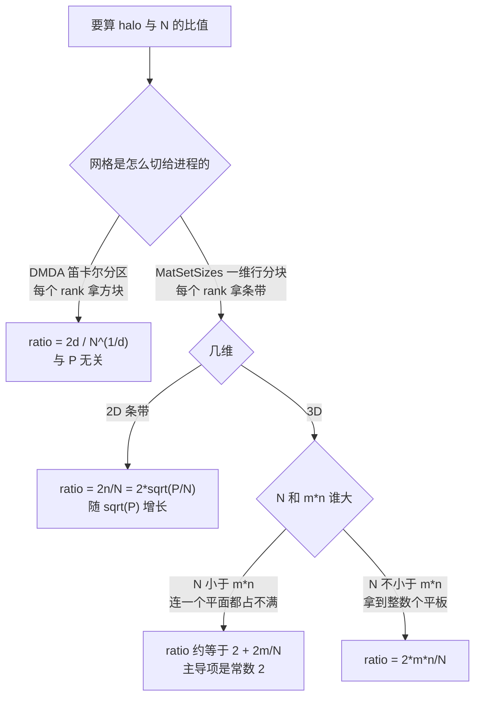

#hpc/scaling #hpc/mpi #hpc/openmp #petsc/ksp #status/review

> [!info] 知识图谱
> 总览：[[0.0 HPC 性能分析知识图谱]] · 前置：[[强扩展与 Amdahl 定律]] · [[MPI 集合通信与归约]] · 后续：[[PETSc DMDA 结构化分区]] · [[GAMG 代数多重网格]] · 原始记录：[[原始稿件/2026-07-31 弱扩展答疑|2026-07-31 弱扩展答疑]]

# 1. 弱扩展与 halo 通信：扩展性好不好，其实由「怎么切网格」决定

跑基准时约束 `25000 <= 未知数/核 <= 100000`，看起来只是个过滤条件，实际上它把整个实验定义成了**弱扩展**。这一句话会连锁改变三件事：图该怎么分组、效率该怎么算、性能变差该怪谁。

一句话分清两种扩展性——**加机器的时候，题目跟不跟着变大**：

| | 题目总大小 | 每个核分到的活 | 理想结果 | 效率怎么算 |
| --- | --- | --- | --- | --- |
| **强扩展** strong scaling | 不变 | 越来越少 | 时间按 $1/P$ 变短 | $E_s = \dfrac{t(P_0)}{t(P)} \cdot \dfrac{P_0}{P}$ |
| **弱扩展** weak scaling | 跟着核数一起变大 | **不变** | 时间**原地不动** | $E_w = \dfrac{t(P_0)}{t(P)}$ |

弱扩展效率的公式里没有 $P$，因为理想情况下时间本来就不该变。**曲线越平越好。**

> [!summary]- 术语表：先认这几个词
> 
> | 词 | 是什么 | 在本篇里的角色 |
> | --- | --- | --- |
> | **rank / 进程** | 一个独立的 MPI 进程，有自己的内存 | 分区的最小单位；rank 之间必须发消息才能交换数据 |
> | **thread / 线程** | 一个进程内部的并行执行流，共享内存 | 同进程内的线程**不需要**发消息 |
> | **layout** | 写成「每节点 rank 数 × 每 rank 线程数」 | 本实验固定 128 核/节点，所以 128×1、64×2、32×4、16×8 用的硬件完全一样 |
> | **未知数 unknown** | 网格上一个格点对应的一个待求值 | 也就是矩阵 $Au=b$ 的一行 |
> | **halo / ghost points** | 自己没有、但计算时必须用到的邻居数据 | 每次矩阵向量乘之前都要通过 MPI 收一次 |
> | **stencil 差分格式** | 算一个点要用到周围哪几个点 | 2D 五点（上下左右），3D 七点（再加前后） |
> | $N$ | **每个 rank** 拥有的未知数个数 | 注意区别于「每个**核**」：16×8 时每 rank 的 $N$ 是 128×1 的 8 倍 |
> | $P$ | rank 总数 | $P = \text{节点数} \times \text{每节点 rank 数}$ |

---

## 一、为什么按「题目大小」分组会什么都看不出来

约束了每核工作量之后，**题目大小就不再是一个能自由调的旋钮了**：核数翻倍，为了留在 25k–100k 这个窗口里，题目必须跟着翻倍。两者被绑死，术语叫**共线**。

后果很具体：每个规模只能在 1～2 个节点数上存活，按规模分面板 = 每条曲线只有两个点 = 一条直线段 = 看不出任何趋势。

正确的分组维度是约束本身固定住的那个量：**每核未知数**。一次 sweep 天然只包含两条弱扩展带：

| 带 | 组成（规模 @ 节点数） | 节点跨度 |
| --- | --- | --- |
| ~40k/core | 5m@1 · 10m@2 · 20m@4 · 41m@8 · 82m@16 · 165m@32 | 6 个点，1→32 |
| ~80k/core | 10m@1 · 20m@2 · 41m@4 · 82m@8 · 165m@16 | 5 个点，1→16 |

> [!warning]- 报告弱扩展效率时，必须同时说清每核规模和节点跨度
> 
> 同一份数据，40k/core 带效率 0.60，80k/core 带 0.82。**这不是两次实验打架，是两个不同的工作点。**
> 
> 原因在第四节：每核的活越多，通信占比越低，扩展性看起来就越好。所以「弱扩展效率 = 0.82」这种光秃秃的数字没有意义，必须写成「在 80k 未知数/核、1→16 节点下为 0.82」。
> 
> 比较不同带时还要对齐节点跨度：1→32 的 0.60 和 1→16 的 0.82 不能直接比；把 40k 带也截到 16 节点是 0.67，这才是公平对照。

## 二、理想是平线，现实为什么会往上翘

每个核分到的活没变，为什么时间还会涨？因为**除了本地计算，每次迭代还有两件事必须跨进程做**：

1. **halo 交换**——邻居的边界数据，靠点对点消息（近邻通信）
2. **全局归约**——CG 每次迭代至少要做一两次 `MPI_Allreduce` 算内积，这是**所有进程都必须到齐**的硬同步点

本地计算完美弱扩展（活没变，时间就不变），这两项却会随进程数变差。所以**弱扩展曲线上翘的幅度，就是通信在总时间里的占比**。

接下来三节做一件事：**把「通信占多少」这个模糊的说法，变成一个能算出来的数字。**

## 三、网格、矩阵行、分区：halo 是怎么冒出来的

三个东西其实是同一个：**网格上一个格点 = 一个未知数 = 矩阵 $Au=b$ 的一行**。

矩阵的行必须排成一条线（0, 1, 2, …），可网格是二维/三维的，所以需要一个编号规则把它摊平。**这个规则决定了「邻居在行号上差多少」**，而那个差值决定了 halo 有多大：

| 维度 | 编号规则 | 邻居的行号偏移 | 代码位置 |
| --- | --- | --- | --- |
| 2D | $Ii = i \cdot n + j$ | $\pm 1$（同行左右）、$\pm n$（上下跨行） | `ex2_repeat.c` 第 57 行 |
| 3D | $Ii = k \cdot mn + j \cdot m + i$ | $\pm 1$、$\pm m$、$\pm mn$ | `3d_repeat.c` 第 46 行 |

PETSc 的 `MatSetSizes(A, PETSC_DECIDE, PETSC_DECIDE, ...)` 会把**连续的行号**平均切给各进程——它完全不知道这些行号背后是个二维网格。而连续行号 = 连续网格行，所以每个进程拿到的是**横贯整张网格的条带**，不是方块：

```text
        j=0  1   2   3   4   5   6   7          n = 8（每行 8 列）
      ┌───┬───┬───┬───┬───┬───┬───┬───┐
i=0   │ 0 │ 1 │ 2 │ 3 │ 4 │ 5 │ 6 │ 7 │   rank 0
i=1   │ 8 │ 9 │10 │11 │12 │13 │14 │15 │   rank 0  ←── rank 1 的 halo（上）
      ├───┼───┼───┼───┼───┼───┼───┼───┤
i=2   │16 │17 │18 │19 │20 │21 │22 │23 │   rank 1  ┐
i=3   │24 │25 │26 │27 │28 │29 │30 │31 │   rank 1  ┘ 自己拥有 N = 16
      ├───┼───┼───┼───┼───┼───┼───┼───┤
i=4   │32 │33 │34 │35 │36 │37 │38 │39 │   rank 2  ←── rank 1 的 halo（下）
i=5   │40 │41 │42 │43 │44 │45 │46 │47 │   rank 2
      └───┴───┴───┴───┴───┴───┴───┴───┘

rank 1 要算 MatMult，逐个检查它需要的邻居在不在自己手里：
  左右邻居 (±1)   20 需要 19 和 21   → 都在 16..31 里，本地有  ✓
  上下邻居 (±8)   16 需要 8         → 在 rank 0 手里，得收    ✗
                  24 需要 32        → 在 rank 2 手里，得收    ✗
  数一数：越界的恰好是紧贴条带的上下两整行
  halo = 2n = 16 个点，而自己只有 16 个 → halo/N = 100%
```

> [!success]- 代码：编号规则与邻居偏移
> 
> ```c
> /* 2D，ex2_repeat.c —— 五点差分 */
> MatSetSizes(A, PETSC_DECIDE, PETSC_DECIDE, m * n, m * n);  /* 一维行分块 */
> MatGetOwnershipRange(A, &Istart, &Iend);                   /* 半开区间 [Istart, Iend) */
> for (Ii = Istart; Ii < Iend; Ii++) {
>   i = Ii / n;        /* 网格行，步长 n */
>   j = Ii - i * n;    /* 网格列，步长 1 */
>   if (i > 0)     J = Ii - n;   /* 上邻居：只在条带最上一行时越界 */
>   if (i < m - 1) J = Ii + n;   /* 下邻居：只在条带最下一行时越界 */
>   if (j > 0)     J = Ii - 1;   /* 左邻居：恒在本地 */
>   if (j < n - 1) J = Ii + 1;   /* 右邻居：恒在本地 */
> }
> 
> /* 3D，3d_repeat.c —— 七点差分，多出 k 方向 */
> i = Ii % m;          /* 步长 1     */
> j = (Ii / m) % n;    /* 步长 m     */
> k = Ii / (m * n);    /* 步长 m*n   ← 越界的元凶 */
> ```
> 
> - `Istart` / `Iend` 是**全局行号**的半开区间，不是网格坐标。
> - 核心语义：**邻居的行号偏移量 = 那个方向的索引步长**。步长越大，越容易跨出本进程的连续区间。
> - 3D 的 k 方向步长是 $mn$（整整一个平面），这就是它必然越界的原因。
> - `PETSC_DECIDE` 是全篇的起点：它选了一维行分块，后面所有结论都由此而来。换成 `DMDA` 则全部重算。

## 四、halo 到底有多少：教科书公式对不上你的代码

教科书讲的「表面积体积比」**前提是笛卡尔分区**（PETSc 里要用 `DMDA` 才有，即每个 rank 拿一个方块/立方体）。默认的一维行分块下结论完全不同，这是最容易算错的地方：

| | 笛卡尔分区（`DMDA`） | 一维行分块（`PETSC_DECIDE`，本项目） |
| --- | --- | --- |
| 2D | $\dfrac{4}{\sqrt N}$ | $\dfrac{2n}{N} = 2\sqrt{\dfrac{P}{N}}$ |
| 3D | $\dfrac{6}{N^{1/3}}$ | $2 + \dfrac{2m}{N}$（当 $N < mn$） |
| $d$ 维通式 | $\dfrac{2d}{N^{1/d}}$ | 看编号规则而定 |
| $P$ 的影响 | **没有**（弱扩展下恒定） | 2D 按 $\sqrt P$ 增长；3D 主导项与 $P$ 无关 |



> [!tip]- 2D 条带：为什么 halo 恰好是 $2n$
> 
> **要解决什么**：得知道「每算一次 `MatMult` 要通过网络搬多少数据」，才能判断通信是不是瓶颈。
> 
> **本质**：一个进程拿到 $N$ 个连续行号，按 $Ii = i \cdot n + j$，这正好是 $N/n$ 个**整的网格行**。
> 
> - 左右邻居（$\pm 1$）在同一网格行内 → 本地就有
> - 上下邻居（$\pm n$）只在条带的**最上面一行**和**最下面一行**才越界
> 
> 所以越界的恰好是紧贴条带的上下两整行：
> 
> $$\text{halo} = 2n$$
> 
> **怎么用**：网格是正方形，$n = \sqrt{N_{\text{total}}} = \sqrt{NP}$，代进去
> 
> $$\frac{\text{halo}}{N} = \frac{2\sqrt{NP}}{N} = 2\sqrt{\frac{P}{N}}$$
> 
> 验证（5m，1 节点，128 ranks，$N = 39200$）：$2\sqrt{128/39200} = 11.4\%$。
> 
> 注意 $P$ 就坐在分子里，所以**节点数翻 4 倍，比值翻 2 倍**。

> [!tip]- 3D 平板：为什么比值会大于 2（交换的比自己有的还多）
> 
> **本质**：3D 的 k 方向邻居在行号上差 $\pm mn$，也就是**整整一个平面那么远**。
> 
> 一个进程拥有 $[I_{\text{start}},\, I_{\text{start}}+N)$。要让某个点的 k 邻居也在本地，需要 $Ii - mn \ge I_{\text{start}}$；而 $Ii < I_{\text{start}} + N$，所以当 $N < mn$ 时
> 
> $$Ii - mn < I_{\text{start}} + N - mn < I_{\text{start}}$$
> 
> **恒不成立**。翻译成人话：
> 
> > 只要一个进程占不满一个完整的 k 平面，它拥有的**每一个点**，上下两个 k 邻居就都在别的进程上。
> 
> 于是每个点贡献 2 个越界值：
> 
> $$\text{halo} \approx \underbrace{2N}_{k\ \text{方向}} + \underbrace{2m}_{j\ \text{方向}} \;\Longrightarrow\; \frac{\text{halo}}{N} \approx 2 + \frac{2m}{N}$$
> 
> 验证（165m，32 节点，$m = 548$，$N = 40177$，一个平面 $= 300304 \gg N$）：$2 + 1096/40177 = 202.7\%$。
> 
> 注意这里 $P$ **不在主导项里**：第二项虽然含 $P$（因为 $m=(NP)^{1/3}$），但只有 2.7%，淹没在常数 2 里。所以 3D 的比值**几乎不随节点数变化**——它已经饱和了。

> [!example]- 自测：先判断规模，再选公式
> 
> **题 1**：3D，1 节点 128 ranks，5m（$171^3$），$N = 39064$。halo/N 是多少？
> 
> 先比大小：一个平面 $mn = 171^2 = 29241$，而 $N = 39064 > 29241$ ——**占得满一个平面**，所以用另一个公式：
> 
> $$\frac{\text{halo}}{N} = \frac{2mn}{N} = \frac{58482}{39064} = 149.7\%$$
> 
> **题 2**：2D，节点数从 8 涨到 32（$P$ 涨 4 倍），每核规模不变。halo/N 怎么变？
> 
> $\text{ratio} = 2\sqrt{P/N}$，$P$ 涨 4 倍 ⇒ 比值涨 $\sqrt 4 = 2$ 倍。实测 32% → 64%，分毫不差。
> 
> **题 3**：同样的问题问 3D，答案是什么？
> 
> 几乎不变（202% → 203%）。因为主导项是常数 2，与 $P$ 无关。**这个差别正是理解第五节的钥匙。**

> [!summary]- halo/N 实测速查表
> 
> | 配置 | 网格 | ranks | N/rank | halo/N |
> | --- | --- | --- | --- | --- |
> | 2D 5m @ 1 节点 | $2240^2$ | 128 | 39,200 | 11.4% |
> | 2D 41m @ 8 节点 | $6400^2$ | 1024 | 40,000 | 32% |
> | 2D 165m @ 32 节点 | $12828^2$ | 4096 | 40,175 | 64% |
> | 3D 41m @ 8 节点 | $345^3$ | 1024 | 40,101 | 202% |
> | 3D 165m @ 32 节点 | $548^3$ | 4096 | 40,177 | 203% |
> 
> 前提：纯 MPI（128 ranks/节点，1 线程/rank），细网格，约 40k 未知数/核。GAMG 粗层的分区与细网格不同，未计入。

## 五、把公式对到实测：退化来自「等待」，不是「搬得多」

3D 的 halo 占比从 1 节点到 32 节点基本不动（约 200%），可弱扩展效率却掉到 0.42。数据量既然饱和了，**退化就不可能是因为要搬的数据变多了**。逐事件拆开看（3D，40k/core 带，纯 MPI）：

| 节点数 | KSPSolve | VecScatterEnd（等 halo） | 占比 | MatMult | 本地计算 = MatMult − 等待 |
| --- | --- | --- | --- | --- | --- |
| 1 | 2.889 s | 0.716 s | 25% | 2.093 s | **1.38 s** |
| 4 | 4.113 s | 1.342 s | 33% | 3.025 s | **1.68 s** |
| 16 | 5.779 s | 2.415 s | 42% | 4.132 s | **1.72 s** |
| 32 | 7.955 s | 4.439 s | **56%** | 5.790 s | **1.35 s** |

**本地计算 1.38 → 1.35 秒，几乎不动——这是完美的弱扩展。全部退化都在 `VecScatterEnd` 上，涨了 6.2 倍。** 到 32 节点时，一半以上的求解时间是在**干等 halo 数据到达**。

> [!warning]- 「等待」和「搬得多」指向完全不同的优化方向
> 
> 数据量恒定、等待时间暴涨，说明瓶颈是**延迟、消息条数、网络竞争，以及 `VecScatterEnd` 作为同步点吸收的负载不均衡**，不是带宽。
> 
> - 压缩数据、合并消息 → **没用**，量本来就没变
> - 改分区（用 `DMDA` 把邻居从「整个平面」降到 6 个面）、计算通信重叠 → **对症**
> 
> 前提：本表只覆盖 40k 带的纯 MPI，$P$ 从 128 到 4096。四种 layout 与 80k 带尚未逐事件拆解。
> 
> 另一处依赖假设：`MatMult` 的计时**包含**内部的 `VecScatterBegin/End`，所以「本地计算」是相减得来的。若 PETSc 版本的嵌套计时口径不同，这一列要重算。

## 六、混合 MPI+OpenMP：什么时候赢，什么时候输

同样 128 核/节点，把 rank 换成线程，有时快有时慢。**判据只有一个：通信占求解时间的比例。**

- rank 变少 ⇒ 消息变少 ⇒ **省下通信时间**（收益，上限就是通信占比）
- 线程变多 ⇒ 未线程化的 kernel 只有 1 个线程在跑 ⇒ **多出闲置核**（损失）

两者谁大谁赢。165m @ 32 节点实测：

| | layout | 消息条数 | 等 halo | KSPSolve | 通信占比 |
| --- | --- | --- | --- | --- | --- |
| **3D** | 128×1 | 3.4e8 | 4.44 s | 7.95 s | **56%** |
| | 64×2 | 1.8e8 | 2.48 s | **6.14 s** | 40% |
| | 32×4 | 1.0e8 | 2.38 s | 6.72 s | 35% |
| | 16×8 | 5.5e7 | 3.24 s | 8.48 s | 38% |
| **2D** | 128×1 | 3.1e8 | 0.96 s | **4.44 s** | **21%** |
| | 64×2 | 8.8e7 | 0.80 s | 3.93 s | 20% |
| | 32×4 | 3.5e7 | 0.75 s | 4.17 s | 18% |
| | 16×8 | 1.9e7 | 0.72 s | 5.77 s | 12% |

**2D：通信只占 21%，全砍光也才省 0.96 秒，而线程化损失有 1.3 秒以上 ⇒ 混合必输**（16×8 慢 1.29 倍）。
**3D：通信占 56%，减少 rank 省下 2 秒，足以覆盖损失 ⇒ 混合能赢**（64×2 快 1.30 倍）。

> [!summary]- 线程化损失从哪来：逐事件计时（2D，5m @ 1 节点，128×1 → 16×8）
> 
> | 事件 | 128×1 | 16×8 | 倍数 |
> | --- | --- | --- | --- |
> | **`MatMult`** | 1.186 s | 1.256 s | **×1.06** |
> | `MatMultTranspose` | 0.265 s | 1.004 s | ×3.78 |
> | `VecAYPX` | 0.137 s | 0.380 s | ×2.78 |
> | `VecAXPBYCZ` | 0.043 s | 0.126 s | ×2.92 |
> | `VecCopy` | 0.041 s | 0.170 s | ×4.19 |
> | `VecSet` | 0.018 s | 0.101 s | ×5.51 |
> | `PCApply` | 1.755 s | 3.347 s | ×1.91 |
> | `KSPSolve` | 1.989 s | 3.678 s | ×1.85 |
> 
> `MatMult` 几乎不变，说明稀疏矩阵向量乘**确实被线程化了**，8 个线程顶得上 8 个 rank。
> 
> 崩溃的是向量运算和转置乘。它们若没被线程化，每 rank 只有 1 个线程干活，16 个 rank 就是**16 核在跑、112 核闲置**，理论上限正好 8 倍，实测 2.8–5.5 倍。这就是节点内的 Amdahl 瓶颈。
> 
> `MatMultTranspose` 是 GAMG 的限制算子，稀疏转置乘因写冲突难以线程化，与实测的 $\times 3.78$ 吻合。

> [!warning]- 「MatMult 被线程化、向量运算没有」是从计时反推的
> 
> 我没有核对 PETSc 源码里哪些 kernel 带 OpenMP 指令。倍数模式（$\times 1.06$ 对 $\times 2.8$–$5.5$）与该假设高度吻合，但要写进论文需要查证 `--with-openmp` 构建下各 kernel 的实际线程化程度。

## 七、三个必须写进 limitations 的前提

> [!warning]- 一、分区方式可能制造了 3D 的正面结论（最严重）
> 
> 第六节的判据是「通信占比」，而 3D 那个 **56% 本身就是一维行分块造成的**：
> 
> | | halo/N | 通信占 KSPSolve |
> | --- | --- | --- |
> | 一维行分块（现状） | 203% | 56% |
> | `DMDA` 笛卡尔分区 | 17.5% | 会大幅下降 |
> 
> 差一个数量级。通信占比一旦从 56% 掉到 10–15%，3D 就会变得和 2D 一样，**混合模式的优势可能整个消失**。
> 
> 所以这不是「对各 layout 一视同仁、可以忽略」的混淆因素——**它有方向性地制造了主要正面结论**。
> 
> 建议：主实验不重跑（内部自洽，前提写清即可），但补一组小规模 `DMDA` 对照——3D、一个规模、1/8/32 节点、4 种 layout、3 次重复 = 36 次运行，用来检验核心结论能否存活。

> [!warning]- 二、计时只覆盖 20% 的墙钟时间
> 
> 驱动程序先在 stage **外**做一次热身 `KSPSolve`（PETSc 是惰性 setup，`KSPSetUp` / `PCSetUp` 全在这一次里发生），之后才 push `RepeatedSolves` stage 循环 19 次。**所以指标只含稳态求解，完全排除了 GAMG 构建与矩阵组装。**
> 
> 165m @ 32 节点的实际占比：
> 
> | layout | 总时间 | PCSetUp (GAMG) | 其中 MatCoarsen | 19×KSPSolve（指标） |
> | --- | --- | --- | --- | --- |
> | 128×1 | 40.49 s | 30.25 s (75%) | 4.21 s | 7.95 s |
> | 64×2 | 25.12 s | 17.96 s (72%) | 6.57 s | 6.14 s |
> | 32×4 | 28.40 s | 21.03 s (74%) | 11.90 s | 6.72 s |
> | 16×8 | 49.06 s | 39.60 s (81%) | 29.85 s | 8.48 s |
> 
> `MatCoarsen` 随线程数单调恶化（4.2 → 29.8 秒，7 倍），方向与 solve 阶段**相反**。
> 
> - **适用**：时间推进类应用——算子组装一次、求解成千上万次。这正是 `-ksp_reuse_preconditioner` 建模的场景。
> - **不适用**：单次求解，或算子每步都变（非线性、动网格）。那时 setup 主导，结论可能翻转。
> 
> 效应大小差很多：按 solve 口径 64×2 快 1.30 倍，按总时间口径快 1.61 倍。**当前指标低估了 64×2 的优势，也低估了 16×8 的劣势。**

> [!warning]- 三、GAMG 是分区依赖的：不同 layout 其实在比不同的预条件子
> 
> GAMG 的聚合按 MPI 分区做，**rank 数变了，粗网格层次就变了**。3D 迭代次数：
> 
> | 节点数 | 128×1 | 64×2 | 32×4 | 16×8 |
> | --- | --- | --- | --- | --- |
> | 2 | 6 | 6 | 7 | 7 |
> | 4 | 6 | 7 | 7 | 7 |
> | 8 及以上 | 7 | 7 | 7 | 7 |
> 
> 2、4 节点上纯 MPI 拿到 6 次而混合要 7 次，说明层次结构确实不同。`seconds_per_iteration` 归一化掉了迭代次数，但归一不掉「每次迭代的粗网格代价不同」。**这是 3D 比值曲线非单调的来源之一。**
> 
> 反例（说明不能一概而论）：165m @ 32 节点上四种 layout 的 `MatMult` 调用次数完全相同（3173 次，`MatMultTranspose` 760 次），层次结构一致，该点的差异是真实硬件效应。
> 
> 排除办法：加 `-pc_gamg_view` 记录各层网格规模做对照；或用分区无关的 `-pc_type jacobi` 跑一组，代价是迭代次数大涨。

## 一句话总结

约束每核工作量就是在做弱扩展，理想曲线是**平的**；偏离多少取决于通信占比，而通信占比不由维度决定、**由编号规则和分区方式决定**——一维行分块下 2D 是 $2\sqrt{P/N}$、3D 饱和在常数 2；正因为 3D 已饱和，它的退化只能归因于**等待而非带宽**；而这个占比又同时决定了混合模式的胜负（2D 占 21% 必输，3D 占 56% 能赢）——**所以换成 `DMDA` 分区后，3D 的正面结论可能不复存在。**

## API 速查

| 函数 | 是否 collective | 完成语义（返回时保证了什么） | 单位 / 注意 |
| --- | --- | --- | --- |
| `MatSetSizes` | 是，communicator 内全体 | 仅设定尺寸，未分配存储 | 传 `PETSC_DECIDE` 即触发**一维行分块** |
| `MatGetOwnershipRange` | 否，本地查询 | 返回本进程的全局行区间 | **半开区间** $[I_{start}, I_{end})$，单位是全局行号 |
| `MatMult` | 是 | 返回时 $y$ 已完整算好 | 计时**包含**内部 `VecScatterBegin/End` |
| `VecScatterBegin` | 是 | **不保证**数据已到达 | 非阻塞，必须配对 End |
| `VecScatterEnd` | 是 | halo 数据全部就位 | **同步点**，弱扩展退化集中在此 |
| `KSPSolve` | 是 | 已收敛或已判定失败 | 计时含 `PCApply`；首次调用触发惰性 setup |
| `KSPSetUp` / `PCSetUp` | 是 | 预条件子构建完成 | 不显式调用时由**首次** `KSPSolve` 触发 |
| `PetscLogStagePush` / `Pop` | 是 | 划定计时区间 | stage **外**的开销不计入该 stage |
| `KSPGetIterationNumber` | 否，本地查询 | 返回**最近一次** solve 的迭代数 | 重复求解时只反映最后一次 |
| `DMDACreate3d` + `DMCreateMatrix` | 是 | 建立笛卡尔分区并按其分配矩阵 | 替代 `PETSC_DECIDE` 的正解，见 limitations 一 |

## 知识图谱

- 总览：[[0.0 HPC 性能分析知识图谱]] · 前置：[[强扩展与 Amdahl 定律]]（效率定义的对照组）· [[MPI 集合通信与归约]]（CG 每次迭代的 Allreduce 来源）
- 同类：[[表面体积比与通信开销]] · [[NUMA 与线程亲和性]]
- 后续：[[PETSc DMDA 结构化分区]]（把 halo 从「整个平面」降到 6 个面的正解）· [[GAMG 代数多重网格]]（粗层分区依赖与 setup 成本）· [[计算通信重叠]]
- 配套基础：[[PETSc log_view 读法]] · [[Krylov 子空间方法 CG]]

## 考点归纳

| 题目/日志里出现这种描述 | 该想到什么 |
| --- | --- |
| 「固定每核未知数 / 每进程网格点数不变」 | 弱扩展；$E_w = t(P_0)/t(P)$，分母**不带** $P$；理想曲线是平的 |
| 「问题规模固定，增加进程数」 | 强扩展；效率要再除以 $P/P_0$ |
| 报告了一个弱扩展效率数字，没说每核规模 | 无效结论；必须成对给出每核工作量与节点跨度 |
| 按问题规模分面板，每条曲线只有 1–2 个点 | 分组维度错了；约束的是每核规模，就该按每核规模分带 |
| 横轴用 NPROC 比较不同 hybrid layout | 陷阱；固定硬件下各 layout 的 NPROC 不同，曲线落在互不重叠的区间。资源轴应该是 **nodes 或 cores** |
| 代码里有 `MatSetSizes(..., PETSC_DECIDE, ...)` 且无 `DMDA` | 一维行分块，**不是**笛卡尔分区；教科书的 $2d/N^{1/d}$ 公式不适用 |
| 3D，且每进程未知数少于一个平面 $mn$ | 每个点的两个 k 邻居必然越界；halo/N $\approx 2$，大于 1 |
| 「通信量恒定但时间暴涨」 | 瓶颈是延迟/同步/负载不均衡，不是带宽；该做重叠与改分区，不是压缩 |
| `MatMult` 时间不变但 `Vec*` 系列暴涨数倍 | 节点内 Amdahl：部分 kernel 未线程化，闲置核数 = (128 − ranks) |
| 问「混合模式该不该用」 | 先看**通信占求解时间的比例**：占比高 ⇒ 减 rank 的收益能覆盖线程化损失 ⇒ 值得；占比低 ⇒ 必输 |
| 计时用了 `PetscLogStage` 且 setup 在 stage 外 | 指标排除了 `PCSetUp`；必须交代适用场景（重复求解 vs 单次求解） |
| 不同进程数下迭代次数不一样（GAMG / block Jacobi） | 预条件子是**分区依赖**的；严格说不是在比同一个算法 |

最集中的三类考法：**① 给一组数据判断强扩展还是弱扩展并算效率；② 给一段分区代码推 halo/N 并判断通信是否瓶颈；③ 给一份 `log_view` 定位退化来源是带宽、延迟还是节点内并行度不足。**

## 待补

| 项 | 状态 | 说明 |
| --- | --- | --- |
| `DMDA` 三维笛卡尔分区对照实验 | ⬜ | **最高优先级**：检验第六节的正面结论能否存活。3D、一规模、1/8/32 节点、4 layout、3 重复 = 36 次运行 |
| 四张图（2D/3D 弱扩展 + 相对 128×1 比值） | ⬜ | 文件在仓库 `analysis_output/plot/lib/{2d,3d}/`，需拷进 `attachments/` 后用 `![[...]]` 嵌入 |
| 逐事件拆解（本地计算 vs 等待）扩到全 sweep | ⬜ | 现有表只覆盖 40k 带纯 MPI；四种 layout 与 80k 带未做 |
| PETSc 各 kernel 的实际 OpenMP 线程化程度 | ⬜ | 第六节结论由计时反推，需查 `--with-openmp` 构建的源码或文档核实 |
| `-pc_gamg_view` 记录各层网格规模 | ⬜ | 排除 GAMG 分区依赖这一混淆因素 |
| `-pc_type jacobi` 对照实验 | ⬜ | 分区无关的预条件子，同时验证「延迟主导」结论与归一化指标的可靠性 |