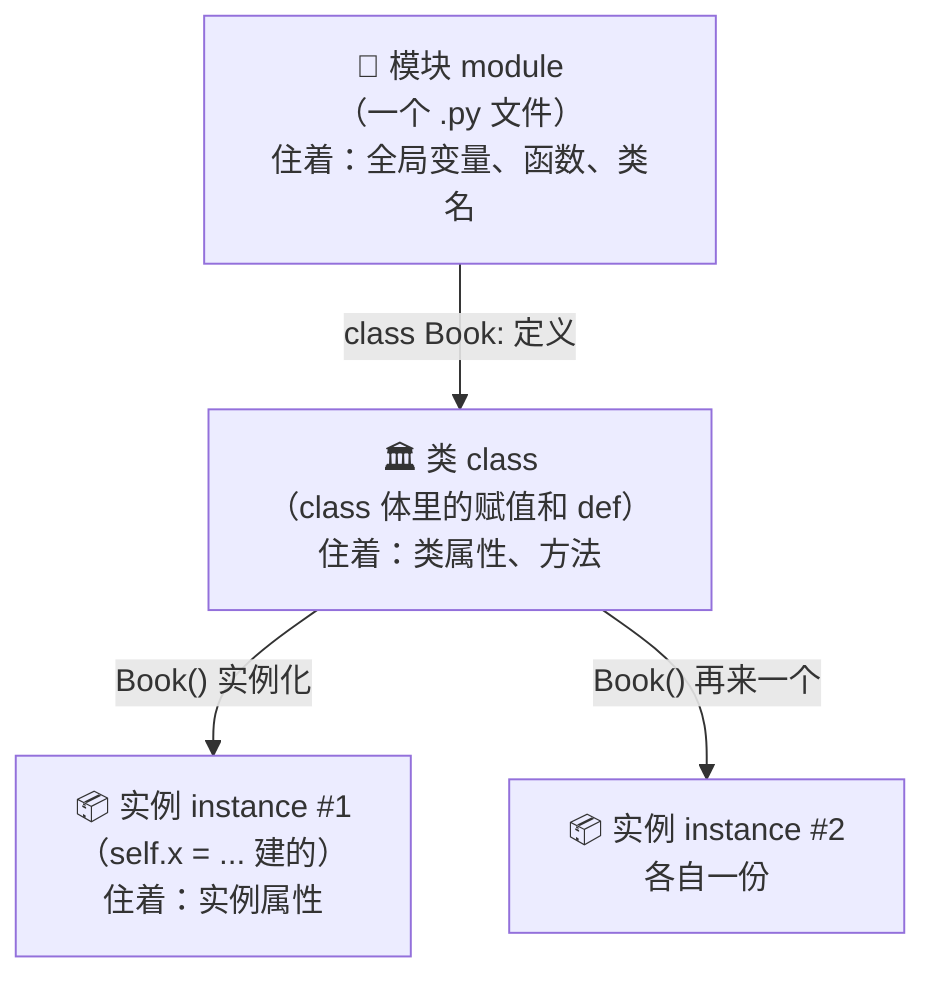
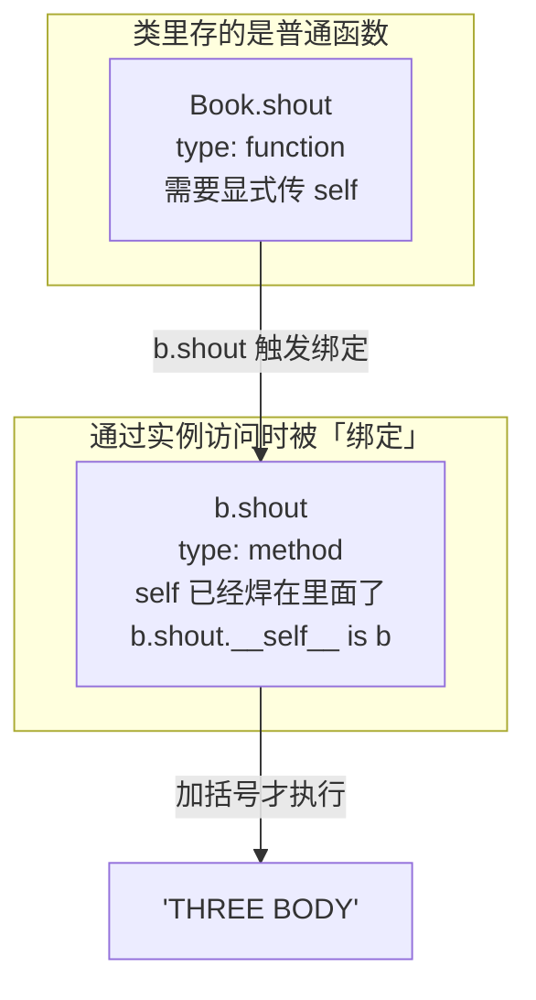
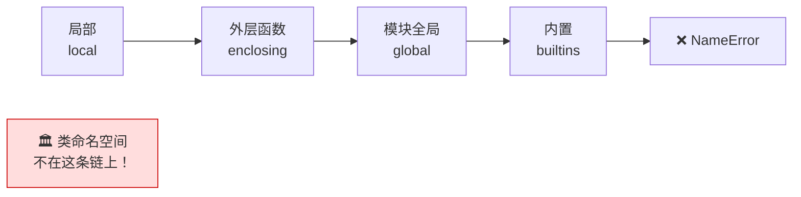
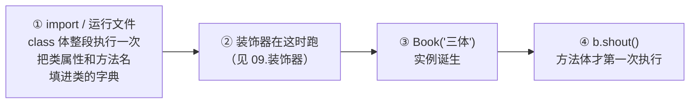
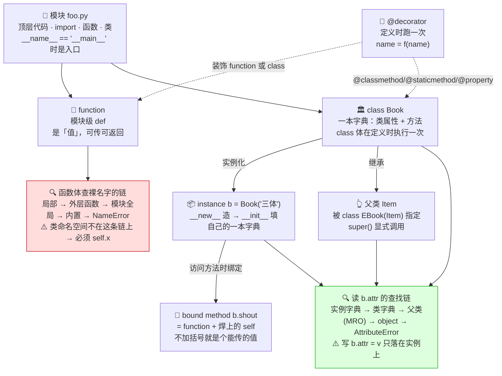

---
tags:
  - python/oop
  - class
  - inheritance
---

# Python 面向对象：一条主线读懂 class

`class` 解决的问题是：**把「一堆相关的数据」和「操作这些数据的函数」捆成一个东西**，从此它们一起出生、一起传递、一起被修改，不会走散。

这份笔记只讲一件事——一个名字（变量、方法、属性）是**住在哪里**、**什么时候被创建**、**被查找时走哪条路**。搞清这三问，`self`、`__init__`、继承、类属性全都是同一套规则的不同侧面，不需要分开背。

> 代码全部在 Python 3.10 实跑过，输出照抄，场景统一用「图书馆」。图是 mermaid，Obsidian 里直接渲染。
>
> **三遍读法**：①第一遍只看每节开头的黑体句 + 代码，能写出第一个 class 就够；②第二遍展开折叠块看实测输出，能预测对就跳过；③第三遍只做「自测」，答不上的回跳。

---

## 思路

面向对象不是「更高级的写法」，它是对一类具体麻烦的回应。先看这个麻烦长什么样：

> [!warning]- 不用 class 会怎样：三个平行的 list
>
> ```python
> titles  = ["三体", "球状闪电"]
> authors = ["刘慈欣", "刘慈欣"]
> pages   = [302, 240]
>
> def describe(i):
>     return f"《{titles[i]}》 {authors[i]} {pages[i]}页"
> ```
>
> 三个 list 靠**下标对齐**维系关系，而这个关系语言层面根本不知道：
>
> - 删一本书要同时删三处，漏一个就**永久错位**，而且不报错；
> - 新增一个字段（比如 `isbn`）要改所有函数；
> - 把「一本书」传给别的函数，得传三个参数。

> [!success]- 用 class：数据和操作捆在一起
>
> ```python
> class Book:
>     def __init__(self, title, author, pages):
>         self.title  = title
>         self.author = author
>         self.pages  = pages
>
>     def describe(self):
>         return f"《{self.title}》 {self.author} {self.pages}页"
>
> books = [Book("三体", "刘慈欣", 302), Book("球状闪电", "刘慈欣", 240)]
> print(books[0].describe())     # 《三体》 刘慈欣 302页
> ```
>
> 一本书就是**一个值**：能进 list、能当参数传、能当返回值。字段和方法绑在一起，不可能错位。

> [!tip]- 核心思路：整份笔记压成两条链
>
> 后面每一节都是这两条链的推论，看不懂某处时回来对一下是哪条链：
>
> ```text
> ① 点号找成员： obj.attr →  实例字典 → 类字典 → 父类(MRO) → object → AttributeError
> ② 裸名字找变量： attr   →  局部 → 外层函数 → 模块全局 → 内置 → NameError
> ```
>
> **两条链互不相通**——类的命名空间只在链 ① 上，不在链 ② 上。这就是 `self.` 不能省的全部原因（第 4 节）。

---

## 目录

| 阶段 | 节 | 回答什么问题 |
| --- | --- | --- |
| **能写出来** | 1 第一个 class · 2 三层结构 | 怎么造对象、名字住在哪 |
| **不写错** | 3 `self` 与绑定 · 4 类内互调 · 5 查找链 · 6 类属性 vs 实例属性 | 名字怎么被找到 |
| **写得好** | 7 继承与多态 · 8 四种成员 · 9 私有约定 · 10 `__repr__` | class 上能挂什么 |
| **知其所以然** | 11 定义时 vs 调用时 · 12 选型 | 什么时候发生、什么时候别用 class |
| **复习区** | 13 易错点 · 14 一图流 · 15 速查表 · 16 自测 | 考前十分钟 |

---

## 1. 第一个 class：`__init__` 与 `self`

**`Book("三体")` 做两件事：造一个空对象，然后调用 `__init__` 往里面填字段。**

```python
class Book:
    def __init__(self, title):     # 初始化器：造好对象后立刻被调用
        self.title = title         # 在这个实例的字典里创建 title 字段

    def shout(self):               # 方法：第一个参数固定是 self
        return self.title.upper()

b = Book("three body")
b.shout()                          # 'THREE BODY'
```

三个必须记住的点：

- **`self` 就是「这个对象自己」**，由 Python 自动传入，你调用时不用写。
- **字段不需要提前声明**，`self.title = x` 在第一次赋值时就地创建。
- **`__init__` 不是构造器，是初始化器**，它只负责往已经造好的对象里填东西。

> [!example]- 完整过程：`__new__` 造壳，`__init__` 填瓤
>
> ```mermaid
> graph LR
>     A["Book('三体')"] --> B["__new__(cls)<br/>分配一个空实例<br/>（99% 情况不用管）"]
>     B --> C["__init__(self, '三体')<br/>self.title = '三体'<br/>往实例字典里填字段"]
>     C --> D["返回填好的实例<br/>b.__dict__ == {'title': '三体'}"]
> ```
>
> 平时只需要写 `__init__`。`__new__` 只在做不可变类型子类、单例这类特殊场景才碰。

> [!warning]- 三个初学者一定会撞的坑
>
> **① 没有构造器重载。** 同名的 `def` 后者静默覆盖前者，不会报错也不会按参数个数分派：
>
> ```text
> 3a) 没有重载    : TypeError -> Weird.__init__() missing 1 required positional argument: 'b'
> 3b) 只有后一个生效: {'a': 1, 'b': 2}
> ```
>
> 想要「多种建对象的方式」，用这两个标准手法代替：
>
> ```python
> def __init__(self, title, pages=0): ...        # ① 默认参数（优先用这个）
>
> @classmethod
> def from_json(cls, blob):                       # ② 命名构造器（见第 8 节）
>     return cls(**json.loads(blob))
> ```
>
> **② `__init__` 不能有返回值。** 必须返回 `None`，`return` 别的会 `TypeError`（实测 `3c) __init__ 返回 : None`）。
>
> **③ 字段名拼错不报错。** `self.titel = x` 会安安静静地多创建一个属性，然后你在别处读 `self.title` 时才炸。这是「不用声明」的代价。

---

## 2. 三层结构：名字住在三本字典里

**Python 里的名字住在三种容器里，每种容器就是一本字典。**



| 容器 | 怎么打印出来看 | 里面装什么 |
| --- | --- | --- |
| 模块 | `globals()` | 顶层变量、`def brew`、`class Book` |
| 类 | `vars(Book)` | `count = 0`、`def shout` |
| 实例 | `vars(b)` 或 `b.__dict__` | `self.title = ...` |

实测（`Library` 里只写了一个类属性和一个方法）：

```text
A5) 命名空间里有什么: ['city', 'open_hours']
```

**这一节要带走的一句话**：类和实例是**两个不同的容器**，方法住在类里，`self.xxx` 住在实例里。第 5、6 节全部由这张图推出来。

> [!tip]- 术语：命名空间 ≠ 作用域
>
> 「一本存名字的字典」叫**命名空间 namespace**；「函数体里能自动看见哪些名字」叫**作用域 scope**。
>
> 两者不是一回事——类有自己的命名空间，但它**不构成作用域**。第 4 节就是这句话的直接后果。

---

## 3. `self`：第一个参数，以及「绑定」这件事

**`b.shout()` 只是 `Book.shout(b)` 的语法糖。`self` 就是那个被自动塞进去的实例。**



> [!example]- 实测：两种调法完全等价
>
> ```text
> 2a) 实例调用      : 11          ← c.bump()
> 2b) 类上直接调用  : 12          ← Counter.bump(c)，手动喂 self，完全等价
> 2c) 方法是函数吗  : <class 'function'> | <class 'method'>
> 2d) bound 的实例  : True        ← c.bump.__self__ is c
> ```
>
> 同一个 `def`，从类上拿到的是 `function`，从实例上拿到的是 `method`——差别就是后者把 `self` 焊进去了。

**`self` 出现在三个场合中的两个**，这是最容易讲混的地方：

| 场合 | 写不写 `self` | 长什么样 |
| --- | --- | --- |
| **定义**方法时 | 写，作为第一个形参 | `def shout(self):` |
| 类**内部**调用 | 写，作为访问入口 | `self.title_line()` |
| 类**外部**调用 | **不写**，自动绑定 | `b.shout()` |

`self` 只是**约定名**，不是关键字（写 `def shout(this)` 也能跑）。但永远写 `self`——改名不报错，只让所有读代码的人皱眉。

> [!tip]- 进阶：`b.shout` 不加括号是个能传的值
>
> **括号是「执行按钮」。** `b.shout` 是那个已经捆好实例的可调用对象，`b.shout()` 才是它的执行结果。
>
> 所以下面这种写法是成立的，而且很常用：
>
> ```python
> handlers = [b.shout, b.describe]     # 把方法装进 list
> sorted(books, key=Book.get_pages)    # 当 key 传给排序
> ```
>
> 绑定方法就是内置版的闭包——「把上下文焊进一个可调用对象」。同样的思路见 [[06.lamda]]。

---

## 4. 类内互调**必须**写 `self.`

```python
class Book:
    def title_line(self):
        return "《三体》"

    def describe_wrong(self):
        return "这本书是 " + title_line()        # ❌
    def describe_right(self):
        return "这本书是 " + self.title_line()   # ✅ Python 必须这样
```

```text
1a) self.method() : 这本书是 《三体》
1b) 裸名字调用   : NameError -> name 'title_line' is not defined
```

**为什么**：函数体查裸名字只走「思路」里的链 ②——



**类命名空间不在这条链上。** 所以裸名字找不到方法，报的是 `NameError`（「根本没这个名字」）而不是 `AttributeError`（「有对象但没这个成员」）——**这个报错的区别本身就证明了 Python 压根没去类里找**。

**一句话记法：类是命名空间，不是作用域。** 作用域会被自动搜索，命名空间必须显式点进去。

> [!warning]- 有 Java / C++ 背景的话，这是最高频的迁移错误
>
> Java 里 `this.` 可以省略，Python 里 `self.` **不可省略**。看到 `NameError` 提到一个你明明定义了的方法名，先检查是不是漏了 `self.`。

---

## 5. `obj.attr` 到底怎么被找到

**读一个属性时，Python 沿着一条固定的链往下找，第一个命中就返回；全找不到才报 `AttributeError`。**

```text
b.title
 │
 ├─① 实例字典 b.__dict__          ← self.xxx = ... 放在这里
 ├─② 类字典 Book.__dict__          ← 类属性、方法放在这里
 ├─③ 父类字典（按 MRO 顺序）        ← 继承来的
 ├─④ object                        ← 所有类的共同祖先
 └─⑤ ❌ AttributeError
```

这条链的顺序叫 **MRO**（Method Resolution Order），可以直接打印出来看：

```text
D2) MRO 查找链: ['EBook', 'Item', 'object']
```

**方向别搞反**：点号**左边是拥有者，右边是被拥有的名字**，即 `对象.成员`。

> [!warning]- 常见误解：方法和属性是两类东西
>
> 不是——**方法就是「值恰好是函数」的属性**，和 `self.title = "三体"` 存在同一种字典里，只是值的类型不同。
>
> 这也是 `getattr(obj, "shout")()`、`vars(Book)`、`hasattr(obj, "shout")` 能统一工作的原因。判断类型的手段见 [[02. Python 类型判断]]。

---

## 6. 类属性 vs 实例属性：读走链，写落点

**这是第 2 节（两个容器）+ 第 5 节（查找链）的直接推论，也是初学者最常踩的坑。**

```python
class Shelf:
    books = []                  # 类属性：一份，所有实例共用
    def __init__(self):
        self.owner = "unset"    # 实例属性：每个实例一份
```

```text
5a) 类属性被共享  : ['三体']              ← 只往 s1 里 append 过，s2 也看得见
5b) 实例属性独立  : leyan / unset
5c) 赋值会遮蔽    : ['新的'] / ['三体'] / ['三体']
```

> [!example]- 为什么 append 会串、赋值却不会
>
> ```mermaid
> graph TD
>     subgraph "① append：修改的是同一个 list 对象"
>         S1["s1.books.append('三体')"] --> L["Shelf.books<br/>['三体']<br/>（只有一份）"]
>         S2["s2.books 读到的也是它"] --> L
>     end
>     subgraph "② 赋值：在实例上新建同名属性，把类属性遮住"
>         S3["s1.books = ['新的']"] --> N["s1.__dict__['books']<br/>['新的']"]
>         S4["Shelf.books 没变<br/>仍是 ['三体']"]
>     end
> ```
>
> `s1.books.append(...)` 是**先读后改**：读走查找链，找到类里那个 list，然后改它——所有实例看到的是同一个对象。
> `s1.books = [...]` 是**纯写**：直接在 `s1` 自己的字典里新建一个同名属性，把类属性盖住。

**两条铁律**：

1. **读走查找链**（实例 → 类 → 父类），**写只落在被赋值的那个对象上**。所以 `s1.books = [...]` 不是「改类属性」，是「在 s1 上盖一层」。
2. **可变对象（`list` / `dict` / `set`）当类属性 = 所有实例共享同一个容器**。想每个实例一份，就写进 `__init__`。

**判据是缩进层级**：写在 class 体里就是类属性；写在 `__init__` 里带 `self.` 才是实例属性。类属性大致相当于其他语言的 `static` 字段，只是少了 `static` 这个视觉提示。

---

## 7. 继承与多态：`super()` 与「self 永远指最初那个实例」

```python
class Item:
    def __init__(self, title):
        self.title = title
    def label(self):
        return "[item]"
    def describe(self):
        return "描述：" + self.label()      # 调的是谁的 label？

class EBook(Item):
    def __init__(self, title, mb):
        super().__init__(title)             # 必须显式写！
        self.mb = mb
    def label(self):
        return "[ebook]"
```

```text
D1) 子类实例调父类方法: 描述：[ebook]      ← 父类的 describe 里，self.label 走到了子类
4a) 漏写 super() : AttributeError -> 'BadEBook' object has no attribute 'title'
4b) 写了 super()  : [三体](3MB)
4c) 是不是父类实例: True                    ← isinstance(e, Item)
```

> [!tip]- 多态：为什么父类的代码能调到子类的实现
>
> ```mermaid
> graph TD
>     A["EBook('三体', 3).describe()"] --> B["查找链找到 Item.describe<br/>（子类没有，去父类拿）"]
>     B --> C["执行 Item.describe 的函数体<br/>里面写着 self.label()"]
>     C --> D["self 是「最初那个 EBook 实例」<br/>不因为代码写在父类里而变"]
>     D --> E["于是 self.label 重新走查找链<br/>先命中 EBook.label ✅"]
>     E --> F["'描述：[ebook]'"]
> ```
>
> **这就是多态 polymorphism**：父类只写「流程」，把某一步留给子类实现。
>
> 关键机制只有一句：**`self` 始终指向最初被调用的那个实例，不管当前执行的代码写在哪个类里。**

> [!warning]- `super()` 不写就不调，而且报错点离案发现场很远
>
> | 写法 | 什么时候用 | 不写的后果 |
> | --- | --- | --- |
> | `super().__init__(...)` | 子类定义了 `__init__` | 父类字段**根本没被创建**，报错延迟到用它时（`4a`） |
> | `super().method()` | override 后还想复用父类实现 | 变成完全替换而非扩展 |
>
> Java 会隐式插一句 `super()`，**Python 不会**。而 `4a` 的错误是在 `label()` 里炸的，不是在构造时——这正是它难查的原因。
>
> **子类不写 `__init__` 时，直接继承父类的，什么都不用管。** 生态里最常见的例子就是自定义异常：
>
> ```python
> class ConfigError(Exception):     # 一行都不用写，构造行为全继承
>     pass
>
> raise ConfigError("缺少 API key")
> ```

---

## 8. 四种成员：装饰器决定「第一个参数是谁」

**`@classmethod` / `@staticmethod` / `@property` 不是新语法，就是三个内置装饰器。它们唯一的作用是改变「访问时怎么绑定」。**

```python
class Book:
    count = 0

    def shout(self):            return self.title.upper()      # 实例方法
    @classmethod
    def total(cls):             return f"共 {cls.count} 本"     # 类方法
    @staticmethod
    def is_isbn(text):          return len(text) == 13          # 静态方法
    @property
    def initial(self):          return self.title[0]            # 属性方法
```

| 成员 | 第一个参数 | 怎么调 | 什么时候用它 |
| --- | --- | --- | --- |
| 实例方法 | `self`（实例） | `b.shout()` | 要用实例数据——**默认选它** |
| `@classmethod` | `cls`（类） | `Book.total()` | 命名构造器 `from_json`、类级计数 |
| `@staticmethod` | 无 | `Book.is_isbn(x)` | 逻辑上属于这个类但不碰任何状态 |
| `@property` | `self` | `b.initial`（**无括号**） | 让「算出来的值」看起来像字段 |

> [!example]- 实测：四者的类型差异
>
> ```mermaid
> graph TD
>     subgraph "第一个参数是什么？"
>         A["实例方法<br/>def f(self)"] --> A1["self = 实例<br/>要数据"]
>         B["@classmethod<br/>def f(cls)"] --> B1["cls = 类本身<br/>要类型/计数/建对象"]
>         C["@staticmethod<br/>def f(x)"] --> C1["什么都不给<br/>只是放在类里的工具函数"]
>         D["@property<br/>def f(self)"] --> D1["self = 实例<br/>但访问时「不写括号」"]
>     end
> ```
>
> ```text
> B1) 实例方法: THREE BODY
> B2) 类方法  : Book 共 1 本 | Book 共 1 本      ← Book.total() 和 b.total() 都行
> B3) 静态方法: True
> B4) property: t   ← 没写括号
>
> B5) 各自的类型（类字典里存的 | 通过实例访问后的）:
>     shout    function     | method     ← 访问时被绑定成 method
>     total    classmethod  | method     ← 绑的是类，不是实例
>     is_isbn  staticmethod | function   ← 不绑定，还是普通函数
>     initial  property     | str        ← 访问就调用了，拿到的是返回值
> ```

**判据口诀**：要 `self` 就是实例方法；只要类不要实例 → `classmethod`；两个都不要 → 那它为什么在类里？（答案通常是「为了归类」，也可以直接搬到模块级函数。）

> [!tip]- `@property` 的真正价值：让接口稳定
>
> 它把 `b.get_initial()` 变成 `b.initial`，**调用方的写法和普通字段一模一样**。
>
> 好处在以后：想加校验、加缓存、改成从数据库读，只要改实现，**调用方一行都不用动**。这是「接口稳定」的一个小型样例。
>
> `@` 这个符号本身是什么、为什么它能改变绑定行为，见 [[09.装饰器]]。这一节只需要知道「它们是三个内置装饰器」就够。

---

## 9. 私有：没有 `private`，只有约定和改名

```text
7a) 下划线能访问  : 约定：别碰
7b) 双下划线改名  : ['_Vault__hard']
7c) 改名后仍可拿  : 会被改名
```

| 写法 | 语言做了什么 | 真实含义 |
| --- | --- | --- |
| `x` | 无 | 公开 |
| `_x` | **什么都没做** | 约定「内部使用」，靠自觉，lint 工具会警告 |
| `__x` | 改名成 `_ClassName__x`（name mangling） | 防**子类意外重名**，不是防访问 |

Python 的口号是 "we're all consenting adults"——没有强制访问控制。`__x` 常被误解成 private，它的真实用途是避免继承时撞名；照样能用 `v._Vault__hard` 拿到。

标准库里到处是这个约定，比如 `random` 模块的 `random._inst`（模块级的那个共享实例）——单下划线在说「这是实现细节，我随时可能改」。完整的命名约定见 [[05. 命名规范]]。

---

## 10. `__repr__`：让对象能被打印

**新手第一次 `print(一个对象)` 都会撞上这个：**

```python
class Book:
    def __init__(self, title):
        self.title = title

print(Book("三体"))        # <__main__.Book object at 0x000001F3A2C4E110>   ← 没法看
print([Book("三体")])      # [<__main__.Book object at 0x000001F3A2C4E110>]
```

加一个 `__repr__` 就解决：

```python
class Book:
    def __init__(self, title):
        self.title = title
    def __repr__(self):
        return f"Book({self.title!r})"      # !r 表示对字段也用 repr

print(Book("三体"))        # Book('三体')
print([Book("三体")])      # [Book('三体')]     ← 容器里也好看了
```

> [!tip]- `__repr__` 和 `__str__` 只写一个的话，写 `__repr__`
>
> | | 给谁看 | 谁会调它 |
> | --- | --- | --- |
> | `__repr__` | **开发者**，追求无歧义、最好能复制回代码 | 调试器、`repr()`、**容器里的元素**、交互式解释器回显 |
> | `__str__` | **用户**，追求可读 | `print()`、`str()`、f-string |
>
> **只写 `__repr__` 的原因**：`print()` 找不到 `__str__` 会**回退到 `__repr__`**，反过来不成立。所以写 `__repr__` 一次，两个场合都覆盖。
>
> 这类 `__双下划线__` 的方法叫**魔术方法 / dunder method**，Python 用它们让自定义类接入内置语法：`__len__` 让 `len(obj)` 能用，`__eq__` 让 `a == b` 能用，`__iter__` 让 `for x in obj` 能用。`__init__` 只是其中最常见的一个。

---

## 11. 时间轴：定义时 vs 调用时

**Python 里「定义」和「执行」是两个不同时刻。混淆它们会产生一类很难查的 bug**——第 6 节的类属性共享坑，根源就在这里。

```python
print("=== A ===")

class Library:
    print("A1) class 体在定义时就执行了")
    city = "Edinburgh"

    def open_hours(self):
        print("A2) 方法体只有被调用时才执行")

print("A3) 定义完了，还没建任何实例")
Library().open_hours()
```

实测输出的**顺序**就是答案：

```text
A1) class 体在定义时就执行了       ← 先
A3) 定义完了，还没建任何实例        ← 再
A2) 方法体只有被调用时才执行        ← 最后（被调用才执行）
```



**为什么这重要**：`class` 体里的代码是**普通语句**，不是声明。写 `books = []` 在 class 体里 = 「在类的字典里放一个 list，**只放一次**」——这就是第 6 节共享坑的完整解释。

> [!tip]- 副产品一：类和函数也是「值」
>
> ```text
> A4) class 本身也是对象: <class 'type'>
> 6b) 函数也是对象      : 我是挂在函数上的属性     ← Book.title_line.tag = "..."
> ```
>
> 在 Python 里，类是对象，函数是对象——它们都能被赋值、传参、返回、挂属性。这条在别的语言里不成立（Java 的方法不能单独拿出来当值）。
>
> 它是很多写法的地基：`sorted(key=...)` 能接函数、闭包工厂能返回函数、装饰器能存在、`b.shout` 不加括号能到处传（第 3 节）。相关见 [[06.lamda]]。

> [!tip]- 副产品二：`@` 一行公式（详见 [[09.装饰器]]）
>
> **`@f` 就是 `name = f(name)`。** 拿名字当前指向的对象去调 `f`，再把返回值绑回这个名字。
>
> ```python
> @wrap
> def hello(): ...
>
> # 完全等价于：
> def hello(): ...
> hello = wrap(hello)
> ```
>
> 装饰器就在**定义那一刻**跑，只跑一次——这正是它出现在「时间轴」这一节的原因。第 8 节的 `@classmethod` / `@staticmethod` / `@property` 全都是这条公式的应用。

> [!tip]- 副产品三：`if __name__ == "__main__":` 守卫
>
> Python 没有 Java 那种「必须写在 class 里的 `main`」，**模块顶层的代码本身就是主程序**。
>
> ```text
> E1) __name__ 现在是: __main__          ← 直接 python foo.py
> E2) 被 import 时会是: foo（模块名）
> ```
>
> ```mermaid
> graph TD
>     A["python foo.py<br/>直接运行"] --> B["__name__ == '__main__'"] --> C["守卫内代码执行 ✅"]
>     D["import foo<br/>被别人导入"] --> E["__name__ == 'foo'"] --> F["守卫内代码跳过 ⛔"]
> ```
>
> **它解决什么问题**：一个 `.py` 既想能被直接跑（当脚本），又想能被 `import`（当库）。没有这个守卫，别人 `import` 你的文件时，你的主流程会**立刻执行一遍**——测试文件 import 生产模块时莫名跑起真实逻辑，就是这么来的。

---

## 12. 与相近写法怎么选：别什么都写成 class

初学者最容易矫枉过正，把只装数据的东西也写成完整 class。选型看两件事：**有没有行为**、**字段固不固定**。

| 需求 | 用什么 | 理由 |
| --- | --- | --- |
| 一包数据 **+ 操作它的方法** | `class` | 本篇讲的全部 |
| 只是一包数据，字段固定 | `@dataclass` | 自动生成 `__init__` / `__repr__` / `__eq__` |
| 只是一包数据，还要不可变 / 能当 dict 的 key | `NamedTuple` 或 `@dataclass(frozen=True)` | 可哈希 |
| 字段**不固定**、要动态增删键 | `dict` | class 的字段是写死在代码里的 |
| 只有一个函数、没有状态 | 模块级 `def` | 别为了归类硬套 class |

> [!success]- `@dataclass`：省掉八成样板代码
>
> ```python
> from dataclasses import dataclass
>
> @dataclass
> class Book:
>     title: str
>     author: str
>     pages: int = 0        # 有默认值的要放后面
>
> b = Book("三体", "刘慈欣", 302)
> print(b)                          # Book(title='三体', author='刘慈欣', pages=302)
> b == Book("三体", "刘慈欣", 302)   # True   ← 普通 class 这里是 False
> ```
>
> 上面这几行等价于手写 `__init__` + `__repr__` + `__eq__` 三个方法。它就是一个**装饰类的装饰器**（第 11 节的公式对类同样成立）。
>
> 什么时候仍然要手写 class：需要 `@property` 做校验、需要复杂的初始化逻辑、需要继承体系。
>
> 注意 `b == Book(...)` 那一行——**普通 class 比较两个实例时，默认比的是「是不是同一个对象」**，所以两个字段完全相同的实例也不相等。`a is b` 与 `a == b` 的完整区别见 [[06. 相同对象的判定]]。

---

## 13. 常见易错点

> [!warning]- 易错点
>
> - **类内调另一个方法漏写 `self.`**：报 `NameError` 而不是 `AttributeError`，因为类命名空间根本不在裸名字的查找链上（第 4 节）。
> - **可变对象当类属性**：`books = []` 写在 class 体里只创建一次，所有实例共享；要每个实例一份就写进 `__init__`（第 6、11 节）。
> - **以为 `s1.books = [...]` 改了类属性**：写只落在被赋值的那个对象上，类属性纹丝不动（第 6 节）。
> - **子类漏写 `super().__init__()`**：Python 不会隐式调用，父类字段根本没被创建，而且报错点离案发现场很远（第 7 节）。
> - **以为有构造器重载**：同名 `def` 后者静默覆盖前者，用默认参数或 `@classmethod` 代替（第 1 节）。
> - **字段名拼错**：不报错，只是悄悄多出一个新属性，等读的时候才炸（第 1 节）。
> - **`@property` 加了括号调用**：`b.initial()` 会去调用返回值，通常报 `'str' object is not callable`（第 8 节）。
> - **把 `__x` 当 private**：它只是改名防撞名，`v._Vault__hard` 照样能拿（第 9 节）。
> - **`print(obj)` 出来一串地址**：没写 `__repr__`（第 10 节）。
> - **用 `a == b` 比较两个自定义对象**：默认比的是身份不是内容，要么写 `__eq__`，要么直接用 `@dataclass`（第 12 节）。

> [!summary]- 四个报错信息的诊断表（考场上最有用的一栏）
>
> | 报错 | 大概率原因 |
> | --- | --- |
> | `NameError: name 'x' is not defined` | 裸名字调方法，忘了 `self.`（第 4 节） |
> | `AttributeError: 'X' object has no attribute 'y'` | 漏写 `super().__init__()`，或字段名拼错（第 7、1 节） |
> | `TypeError: f() missing 1 required positional argument` | 以为有重载（第 1 节），或 `@staticmethod` 忘了加 |
> | `TypeError: 'X' object is not callable` | 该加括号的没加 / 不该加的加了（第 3、8 节） |

---

## 14. 一图流



**整份笔记压成两条链**：绿色那条是「点号怎么找成员」，红色那条是「裸名字怎么找变量」。两条链互不相通，这就是 `self.` 不能省的全部原因。

---

## 15. 速查表

| 想做的事 | 写法 | 陷阱 |
| --- | --- | --- |
| 建一个对象 | `def __init__(self, ...)` 里写 `self.x = ...` | 没有构造器重载（第 1 节） |
| 类内调另一个方法 | `self.other()` | 裸名字 → `NameError`（第 4 节） |
| 每个实例一份的字段 | 写在 `__init__` 里 `self.x = ...` | 写在 class 体里会被共享（第 6 节） |
| 所有实例共享的常量 | 写在 class 体里 | 别用可变对象（第 6 节） |
| 调父类构造 | `super().__init__(...)` | 不写就不调，报错延迟（第 7 节） |
| 复用父类实现 | `super().method()` | — |
| 多种建对象方式 | 默认参数 或 `@classmethod` | 没有构造器重载（第 1 节） |
| 算出来的值当字段用 | `@property` | 访问时不加括号（第 8 节） |
| 不碰状态的工具 | `@staticmethod` | 也可以直接放模块级 |
| 标记「内部使用」 | `_x` | 语言不拦你（第 9 节） |
| 让对象能 print | `def __repr__(self)` | 只写一个就写 `__repr__`（第 10 节） |
| 让两个对象能比内容 | `def __eq__(self, other)` 或 `@dataclass` | 默认比的是身份（第 12 节） |
| 只装数据不要行为 | `@dataclass` | 字段不固定就该用 dict（第 12 节） |
| 一个文件既能跑又能 import | `if __name__ == "__main__":` | 不写会在被 import 时执行主流程（第 11 节） |
| 把方法当值传 | `b.shout`（不加括号） | 加括号就变成结果了（第 3、11 节） |

---

## 16. 自测

**能写出来**
1. `__init__` 里的 `self.title = title` 做了什么？这个字段需要提前声明吗？
2. `b.shout()` 的等价写法是什么？`Book.shout` 和 `b.shout` 的类型一样吗？
3. Python 有构造器重载吗？没有的话，「多种建对象方式」怎么写？

**名字住在哪**
4. 类属性、实例属性、模块全局变量分别住在哪本字典里？怎么打印出来看？
5. 类里 `def a` 和 `def b`，`b` 里写 `a()` 会报什么错？**为什么是那个错而不是 `AttributeError`**？
6. `type(Book)` 是什么？这说明了什么？

**查找链**
7. 读 `b.title` 时 Python 依次去哪几个地方找？找不到报什么？
8. `books = []` 写在 class 体里和写在 `__init__` 里，差别是什么？`s1.books = ["新的"]` 之后 `Shelf.books` 变了吗？
9. 父类的 `describe()` 里写 `self.label()`，子类 override 了 `label`——执行时调的是谁的？为什么？
10. 子类漏写 `super().__init__()` 会**在什么时候**报错？为什么难查？

**成员与惯例**
11. `@classmethod`、`@staticmethod`、`@property` 三者的第一个参数分别是什么？各自什么时候用？
12. `_x` 和 `__x` 分别对语言做了什么？哪个才有实际效果、效果是什么？
13. `print(book)` 出来一串地址，加什么方法能解决？为什么优先写 `__repr__` 而不是 `__str__`？

**时间轴与选型**
14. `class` 体里的 `print(...)` 什么时候执行？方法体里的呢？这跟第 8 题的坑有什么关系？
15. 不写 `if __name__ == "__main__":` 会出什么问题？
16. 什么时候该用 `@dataclass` 而不是手写 class？什么时候连 `@dataclass` 都不该用？

> 答不上的题号 → 回跳对应小节（1–3 → 第 1、3 节 · 4–6 → 第 2、4 节 · 7–10 → 第 5、6、7 节 · 11–13 → 第 8、9、10 节 · 14–16 → 第 11、12 节）。

---

## 一句话总结

class 就是**把数据和操作数据的函数捆成一个值**；而理解它只需要两条链——**点号沿「实例 → 类 → 父类」找成员，裸名字沿「局部 → 全局 → 内置」找变量**，两条链互不相通，所以 `self.` 永远不能省。

---

## 模板归纳

写一个 class 时，按这个顺序填空：

```python
class Book:                            # ① 名字用大驼峰
    count = 0                          # ② 类属性：所有实例共享（别放 list/dict）

    def __init__(self, title, pages=0):    # ③ 初始化器：默认参数代替重载
        self.title = title                 #    实例属性：每个实例一份
        self.pages = pages
        Book.count += 1                    #    改类属性要写类名，不能写 self.count

    def __repr__(self):                    # ④ 让它能被 print 和调试
        return f"Book({self.title!r}, {self.pages})"

    def describe(self):                    # ⑤ 实例方法：类内互调必须 self.
        return f"{self.title}：{self.page_label()}"

    def page_label(self):
        return f"{self.pages} 页"

    @property                              # ⑥ 算出来的值当字段用（无括号访问）
    def initial(self):
        return self.title[0]

    @classmethod                           # ⑦ 命名构造器
    def from_line(cls, line):
        title, pages = line.split(",")
        return cls(title, int(pages))


class EBook(Book):                     # ⑧ 继承
    def __init__(self, title, pages, mb):
        super().__init__(title, pages)     #    必须显式调用，不写父类字段就不存在
        self.mb = mb

    def page_label(self):                  # ⑨ override：父类的 describe 会自动调到这里
        return f"{self.mb}MB"
```

只装数据不要行为时，整段替换成 `@dataclass`（第 12 节）；`@` 这个符号本身怎么工作，见 [[09.装饰器]]。
