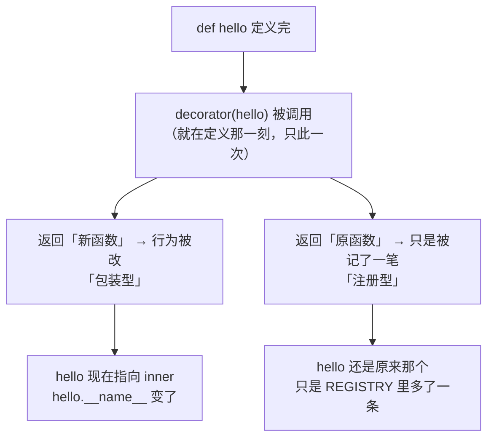
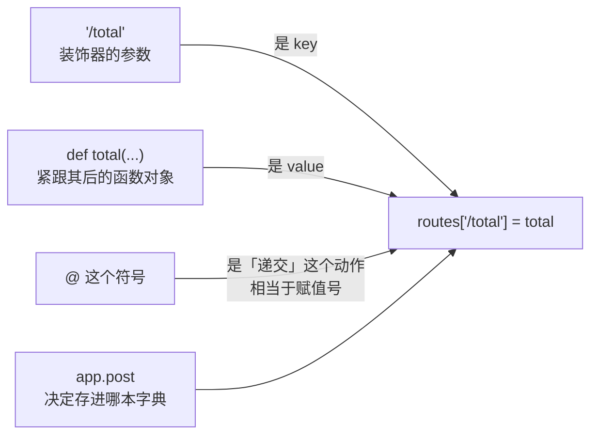

---
tags:
  - python/decorator
  - higher-order-function
  - closure
---

# Python 装饰器：`@f` 就是 `name = f(name)`

装饰器解决的问题是：**给一个已经写好的函数加行为（日志、计时、缓存、重试），或者把它登记进某张表，而调用方一行都不用改**。

它不是新语法，也没有魔法——`@` 只是一个**赋值的简写**。整份笔记只有一行公式要背，其余全是它的推论。

> 前置：函数是「值」这件事（见 [[06.lamda]]）。`@classmethod` / `@staticmethod` / `@property` 的用法见 [[00.python面向对象]] 第 8 节，这里讲的是 `@` 这个符号本身怎么工作。
>
> 代码全部在 Python 3.10 实跑过，输出照抄。

---

## 思路

装饰器唯一需要的前提是：**在 Python 里函数是普通的值**，可以赋给变量、当参数传、当返回值递出去。

一旦接受这一点，`@` 就没什么可解释的了——它接过下面那个函数、递给你指定的另一个函数、再把结果绑回原来的名字。**所有困惑都来自把 `@` 想成一种特殊语法，而不是一次赋值。**

> [!tip]- 核心思路：唯一要记的公式
>
> **`@f` 就是 `name = f(name)`。** 拿名字当前指向的对象去调 `f`，再把返回值绑回这个名字。
>
> ```python
> @wrap
> def hello(): ...
>
> # 完全等价于：
> def hello(): ...
> hello = wrap(hello)
> ```
>
> 实测两种写法等价（同一个 `shout` 装饰器，两种写法都输出 `HI`）：
>
> ```text
> B1) 手写: HI
> B2) @ 版: HI | 两者等价
> ```
>
> 判断依据：任何看不懂的 `@`，先把它展开成 `name = f(name)` 再读。

---

## 1. 装饰器**不必**返回函数

**`f` 可以返回任何东西，返回值决定这个名字变成什么。** 极端反例——返回一个整数：

```python
def become_42(fn):
    return 42

@become_42
def hello(): return "hi"
```

```text
A1) hello 现在是: 42 | 类型: int
A2) 想调用它: TypeError -> 'int' object is not callable
```

`hello` 这个名字被换成了整数。**装饰器没有「必须返回函数」的规定**——它只是个普通函数，`@` 只负责递参数和绑回名字。

这条虽然没人真这么写，但它是理解后面一切的关键：**装饰器的全部权力就在 `return` 那一句上。**

---

## 2. 两种流派：看 `return` 什么



```python
def wrap(fn):                    # 包装型：返回新函数
    def inner(*args, **kwargs):
        return f"<{fn(*args, **kwargs)}>"
    return inner

REGISTRY = {}
def register(fn):                # 注册型：返回原函数
    REGISTRY[fn.__name__] = fn
    return fn
```

```text
C1) 包装型: <hi>  | 还是原函数吗: False
C2) 注册型: bye   | 还是原函数吗: True
C3) 注册表: ['bye']
```

| | 返回什么 | 原函数被改了吗 | 典型用途 | 生态里的例子 |
| --- | --- | --- | --- | --- |
| **包装型** | 新函数 | 是 | 加日志、计时、重试、缓存 | `functools.lru_cache`、`functools.wraps`、`contextlib.contextmanager` |
| **注册型** | 原函数 | 否 | 建路由表、插件表、钩子表 | `@app.get("/x")`（FastAPI）、`@app.route`（Flask）、`@pytest.fixture`、`@functools.singledispatch` 的 `.register` |

`inner(*args, **kwargs)` 那个写法是为了「原封不动转发任意参数」，`*` / `**` 的含义见 [[08.星星符号]]。

> [!tip]- 为什么 `@app.post("/ask")` 多一层括号
>
> 它是「**返回装饰器**的函数」——先调 `app.post("/ask")` 得到真正的装饰器，再由 `@` 把函数喂给它。
>
> 所以**带参数的装饰器总是三层**：
>
> ```python
> app.post("/ask")        # ① 调用它，得到一个装饰器
>          (handler)      # ② @ 把函数递给这个装饰器
> # 展开：handler = app.post("/ask")(handler)
> ```
>
> 判断方法很简单：`@` 后面**带括号**就是三层，**不带括号**就是两层。

---

## 3. 注册型的「字典模型」：谁是 key、谁是 value

看注册型时，很容易想成「一本字典」。**这个直觉是对的，但角色要对准**——用一个二十行的 `MiniApp` 当模型：

```python
class MiniApp:
    def __init__(self):
        self.routes = {}
    def post(self, path):
        def register(fn):
            self.routes[path] = fn      # ← 全部戏在这一行
            return fn
        return register
```



| 常见说法 | 对不对 | 实际是什么 |
| --- | --- | --- |
| 「`@` 是 key」 | ❌ | `@` 是**递交动作**，相当于 `routes[k] = v` 里的那个 $=$ |
| 「路径字符串是 key」 | ✅ | `app.post("/total")` 的**参数**才是 key |
| 「下面的函数是 value」 | ✅ | 存进表里的就是这个函数对象 |
| 「装饰器去找下面第一个函数」 | ❌ | **方向反了**：是 `@` 把函数**递给**装饰器，装饰器只是收参数的普通函数 |

最后一条的证据是手写等价形式——函数可以叫任何名字、定义在任何地方：

```python
def whatever(amount): ...
app4.post("/hand-written")(whatever)     # 和 @ 完全等价
```

```text
E1) 表里: ['/hand-written'] -> 手写注册的
```

> [!example]- 双向验证：path 和函数名属于两个互不相干的命名空间
>
> ```text
> B1) 表的 key 是: ['/sum']            ← 函数还叫 total，path 换成 /sum
> B3) 用 /total 查: KeyError '/total'   ← key 变了就查不到
>
> C1) key 仍是: ['/total']             ← 函数改名 compute_grand_total
> C2) 表里存的函数叫: compute_grand_total
> ```
>
> 这个解耦是**有意**的：**path 是外部世界（HTTP 客户端）用的名字，函数名是代码内部用的名字**。改 URL 不用重命名函数，重命名函数不会破坏 URL。
>
> 注册型**不吃掉原名字**（因为 `return fn`），所以两条路通向同一个对象：
>
> ```text
> D1) 直接用函数名调: 20
> D2) 两条路通向同一个对象: True        ← app3.routes["/total"] is compute_grand_total
> ```

> [!warning]- `MiniApp` 是简化模型，冲突语义与真 FastAPI 不同
>
> 同一个 path 注册两次时，字典是**后者覆盖**，而 Starlette 的路由是一个**列表**、按顺序匹配、**首个命中即返回**：
>
> ```text
> F1) 只剩一个: second                          ← MiniApp（字典）
> 真 FastAPI 同 path 注册两次 -> {'who': 'first'}  ← 先注册的赢
> 路由表里有几条 /dup: 2                          ← 两条都还在表里
> ```
>
> 字典模型用来理解「谁是 key 谁是 value」够了，但别拿它推断真框架的冲突行为。

---

## 4. 叠加：从下往上套

```python
@outer          # 后套
@inner          # 先套
def core(): return "core"
```

```text
   inner 被调用          ← 贴着函数的先执行
   outer 被调用
C1) 结果: outer(inner(core))
```

直接由公式推出：展开成 `core = outer(inner(core))`，内层先算。**离 `def` 最近的装饰器最先生效。**

---

## 5. 装饰器不止能装函数

```python
def add_tag(cls):
    cls.tag = "我是被装饰器加上的类属性"
    return cls

@add_tag
class Book: pass
```

```text
D1) Book.tag = 我是被装饰器加上的类属性
D2) Book 还是类吗: type
```

`@` 装在 `class` 上照样成立——因为公式里的 `name` 可以是任何名字，而**类也是对象**。生态里最常见的两个就是 `@dataclass` 和 `@pytest.mark.parametrize`。

**推论：字典模型只是注册型这一支的实现细节，不是 `@` 的语义。** `@wrap`、`functools.lru_cache`、`@dataclass`、`@property` 里一张表都没有。

---

## 6. 包装型的必修课：`functools.wraps`

**包装型返回的是一个新函数，原函数的身份信息会全部丢失**——这是写包装型时必踩的坑：

```python
def wrap(fn):
    def inner(*args, **kwargs):
        return fn(*args, **kwargs)
    return inner

@wrap
def hello():
    """打个招呼"""

hello.__name__      # 'inner'    ← 不是 'hello' 了
hello.__doc__       # None       ← 文档字符串没了
```

修法是给内层函数加一个 `@wraps`：

```python
from functools import wraps

def wrap(fn):
    @wraps(fn)                          # 把 fn 的 __name__ / __doc__ 等抄到 inner 上
    def inner(*args, **kwargs):
        return fn(*args, **kwargs)
    return inner

hello.__name__      # 'hello'  ✅
```

> [!warning]- 不加 `wraps` 时，两种装饰器叠在一起会撞车
>
> 回头看第 2 节的注册型——它用 `fn.__name__` 当 key。如果一个函数**先被没写 `wraps` 的包装型装过**，再被注册型收走：
>
> ```python
> @register        # 后套：读到的 __name__ 已经是 'inner'
> @wrap            # 先套：换成了 inner，且没抄 __name__
> def hello(): ...
>
> @register
> @wrap
> def bye(): ...
>
> REGISTRY.keys()    # dict_keys(['inner'])   ← 两个函数抢同一个 key，后者覆盖前者
> ```
>
> 报错现场会离案发点很远：注册表里少了一条，或者调到了错的函数。**写包装型就顺手写 `@wraps`**，没有例外。

---

## 7. 判据：什么时候可以放心用字典模型

**看装饰器 `return` 什么**（这也是区分两型的唯一判据）：

| 看到 | 判定 | 该用哪个模型想 |
| --- | --- | --- |
| `return fn`（原样还回去） | 注册型 | ✅ 字典模型：参数是 key、函数是 value |
| `return inner` / 别的东西 | 包装型 | ❌ 字典模型失效，用 `name = f(name)` 想 |

`@staticmethod` / `@classmethod` / `@property` 属于「返回别的东西」那一支——它们返回的是**描述符对象**，所以在类字典里存的类型分别是 `staticmethod` / `classmethod` / `property`，而不是 `function`（实测见 [[00.python面向对象]] 第 8 节）。

---

## 8. 常见易错点

> [!warning]- 易错点
>
> - **以为 `@` 是一种声明**：它是一次赋值。任何看不懂的装饰器，先展开成 `name = f(name)`。
> - **以为装饰器必须返回函数**：不必。返回什么，名字就变成什么（第 1 节）。
> - **叠加顺序记反**：`core = outer(inner(core))`，**离 `def` 最近的先生效**（第 4 节）。
> - **带参数的装饰器少写一层**：`@app.post("/x")` 里 `app.post("/x")` 先被调用一次，返回的才是装饰器。自己写带参装饰器时要写三层嵌套（第 2 节）。
> - **包装型忘了 `@wraps`**：`__name__` / `__doc__` 丢失，与注册型叠加时还会撞 key（第 6 节）。
> - **把字典模型套到包装型上**：包装型里根本没有表（第 7 节）。
> - **以为「装饰器会去找下面的函数」**：方向反了，是 `@` 把函数递给装饰器（第 3 节）。
> - **认为函数名和注册的 key 有关系**：两个独立的命名空间，改一个不影响另一个（第 3 节）。

---

## 一句话总结

`@f` 就是 `name = f(name)`——在**定义那一刻**执行一次；`f` 返回原函数就是「注册型」（只记一笔，可以用字典模型想），返回新函数就是「包装型」（换掉了名字指向的东西，记得加 `@wraps`）。

---

## 模板归纳

看到任何 `@`，两步读懂：

1. **展开**成 `name = f(name)`；带括号的先算括号：`name = f(参数)(name)`。
2. **看 `f` 的 `return`**：`return fn` → 注册型，原函数没变；`return inner` → 包装型，名字已经换人。

```python
# 模板一：包装型（加行为，调用方不改）
from functools import wraps

def timed(fn):
    @wraps(fn)                              # 必写，否则丢 __name__
    def inner(*args, **kwargs):
        t0 = time.perf_counter()
        result = fn(*args, **kwargs)        # 前后可以插任何逻辑
        print(f"{fn.__name__} 耗时 {time.perf_counter() - t0:.3f}s")
        return result                       # 别忘了把返回值传出去
    return inner


# 模板二：注册型（登记进表，原函数不变）
REGISTRY = {}

def route(path):                            # 带参数 → 三层
    def decorator(fn):
        REGISTRY[path] = fn
        return fn                           # 原样还回去，名字不被吃掉
    return decorator


@timed
@route("/total")
def total(items): ...
```

相关笔记：[[00.python面向对象]]（`@classmethod` / `@property` 的用法与四种成员）· [[06.lamda]]（函数是值、闭包）· [[08.星星符号]]（`*args` / `**kwargs` 转发）
