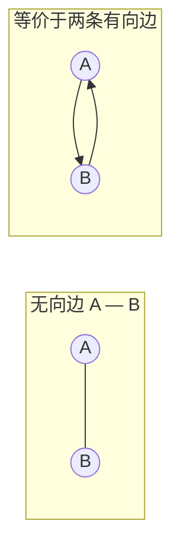
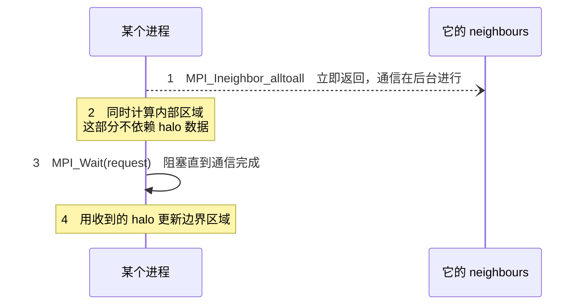
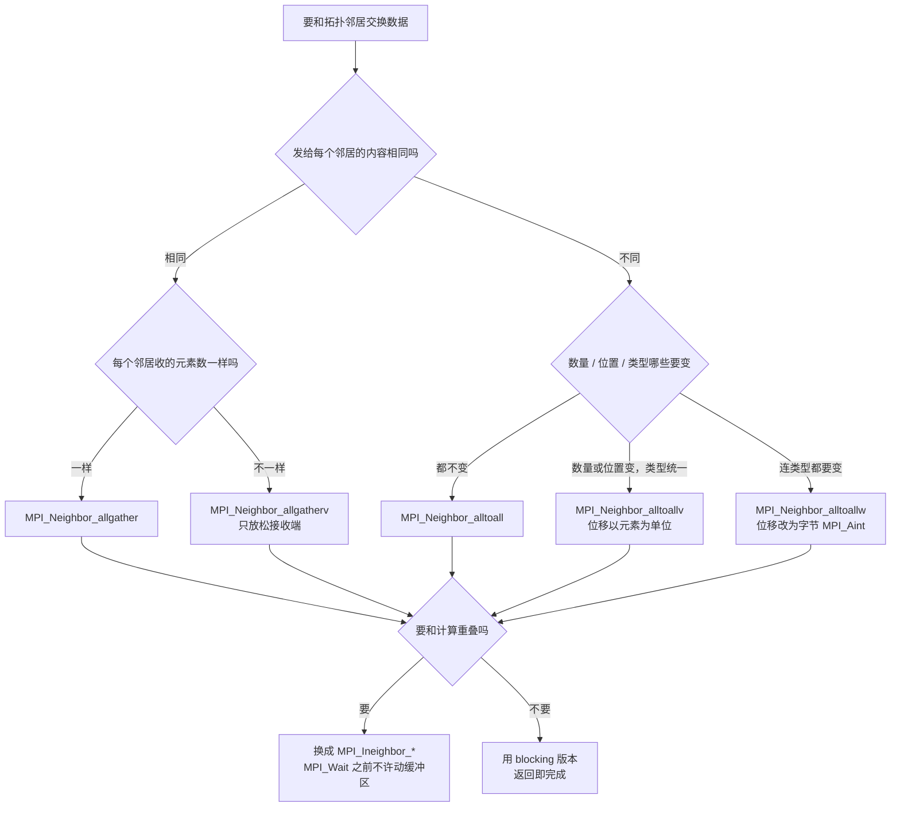

#course/ampp #mpi/neighbourhood #mpi/topology #type/lecture #status/review

> [!info] 知识图谱
> 前置：[[W5|W5 高级虚拟拓扑原始稿]] · 后续：[[07 单边通信与 RMA]] · 配套实验：[[T 6 p|T6 实验原始稿]] · 课堂测验：[[T6 q|T6 习题原始稿]] · 原始导出稿：[[T 6|T6 原始稿]] · 手写批注：[[T 6 - Ink.svg]]

# 06. 邻域集体通信：只跟邻居说话的 collective

邻域集体通信 Neighbourhood collective operations 要解决的是一件事：**很多科学计算里，一个进程只需要跟拓扑上相邻的少数几个进程交换数据，却不得不用面向全体的 collective 去表达**。MPI 3.0 把「邻居」这个概念直接做进了 collective 里。

一句话先钉死最容易错的地方：**它们仍然是 collective**——名字里的 neighbourhood 只限制**数据流向谁**，不放松**谁必须调用**。communicator 里所有进程都得调，少一个就死锁。

本讲的五个函数是两条正交的轴：

| | 发给每个邻居的数据 | 每个邻居的 count / 位移 | 每个邻居的 datatype |
| --- | --- | --- | --- |
| `MPI_Neighbor_allgather` | **相同** | 相同 | 相同 |
| `MPI_Neighbor_allgatherv` | **相同** | **可不同**（仅接收端） | 相同 |
| `MPI_Neighbor_alltoall` | **不同** | 相同 | 相同 |
| `MPI_Neighbor_alltoallv` | **不同** | **可不同**（收发两端） | 相同 |
| `MPI_Neighbor_alltoallw` | **不同** | **可不同**，且单位是**字节** | **可不同** |

---

## 一、为什么需要邻域集体通信

出发点是一个具体场景：**每个进程持有一个数值，想算出它所有邻居数值的和**。这是对邻居做局部 reduction，不是对整个 communicator 做全局 reduction。

MPI 3.0 之前只能绕：给每一组「某进程 + 它的邻居」建一个 sub-communicator，在每个子通信器里做一次全局 reduction。

> [!warning]- 易错点：sub-communicator 方案为什么不可行
>
> 三条理由，都是结构性的，不是实现质量问题：
>
> 1. **MPI 不是为成千上万个 communicator 设计的**——communicator 是重对象，进程数一大，子通信器数量会爆炸；
> 2. **不同 communicator 之间的 collective 会引入延迟**（introduction delays）——每个子通信器的 collective 各自同步，串起来就是一串屏障；
> 3. **没有跨 communicator 优化**——同一个值可能要被送进多个子通信器，runtime 看不到全局，只能重复搬运。
>
> 净效果：通信开销变大、runtime 无法全局优化、管理复杂度上升。

真正的解法是**先把连接关系告诉 MPI**。一旦 communicator 带上 topology（虚拟拓扑，见 [[W5|W5 高级虚拟拓扑]]），runtime 就拿到了**完整的 connectivity information**，每个进程的邻居是谁不再是程序员脑子里的知识，而是 MPI 自己能查的数据。

MPI 3.0 在此基础上引入 neighbourhood collective operations：**只在每个进程的邻居之间做数据交换或 reduction**。收益：

1. 不需要大量 sub-communicator；
2. runtime 可以基于拓扑信息做底层优化（通信路径、调度）；
3. 通信规模从 $O(P)$ 降到 $O(\text{degree})$，$\text{degree}$ 是该进程在拓扑中的邻居数；
4. 天然贴合 structured grid、Cartesian topology 这类应用。

规则网格的 degree 是常数：2D 网格内部点 degree = 4，边界点 degree = 2 或 3。所以进程数再多，单个进程的通信量也不变——这才是它比全局 collective 快的根本原因。

> [!warning]- 最容易错的一点：neighbourhood collective 仍然是 collective
>
> **必须由 communicator 中的所有 MPI process 调用**。哪怕某个进程的邻居集合是空的、哪怕它这一轮什么都不想收发，它也必须调用。
>
> 有进程没调 → 程序错误或死锁，和普通 collective 完全一样。
>
> 记忆方式：**neighbourhood 修饰的是「数据去哪」，不是「谁要来」。**

## 二、Allgather 系列：发给每个邻居的是同一份

`MPI_Neighbor_allgather` 和 `MPI_Allgather` 的关系很简单：**收集范围从「communicator 里所有进程」缩成「拓扑里的 incoming neighbours」**。

| 操作 | 收集范围 |
| --- | --- |
| `MPI_Allgather` | 所有 processes |
| `MPI_Neighbor_allgather` | **仅 neighbours** |

拓扑用无向边描述时要记住一条换算规则：**一条无向边 A — B 等价于两条有向边 A → B 和 B → A**，也就是通信是双向的。



一次交换的三个阶段（以某进程 P 有 3 个邻居为例）：

```text
              MPI_Neighbor_allgather：发给每个邻居的是同一份数据

 交换前   进程 P    sendbuf: [ P ]        recvbuf: [ ? ][ ? ][ ? ]
                                                    ↑    ↑    ↑
                                                   n0   n1   n2

 交换中   P ──[P]──> n0          同时     n0 ──[n0]──> P
          P ──[P]──> n1                   n1 ──[n1]──> P
          P ──[P]──> n2                   n2 ──[n2]──> P
          └─ 三份内容完全相同 ─┘           └─ 三份内容互不相同 ─┘

 交换后   进程 P    recvbuf: [ n0 ][ n1 ][ n2 ]
                             顺序 = topology 定义的 incoming neighbour 顺序
                             长度 = recvcount × indegree
                             非邻居进程的数据不会出现在这里
```

> [!success]- 代码：MPI_Neighbor_allgather 原型与参数
>
> ```c
> int MPI_Neighbor_allgather(
>     const void*  sendbuf,     // 发送缓冲区，只有一份数据
>     int          sendcount,   // 发送元素个数
>     MPI_Datatype sendtype,    // 发送数据类型
>     void*        recvbuf,     // 接收缓冲区
>     int          recvcount,   // 从每个 neighbour 接收的元素个数
>     MPI_Datatype recvtype,    // 接收数据类型
>     MPI_Comm     comm         // 必须是带 topology 的 communicator
> );
> ```
>
> 三条必须写死的语义：
>
> 1. **是 collective**，communicator 内所有进程都要调用；
> 2. 每个进程向**所有 outgoing neighbours** 发送同一份数据，从**所有 incoming neighbours** 接收；
> 3. `recvbuf` 的大小必须是 $recvcount \times indegree$，其中 $indegree$ 是 incoming neighbours 的数量。

`MPI_Neighbor_allgather` 有一条硬限制：**每个进程必须从每个 neighbour 接收相同数量的元素**。`recvcount` 是一个标量，对所有邻居生效——既不能给不同邻居设不同接收数量，也不能设不同的接收偏移。

`MPI_Neighbor_allgatherv` 就是为放松这条限制存在的：**允许每个 neighbour 接收不同数量的元素，并放到 `recvbuf` 的不同位置**。

| 特性 | `MPI_Neighbor_allgather` | `MPI_Neighbor_allgatherv` |
| --- | --- | --- |
| 不同接收 counts | 否 | **是** |
| 不同 displacements | 否 | **是** |
| 不同 element types | 否 | 否 |

（表里 No 表示所有 neighbour 用同一个值，Yes 表示可以逐邻居不同。）

> [!success]- 代码：MPI_Neighbor_allgatherv 原型与参数
>
> ```c
> int MPI_Neighbor_allgatherv(
>     const void*  sendbuf,          // 发送缓冲区
>     int          sendcount,        // 发送元素个数，对所有 neighbour 相同
>     MPI_Datatype sendtype,         // 发送数据类型
>     void*        recvbuf,          // 接收缓冲区
>     int          recvcounts[],     // 数组，每个 neighbour 一个接收数量
>     const int    displacements[],  // 数组，每个 neighbour 在 recvbuf 中的偏移
>     MPI_Datatype recvtype,         // 接收数据类型，对所有 neighbour 相同
>     MPI_Comm     comm              // 带 topology 的 communicator
> );
> ```
>
> 注意 `recvcounts[]` 与 `displacements[]` 的数组长度是 $indegree$，下标含义由邻居顺序决定（见第四节）。

> [!warning]- 易错点：v 版本放松的只有接收端
>
> 1. **`sendcount` 永远是固定的**——不论 allgather 还是 allgatherv，都**不能为不同 neighbour 指定不同 `sendcount`**。v 只作用在接收端。
> 2. **不存在允许不同 element types 的 neighbourhood allgather 版本**——`recvtype` 对所有 neighbour 必须一致。需要不同类型时，用 MPI derived datatype 把结构封装进一个类型里。
> 3. **`recvbuf` 开小了**——allgather 版本必须按 $recvcount \times indegree$ 分配，只按一个邻居的量分配是最典型的越界。

> [!example]- 练习：什么时候该从 allgather 换成 allgatherv
>
> **答**：看每个邻居要传的数据量是否一致。
>
> - **规则结构**（如 2D Cartesian topology 的内部点）：上下左右 halo 大小相同 → `MPI_Neighbor_allgather` 就够；
> - **不规则结构**（非均匀 domain decomposition、图结构负载不均）：不同 neighbour 需要传输不同大小的数据 → 必须用 `MPI_Neighbor_allgatherv`。
>
> 判据是**接收端的数据量是否逐邻居不同**，跟发送端无关——发送端两个版本都只能用一个 `sendcount`。

> [!tip]- 设计哲学：为什么接口只放松到这个程度
>
> Neighbourhood collectives 的设计原则是四条互相拉扯的目标：保持 collective 语义、利用 topology 信息、提供足够灵活性、但避免接口过度复杂。
>
> 权衡的结果就是：**不允许不同 `sendcount`、不允许不同 element types，只允许接收端在 v 版本里调整布局**。理解这条哲学，就不用死记哪个版本能变哪个参数——凡是会让发送端变得逐邻居不同的，allgather 系列一律不给。

在 HPC 里，这一族的典型用途是 halo exchange、ghost cell update、neighbour data sharing。相比手写 `MPI_Isend` / `MPI_Irecv`：语义更清晰、代码更简洁，且 runtime 可以基于 topology 优化通信路径。

## 三、Alltoall 系列：发给每个邻居的可以不同

`MPI_Neighbor_alltoall` 与 `MPI_Neighbor_allgather` 结构相同，只有一处关键区别：**每个进程可以向不同 neighbour 发送不同的数据**。

| 操作 | 发送数据 | 接收数据 |
| --- | --- | --- |
| `MPI_Neighbor_allgather` | 相同数据发给所有 neighbour | 每个邻居相同数量 |
| `MPI_Neighbor_alltoall` | **不同数据发给不同 neighbour** | 每个邻居相同数量 |

因此 `sendbuf` 的含义变了：它不再是一份数据，而是**按邻居顺序排好的 degree 个数据块**。

```text
              MPI_Neighbor_alltoall：发给每个邻居的是不同数据

 交换前   进程 P   sendbuf: [ a0 ][ a1 ][ a2 ]
                             ↓     ↓     ↓      a_i 是专门给第 i 个 outgoing neighbour 的
                            n0    n1    n2      不是广播同一个值

 交换中            P ──[a0]──> n0        同时从每个 incoming neighbour 各收一块
                   P ──[a1]──> n1
                   P ──[a2]──> n2

 交换后   进程 P   recvbuf: [ b0 ][ b1 ][ b2 ]
                             ↑     ↑     ↑
                            n0    n1    n2      b_i 来自第 i 个 incoming neighbour
                                                顺序与 neighbour 顺序严格一致
```

这正是 halo exchange 里最常见的形状：2D Cartesian grid 中，上方邻居要收上边界、下方邻居要收下边界、左右方向数据又各不相同——**方向不同、内容不同，但每块大小一样**，`MPI_Neighbor_alltoall` 正好对上。

> [!success]- 代码：MPI_Neighbor_alltoall 原型与参数
>
> ```c
> int MPI_Neighbor_alltoall(
>     const void*  sendbuf,     // 发送缓冲区，含针对每个 neighbour 的数据块
>     int          sendcount,   // 发给每个 neighbour 的元素数量，相同
>     MPI_Datatype sendtype,    // 发送数据类型
>     void*        recvbuf,     // 接收缓冲区
>     int          recvcount,   // 从每个 neighbour 接收的元素数量，相同
>     MPI_Datatype recvtype,    // 接收数据类型
>     MPI_Comm     comm         // 带 topology 的 communicator
> );
> ```
>
> 限制与 allgather 同源：所有进程必须向每个 neighbour 发送**相同数量的元素**，`sendcount` / `recvcount` 对所有 neighbour 相同，`sendtype` / `recvtype` 固定。
>
> **单位写死**：这里的数量是**元素个数**，不是字节数。

放松限制的两级台阶：

`MPI_Neighbor_alltoallv` 允许 `sendcounts` 与 `sdispls`、`recvcounts` 与 `rdispls` 逐邻居变化——即不同 neighbour 可收发不同数量的元素、数据可放在缓冲区不同位置。**但仍然要求所有 neighbour 使用相同的 `MPI_Datatype`**。

`MPI_Neighbor_alltoallw` 再放松最后一条：`sendtypes` 与 `recvtypes` 也变成数组，逐邻居可不同。代价是**位移的单位从元素改成字节**，类型也随之变成 `MPI_Aint`。

| 操作 | Counts | Displacements | Types |
| --- | --- | --- | --- |
| `MPI_Neighbor_alltoall` | No | No | No |
| `MPI_Neighbor_alltoallv` | **Yes** | **Yes**（元素为单位） | No |
| `MPI_Neighbor_alltoallw` | **Yes** | **Yes**（**字节**为单位） | **Yes** |

> [!success]- 代码：alltoallv 与 alltoallw 原型
>
> ```c
> int MPI_Neighbor_alltoallv(
>     const void*  sendbuf,
>     const int    sendcounts[],   // 每个 neighbour 的发送元素数量
>     const int    sdispls[],      // 每个 neighbour 在 sendbuf 中的偏移，以元素个数为单位
>     MPI_Datatype sendtype,       // 所有 neighbour 共用
>     void*        recvbuf,
>     const int    recvcounts[],   // 每个 neighbour 的接收元素数量
>     const int    rdispls[],      // 每个 neighbour 在 recvbuf 中的偏移，以元素个数为单位
>     MPI_Datatype recvtype,       // 所有 neighbour 共用
>     MPI_Comm     comm
> );
>
> int MPI_Neighbor_alltoallw(
>     const void*        sendbuf,
>     const int          sendcounts[],
>     const MPI_Aint     sdispls[],       // 注意：单位是字节，类型是 MPI_Aint
>     const MPI_Datatype sendtypes[],     // 逐 neighbour 可不同
>     void*              recvbuf,
>     const int          recvcounts[],
>     const MPI_Aint     rdispls[],       // 注意：单位是字节，类型是 MPI_Aint
>     const MPI_Datatype recvtypes[],     // 逐 neighbour 可不同
>     MPI_Comm           comm
> );
> ```
>
> **两处最容易混的差别**：`alltoallv` 的位移是 `int` 数组、以**元素**为单位；`alltoallw` 的位移是 `MPI_Aint` 数组、以**字节**为单位。类型从标量变数组和单位从元素变字节，是同一步升级带来的。

> [!example]- 练习：三个版本怎么选
>
> **`MPI_Neighbor_alltoall`**：每个 neighbour 数据大小相同、类型一致、规则网格。例：均匀的 2D 或 3D stencil。
>
> **`MPI_Neighbor_alltoallv`**：不同 neighbour 数据块大小不同、类型一致、不规则负载划分。例：非均匀 domain decomposition。
>
> **`MPI_Neighbor_alltoallw`**：不同 neighbour 需要不同的 `MPI_Datatype`，用 derived datatype 表示复杂结构、高度不规则的图结构。例：发送不同维度的切片、不同结构体布局。
>
> 一句话记法：**大小不同上 v，类型也不同上 w。**

Allgather 与 Alltoall 的关系可以一句话概括：**Allgather 是 Alltoall 的特例**。Allgather 里每个进程只准备一个数据块发给所有邻居；Alltoall 里每个进程为每个邻居准备独立数据块，是更一般的形式。

## 四、邻居顺序：最不起眼、最难查的 bug 来源

`sendbuf` 和 `recvbuf` 都是**线性数组**，MPI 按邻居顺序解释它们：**`sendbuf` 的第 i 块对应第 i 个 outgoing neighbour，`recvbuf` 的第 i 块来自第 i 个 incoming neighbour**。所以顺序理解错了，数据就发给了错的邻居——halo 更新错误、程序逻辑错乱。

**顺序由 topology 决定，不是用户随意指定的**，三条否定要一起记住：

- 不是按 rank 排序；
- 不是自动排序；
- 完全按照拓扑创建时的顺序。

不同拓扑的规则不同：

| 拓扑创建方式 | 邻居顺序由什么决定 |
| --- | --- |
| `MPI_Graph_create` | 创建时提供的邻接列表顺序 |
| `MPI_Dist_graph_create` / `MPI_Dist_graph_create_adjacent` | `MPI_Dist_graph_neighbors` 返回的顺序（**MPI 标准推荐**） |
| `MPI_Cart_create` | 按维度顺序、每维先负后正（见下） |

Distributed graph topology 是 MPI 3.0 之后推荐的方式：支持分布式构建、区分 in-degree 与 out-degree、支持 weighted graph，更适合大规模不规则应用。

> [!summary]- 速查：查询邻居的四个函数
>
> **Graph topology**——先问数量、按数量分配数组、再取列表，两步固定搭配：
>
> ```c
> int MPI_Graph_neighbors_count(
>     MPI_Comm comm,
>     int      rank,             // 要查询的进程
>     int*     neighbour_count   // 输出：该 rank 的邻居数量
> );
>
> int MPI_Graph_neighbors(
>     MPI_Comm comm,
>     int      rank,
>     int      max_neighbours,   // 数组容量，来自上一个函数
>     int      neighbours[]      // 输出：邻居列表
> );
> ```
>
> **Distributed graph topology**——多了 in / out 的区分，这对有向图是必需的：
>
> ```c
> int MPI_Dist_graph_neighbors_count(
>     MPI_Comm comm,
>     int*     in_degree,    // 输出：入邻居数量
>     int*     out_degree,   // 输出：出邻居数量
>     int*     weighted      // 输出：是否存在权重
> );
>
> int MPI_Dist_graph_neighbors(
>     MPI_Comm comm,
>     int      max_in_degree,
>     int      sources[],               // 输出：所有 incoming neighbours
>     int      source_weights[],
>     int      max_out_degree,
>     int      destinations[],          // 输出：所有 outgoing neighbours
>     int      destination_weights[]
> );
> ```
>
> **关键语义**：这两个函数返回数组里的顺序，**就是** neighbourhood collective 解释 `sendbuf` 和 `recvbuf` 的顺序。`sources[]` 对应 `recvbuf` 的排列，`destinations[]` 对应 `sendbuf` 的排列。

Cartesian topology 的顺序有明确规则，两条：

1. **按维度顺序遍历**——先第 0 维，再第 1 维，依此类推；
2. **每个维度里先负方向**——负方向 neighbour 在前，正方向在后。

```text
2D Cartesian，维度顺序 (x, y)

                y+  → 索引 3
                 ↑
  索引 0 ←  x-   P   x+  → 索引 1
                 ↓
                y-  → 索引 2

  sendbuf / recvbuf 布局：[ x- ][ x+ ][ y- ][ y+ ]
                            0     1     2     3

3D 同理，维度顺序 (x, y, z)：
                          [ x- ][ x+ ][ y- ][ y+ ][ z- ][ z+ ]
                            0     1     2     3     4     5
```

边界进程会出现某个方向根本没有邻居的情况。MPI 用 `MPI_PROC_NULL` 占位，而 **neighbourhood collective 的行为要当作该 neighbour 存在**——缓冲区必须为这个方向保留位置：

```text
某进程位于左边界：x- 方向没有真实邻居

 有真实邻居？    ✗            ✓            ✓            ✓
 方向           x-           x+           y-           y+
              ┌────────────┬────────────┬────────────┬────────────┐
 sendbuf      │  仍要占位  │    数据    │    数据    │    数据    │
              └────────────┴────────────┴────────────┴────────────┘
 索引              0            1            2            3
                   ↑
            MPI_PROC_NULL：这一格必须保留，通信本身是空操作

 如果"省掉"这一格：后面三格全部前移一位
   → 本该发给 x+ 的数据被当成 x- 的
   → 不报错、不崩溃，只是结果数值错误
```

> [!warning]- 易错点：邻居顺序的三个经典错法
>
> 1. **假设 neighbour 按 rank 排序**——顺序来自拓扑创建时的结构，跟 rank 大小无关。
> 2. **自己定义一套顺序，但与 topology 不一致**——代码里「上下左右」的直觉顺序和 MPI 的「x- x+ y- y+」对不上，是最常见的错位来源。
> 3. **混淆 in_degree 与 out_degree**——有向图里两者可以不等，`sendbuf` 按 out、`recvbuf` 按 in，用错一个数组就长度都不对。
>
> **为什么难查**：在大规模系统上，顺序错误**不会报错**，只会导致数值错误。程序照跑，结果慢慢偏掉，这是最难定位的一类 bug。

> [!example]- 练习：写 neighbourhood collectives 代码的三条纪律
>
> 1. **永远先调用 `neighbors_count`**，再按返回值分配数组，不要用自己算的 degree；
> 2. **打印一遍 neighbour 列表验证顺序**，别靠推理；
> 3. **严格按照返回顺序组织 `sendbuf`**，并在代码里明确记录这个逻辑顺序。
>
> Cartesian topology 下还可以用 `MPI_Cart_shift` 明确拿到各方向的 neighbour rank，再和自己假设的顺序对一遍。
>
> 在 stencil 或 domain decomposition 里，ordering 直接决定 halo 数据布局、ghost cell 填充逻辑、以及通信与计算的映射关系。

## 五、Non-blocking 变体

Neighbourhood collectives 和点对点通信是同一套设计：blocking 版本返回时通信已完成，non-blocking 版本立即返回、需要等待。

| | Blocking | Non-blocking |
| --- | --- | --- |
| 点对点 | `MPI_Send` / `MPI_Recv` | `MPI_Isend` / `MPI_Irecv` |
| 邻域集体 | `MPI_Neighbor_*` | `MPI_Ineighbor_*` |

> [!summary]- 速查：五对函数
>
> | Blocking | Non-blocking |
> | --- | --- |
> | `MPI_Neighbor_allgather` | `MPI_Ineighbor_allgather` |
> | `MPI_Neighbor_allgatherv` | `MPI_Ineighbor_allgatherv` |
> | `MPI_Neighbor_alltoall` | `MPI_Ineighbor_alltoall` |
> | `MPI_Neighbor_alltoallv` | `MPI_Ineighbor_alltoallv` |
> | `MPI_Neighbor_alltoallw` | `MPI_Ineighbor_alltoallw` |
>
> 命名规则：**函数名前缀多一个 `I`**。接口形式是在对应 blocking 版本的参数表末尾追加一个输出参数：
>
> ```c
> int MPI_Ineighbor_alltoall(
>     /* 与 MPI_Neighbor_alltoall 完全相同的参数 */
>     MPI_Request* request     // 输出：用于后续 MPI_Wait / MPI_Waitall
> );
> ```

**完成语义写死**：buffers passed must not be overwritten until the corresponding request object has been waited upon——调用后立即返回，在对该 request 完成等待之前，**既不能修改 `sendbuf` 也不能读写 `recvbuf`**，否则是未定义行为。完成保证来自 `MPI_Wait` / `MPI_Test`，不是来自函数返回。

用它的理由是 **communication-computation overlap**：



对 stencil 计算，这一步至关重要：内部点的计算量通常远大于边界，把 halo 交换藏在内部计算后面，通信基本可以免费。

## 一句话总结

邻域集体通信把「邻居」从程序员脑子里搬进了 communicator 的 topology，让 collective 的通信量从 $O(P)$ 降到 $O(\text{degree})$；代价是**它仍然要求全体调用**，而且**缓冲区完全按拓扑定义的邻居顺序线性排列**——顺序错了不报错，只会算错。

## API 速查

| 函数 | 是否 collective | 作用 | 完成语义 |
| --- | --- | --- | --- |
| `MPI_Neighbor_allgather` | **是** | 同一份数据发给所有邻居，从每个邻居收等量数据 | 返回时通信已完成 |
| `MPI_Neighbor_allgatherv` | **是** | 同上，但接收端 counts / displacements 逐邻居可变 | 返回时通信已完成 |
| `MPI_Neighbor_alltoall` | **是** | 每个邻居一块独立数据，收发数量相同 | 返回时通信已完成 |
| `MPI_Neighbor_alltoallv` | **是** | 同上，收发 counts / displacements 逐邻居可变（**元素**为单位），类型统一 | 返回时通信已完成 |
| `MPI_Neighbor_alltoallw` | **是** | 同上，且 types 逐邻居可变，位移改为 **字节**（`MPI_Aint`） | 返回时通信已完成 |
| `MPI_Ineighbor_allgather(v)` | **是** | 上述 allgather 系列的非阻塞版 | **仅发起**；须 `MPI_Wait` / `MPI_Test` 后缓冲区才可动 |
| `MPI_Ineighbor_alltoall(v/w)` | **是** | 上述 alltoall 系列的非阻塞版 | **仅发起**；须 `MPI_Wait` / `MPI_Test` 后缓冲区才可动 |
| `MPI_Graph_neighbors_count` | 否（本地查询） | 取某 rank 的邻居数量 | 返回即有效 |
| `MPI_Graph_neighbors` | 否（本地查询） | 取邻居列表，**顺序即缓冲区顺序** | 返回即有效 |
| `MPI_Dist_graph_neighbors_count` | 否（本地查询） | 取 in_degree / out_degree / weighted | 返回即有效 |
| `MPI_Dist_graph_neighbors` | 否（本地查询） | 取 `sources[]` 与 `destinations[]`，**顺序即缓冲区顺序** | 返回即有效 |

**单位一览**：`allgather` / `alltoall` / `alltoallv` 的 counts 与 displacements 都以**元素**为单位；只有 `alltoallw` 的 displacements 以**字节**为单位、类型为 `MPI_Aint`。

**缓冲区大小**：allgather 的 `recvbuf` 至少 $recvcount \times indegree$；alltoall 的 `sendbuf` 至少 $sendcount \times outdegree$、`recvbuf` 至少 $recvcount \times indegree$。

## 知识图谱

- 前置：[[W5|W5 高级虚拟拓扑]]——邻域集体通信完全建立在虚拟拓扑之上，没有 topology 就没有「邻居」这个概念
- 后续：[[07 单边通信与 RMA]]——同样是「让通信更贴近实际硬件与实际访问模式」这条主线上的下一站，只是它绕开的是匹配调用，本讲绕开的是全局 collective
- 相关：[[T10 Persistent Communication|T10 持久化通信原始稿]]——邻域集体的通信模式在迭代中反复不变，正是持久化通信的典型适用场景
- 配套实验：[[T 6 p|T6 实验原始稿]] · 课堂测验：[[T6 q|T6 习题原始稿]]
- 原始导出稿：[[T 6|T6 原始稿]] · 手写批注：[[T 6 - Ink.svg]]

## 考点归纳

| 题目里出现这种描述 | 该想到 |
| --- | --- |
| 「只跟邻居通信，是不是就不用所有进程都调用了」 | **仍然是 collective**，少一个进程就死锁 |
| 「MPI 3.0 之前怎么做」「为什么不用 sub-communicator」 | communicator 太重、跨通信器有延迟、无法跨通信器优化 |
| 「通信规模」「为什么比全局 collective 快」 | $O(P) \to O(\text{degree})$，规则网格 degree 是常数 |
| 「发给每个邻居的数据相同 / 不同」 | 相同 → allgather 系列；不同 → alltoall 系列 |
| 「不同邻居收发的元素数量不同」 | 加 v（`allgatherv` 只放松接收端，`alltoallv` 收发都放松） |
| 「不同邻居要用不同的 datatype」 | 只有 `alltoallw`，且位移单位变成字节 |
| 「`sendcount` 能不能逐邻居不同」 | allgather 系列**不能**，永远只有一个标量 |
| 「`recvbuf` 该开多大」 | $recvcount \times indegree$ |
| 「数据发给了错误的邻居」「halo 更新错但不报错」 | 邻居顺序错，回去查 `MPI_Dist_graph_neighbors` / Cartesian 的 x- x+ y- y+ |
| 「2D Cartesian 的缓冲区怎么排」 | 按维度、每维先负后正：x- x+ y- y+ |
| 「边界进程少一个邻居，缓冲区怎么办」 | `MPI_PROC_NULL` 占位，位置**必须保留**，否则整体错位 |
| 「想让通信和计算重叠」 | `MPI_Ineighbor_*` + 先算内部区域 + `MPI_Wait` + 再更新边界 |

考试最集中的四类问题：**neighbourhood 仍是 collective 这一条**；**allgather / alltoall / v / w 各放松了哪个参数**；**邻居顺序由谁决定、`MPI_PROC_NULL` 怎么占位**；**非阻塞版本的缓冲区何时可以动**。

选函数的判断路径：



## 待补

**缺失插图 30 张**。原稿引用的 `Exported image 202607301610*.png` / `...1611*.png` 在 `attachments\` 中**全部不存在**（该目录最新的导出图停在 2026-05），断链已删除。其中 **26 张已重建**，**只剩 4 张真正需要回课件重新截图**：

| 原图 | 原本要说明什么 | 现在的处理 |
| --- | --- | --- |
| `...161034-0` | 4 进程 graph topology、无向边示例 | ✅ §二 mermaid：无向边 = 两条有向边 |
| `...161035-1` `...161035-2` `...161037-3` | allgather 的 before / during / after 三阶段 | ✅ §二 等宽三阶段缓冲区示意图（合并成一张） |
| `...161044-7` | `MPI_Neighbor_allgather` 原型截图 | ✅ 已按原稿文字还原成代码块 |
| `...161045-8` | allgather 的 recvcount 限制 | ✅ §二 正文 + 易错点 callout |
| `...161046-9` | allgather vs allgatherv 对比表 | ✅ markdown 表格 |
| `...161047-10` `...161048-11` `...161048-12` `...161052-13` | alltoall 概念与 before / during / after | ✅ §三 等宽三阶段缓冲区示意图（合并成一张） |
| `...161053-14` | `MPI_Neighbor_alltoall` 原型截图 | ✅ 已还原成代码块 |
| `...161054-15` | allgather vs alltoall 的核心区别 | ✅ markdown 表格 |
| `...161055-16` `...161103-21` | 为什么邻居顺序重要、`sendbuf[i]` 与邻居的对应 | ✅ §四 正文 + `MPI_PROC_NULL` 错位示意图 |
| `...161055-17` | `MPI_Neighbor_alltoallv` 原型截图 | ✅ 已还原成代码块 |
| `...161056-18` | `MPI_Neighbor_alltoallw` 说明 | ✅ 已还原成代码块 + 三版本对比表 |
| `...161058-19` | alltoall 三版本 Counts/Displacements/Types 表 | ✅ markdown 表格 |
| `...161104-22` `...161105-23` | `MPI_Graph_neighbors_count` / `MPI_Graph_neighbors` 原型 | ✅ 已还原成代码块 |
| `...161106-24` `...161107-25` | `MPI_Dist_graph_neighbors_count` / `MPI_Dist_graph_neighbors` 原型 | ✅ 已还原成代码块 |
| `...161108-26` | Cartesian topology 的邻居顺序规则 | ✅ §四 等宽 2D/3D 顺序示意图 |
| `...161112-27` | `MPI_PROC_NULL` 边界占位 | ✅ §四 等宽占位错位示意图 |
| `...161113-28` `...161114-29` | blocking / non-blocking 函数清单 | ✅ §五 markdown 对照表 |
| `...161037-4` `...161039-5` `...161043-6` | allgather 的「另一个例子」三连图 | ⬜ 待截图（原稿此处只有「另一个例子：」六个字，**没有任何文字说明**，无法从文本还原这个例子讲的是什么拓扑） |
| `...161101-20` | 均匀 2D / 3D stencil 的示意 | ⬜ 待截图（原稿只在「使用 `MPI_Neighbor_alltoall`」的选型建议里插图，未给文字描述；正文的选型表已覆盖结论，图能补的是 stencil 形状的直观感） |

手写批注 [[T 6 - Ink.svg]] 覆盖了本讲部分内容，已在顶部导航链接。

**其他存疑**：

- 原稿的所有函数原型都是被导出压平的单行文本（参数之间只有全角空白分隔、没有换行），本笔记按 MPI 标准补齐了排版与参数类型；参数名与顺序均照抄原稿，**若课件原型与此不符以课件为准**。
- `MPI_Graph_neighbors_count` 等四个查询函数的 collective 性，原稿**没有明说**。API 速查表里按 MPI 标准标为本地查询（非 collective），需要时对照 slides 复核。
- 原稿在「2.4 与 MPI_Allgather 的对比」「2.6 重要语义说明」等多处留有被高亮标记包裹的残片：高亮语法在导出时被中文括号和全角空白打断，同一句话里出现好几段互相咬合的等号标记。这些已全部改写成正常句子，需要强调的地方改用加粗。
- 原稿把 **Alltoall** 和 **Ordering of neighbours** 各讲了两轮（3.1–3.5 与 3.6–3.12；4.1–4.5 与 4.1–4.18），内容互有补充也互有重复，本笔记已合并成各一节，取最完整的表述。
- 原稿末尾保留有 `来自 <chatgpt.com/...>` 的出处标记，以及一句「如果你愿意，我可以帮你做一个整章的结构性总结笔记」的生成式收尾——说明该导出稿是对课件的二次整理稿而非课件原文，关键结论建议对照 slides 复核一遍。
- 原稿开头的 Acknowledgements（致谢 David Henty）、License（CC BY-NC-SA-4.0）、Beamer 制作说明属于课件封面页，与知识无关，未收入。
