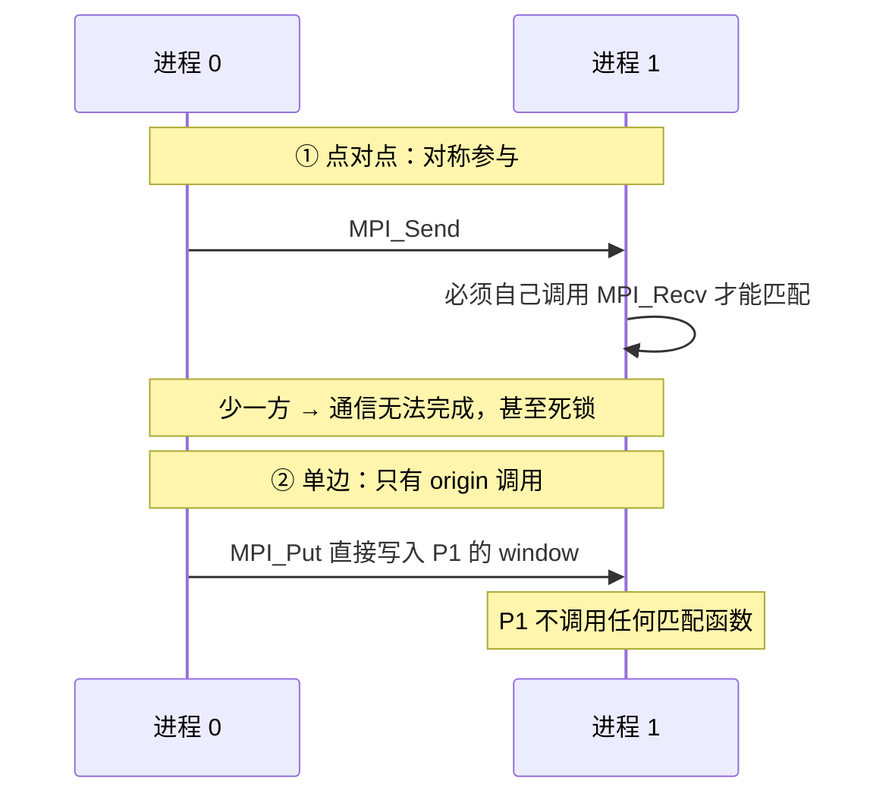
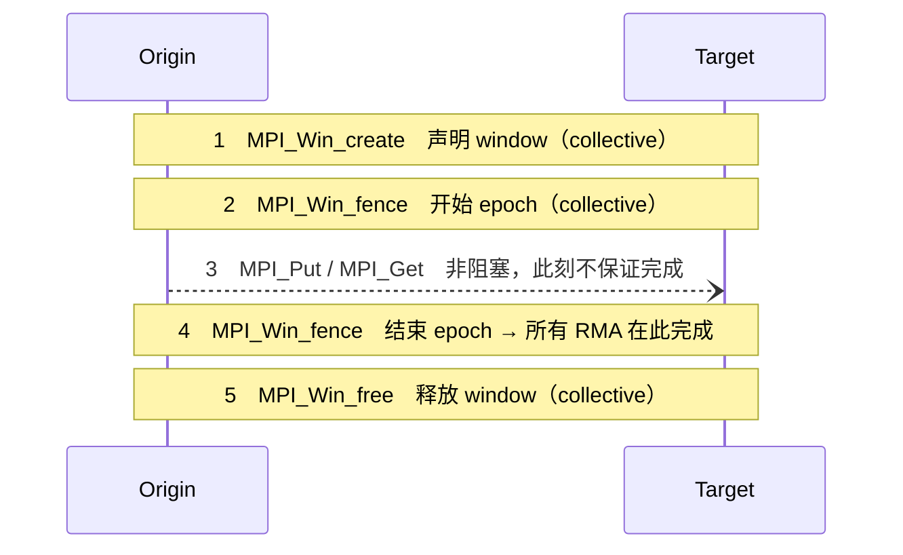
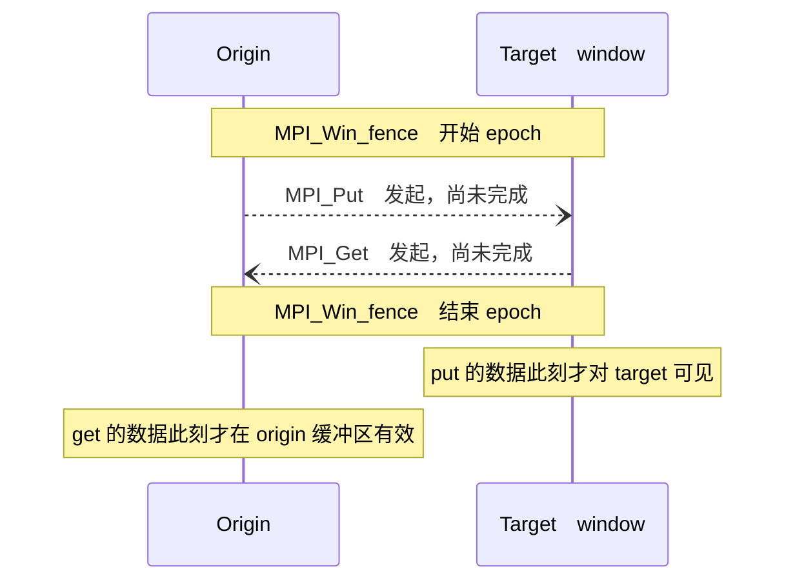
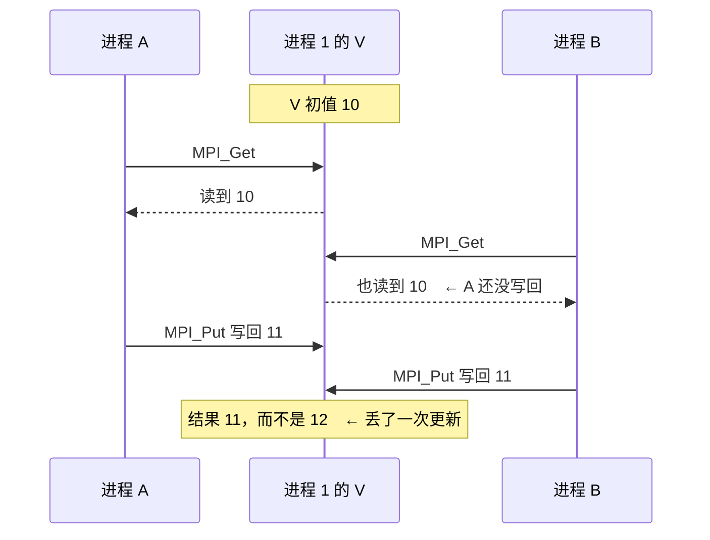
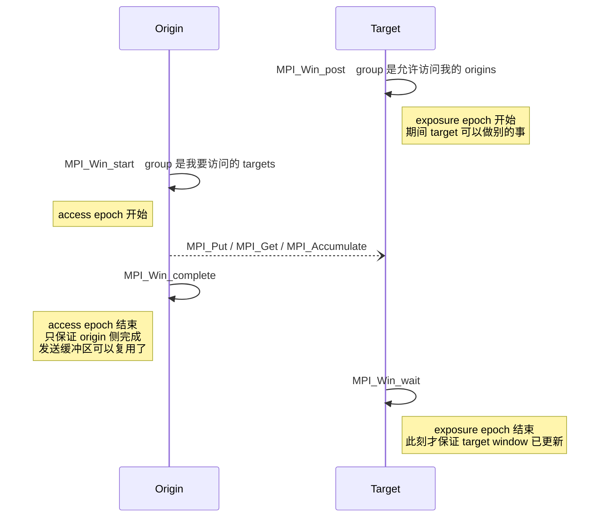
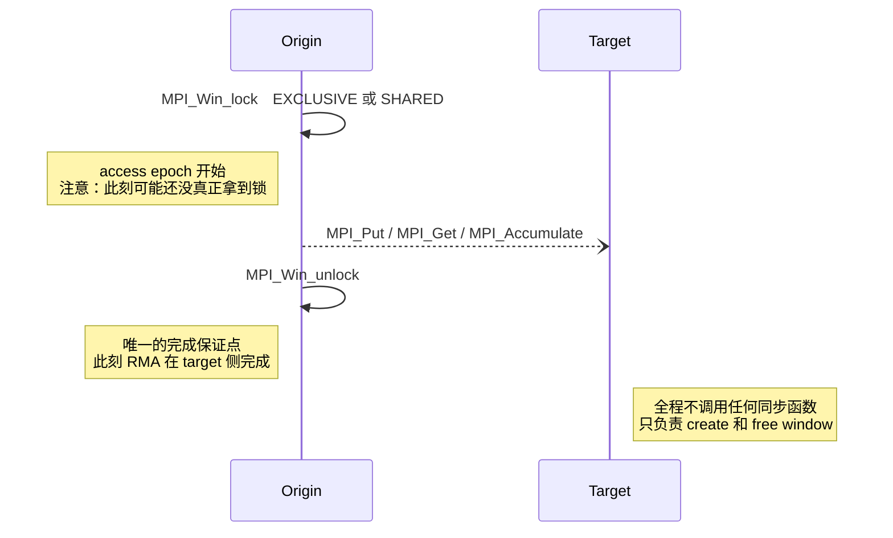
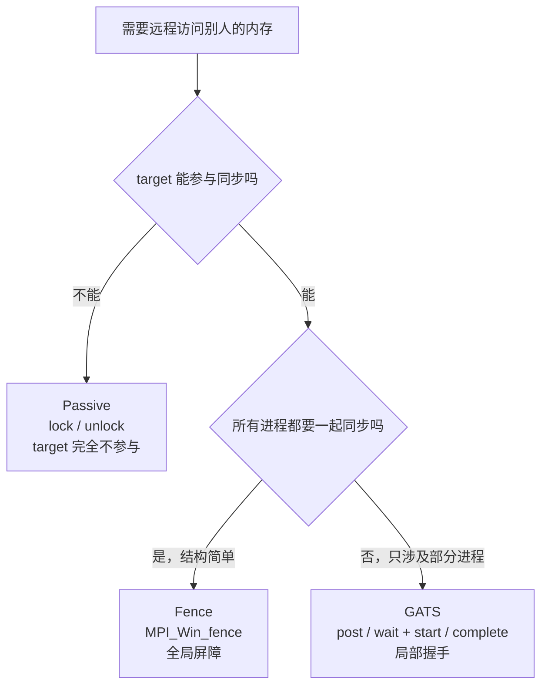

#course/ampp #mpi/rma #type/lecture #status/review

> [!info] 知识图谱
> 前置：[[06 邻域集体通信]] · 后续：[[08 MPI 共享内存]] · 原始导出稿：[[T7|T7 原始稿]] · 手写批注：[[T7 - Ink.svg]]

# 07. 单边通信与 RMA：window、epoch 与三种同步模型

单边通信 One-sided communication 要解决的是一件事：**让通信只由一方发起，另一方不必调用任何匹配函数**。代价是同步不再免费——本讲的全部内容都是在回答「既然没有配对调用了，安全访问的边界由谁来划」。

三种同步模型是一条不断解耦的主线：

| 模型 | target 是否参与同步 | 同步粒度 |
| --- | --- | --- |
| Fence | 参与，且全体 collective | 全局屏障 |
| GATS（active target） | 参与，但只和指定 group 握手 | 局部握手 |
| Passive（lock/unlock） | **完全不参与** | 单个 origin 自主 |

---

## 一、为什么需要 RMA

点对点通信 Point-to-Point 的本质是**对称参与**：`MPI_Send` 必须有匹配的 `MPI_Recv`，哪怕用 `MPI_ANY_SOURCE` / `MPI_ANY_TAG`，接收方也得显式调用才能参与匹配。



> [!tip]- 核心思路：对称参与带来的三重负担
> 
> 匹配机制强制了三件事：
> 
> 1. 每个进程必须**提前知道**自己可能参与哪些通信——否则它不会调用 `MPI_Recv`；
> 2. runtime 必须执行匹配逻辑，这是纯开销；
> 3. 程序员必须手动设计整套匹配结构。
> 
> 而现代超算网络的硬件本来就支持 **RMA（Remote Memory Access，远程内存访问）**：一个进程可以直接读写另一个进程的内存。既然硬件能做，就没必要让软件层再走一遍匹配。
> 
> 于是收益是：省去 runtime 匹配开销、编程模型更直接、更贴近底层硬件能力。

代价立刻出现。`MPI_Send` / `MPI_Recv` 的同步是**隐式**的——双方都调用了，那个点就是同步点。而远程写和远程读**没有天然的配对操作**，所以必须人为回答三个问题：

1. 什么时候目标进程允许别人访问它的内存？
2. 什么时候访问结束？
3. 如何保证一致性 synchronisation？

这三个问题就是后面 window、epoch、以及三种同步模型存在的全部理由。

> [!example]- 练习：为什么点对点里每个进程必须「知道」自己会参与哪些通信
> 
> **答**：点对点要求 matching calls，`MPI_Send` 必须匹配 `MPI_Recv`。如果一个进程不知道会有数据发给它，它就不会调用 `MPI_Recv`，通信无法完成甚至死锁。因为通信是配对机制、双方都必须显式参与，所以每个进程必须提前把可能的 send/recv 设计好。

## 二、四个基本概念：origin、target、window、epoch

> [!tip]- 核心思路：四个概念各自回答上一节的哪个问题
> 
> **origin / target**——回答「谁在动」。
> `origin` 是发起 RMA 操作的进程（读写都算），`target` 是内存被访问的进程。本质区别在于：**只有 origin 显式调用操作函数，target 不调用任何匹配的读写函数**。点对点里双方对称，这里必须区分角色。
> 
> **window**——回答「哪块内存可以被碰」。
> 不能允许别人访问自己的整个地址空间。`window` 是进程主动对外暴露的一块内存区域，**只有落在 window 里的内存才允许被远程读写**。直觉：window = 受控共享区。
> 
> **epoch**——回答「什么时候可以碰」。
> 因为没有配对操作，必须人为定义一个「允许远程访问的时间区间」。`epoch` 就是这个区间，**只有在 epoch 内，origin 才可以对 target 的 window 发起读写**。直觉：epoch = 同步区间。

RMA 的基本生命周期固定为五步，每个进程都参与：



**最关键的一句语义**：远程内存访问是 **non-blocking** 的。`MPI_Put` / `MPI_Get` 返回时操作**可能尚未完成**，完成保证来自 epoch 结束时的同步，不是来自调用返回。这一句贯穿本讲后面所有内容。

> [!summary]- 速查：MPI_Win_create 与 MPI_Win_fence
> 
> ```c
> int MPI_Win_create(
>     void*     base,        // 已分配内存的起始地址，必须事先 malloc 或静态分配
>     MPI_Aint  size,        // window 大小，字节数
>     int       disp_unit,   // 位移单位，origin 指定偏移时以此为基准
>     MPI_Info  info,        // 额外优化提示
>     MPI_Comm  comm,        // 参与 window 的 communicator
>     MPI_Win*  win          // 输出的 window 对象
> );
> ```
> 
> `disp_unit` 的作用：若 `disp_unit = sizeof(int)`，则 `displacement = 3` 表示偏移 3 个 `int`（前提是 origin 和 target 的 `int` 大小一致）。
> 
> `MPI_Win_create` 是 **collective**，communicator 内所有进程都必须调用。它**不会替你分配内存**；想让 MPI 自动分配就改用 `MPI_Win_allocate`。
> 
> ```c
> int MPI_Win_fence(int assert, MPI_Win win);
> ```
> 
> `MPI_Win_fence` 同样是 collective，一次调用同时承担三件事：**结束上一个访问区间、开始下一个访问区间、对已发起的 RMA 给出完成保证**。课件里「第一次调用开始 epoch、第二次调用结束 epoch」是针对单个 epoch 的简化说法，实际语义就是上面这三合一——后面 `NOPRECEDE` / `NOSUCCEED` 两个断言之所以存在，正是因为一次 fence 本来前后两半都有活干。

> [!warning]- 易错点：window 与 fence 的四个坑
> 
> 1. **忘了 fence 是 collective**——只要有一个进程没调用 `MPI_Win_fence`，其余进程会一直等，直接死锁。
> 2. **`base` 没有分配内存**——`MPI_Win_create` 不负责分配，传进去的必须是已经有效的地址。
> 3. **误以为 RMA 是 blocking**——读写是否真的完成，取决于 epoch 结束，不是函数返回。
> 4. **`disp_unit` 用错**——origin 和 target 的数据类型大小不同时，同一个 displacement 会落到完全不同的字节位置。

> [!example]- 练习：displacement 该传多少
> 
> 两个进程共享 `int arr[10]`，用 `MPI_Win_create` 暴露，`disp_unit = sizeof(int)`。origin 想写入 `arr[4]`，displacement 传多少？
> 
> **答**：displacement 的单位就是 `disp_unit`，而 `disp_unit = sizeof(int)`，`arr[4]` 偏移 4 个 `int`，所以 **displacement = 4**。
> 
> 反过来，如果 `disp_unit = 1`（按字节），就得传 `4 * sizeof(int)`。
> 
> ```text
> target 的 window：int arr[10]
> 
>  下标           0    1    2    3    4    5    6    7    8    9
>               ┌────┬────┬────┬────┬────┬────┬────┬────┬────┬────┐
>  内存         │    │    │    │    │ ●  │    │    │    │    │    │
>               └────┴────┴────┴────┴────┴────┴────┴────┴────┴────┘
>  disp_unit                            ↑ 想写这里
>    = sizeof(int)  displacement =      4        一格就是一个 int
>    = 1            displacement =     16        一格是一个字节
> ```

## 三、Fence 模型：MPI_Put 与 MPI_Get

`MPI_Put` 把 origin 缓冲区的数据**写入** target 的 window，`MPI_Get` 把 target window 的数据**读到** origin 本地。两者参数表完全同构，**调用者始终是 origin**，区别只在数据流向。

| | 数据流向 | origin_address 的角色 |
| --- | --- | --- |
| `MPI_Put` | origin → target | 本地数据源 |
| `MPI_Get` | target → origin | 本地接收缓冲区 |

> [!success]- 代码：MPI_Put / MPI_Get 原型与参数
> 
> ```c
> int MPI_Put(
>     const void*  origin_address,        // 本地数据起始地址
>     int          origin_count,          // 本地元素个数
>     MPI_Datatype origin_datatype,       // 本地数据类型
>     int          target_rank,           // 目标进程编号
>     MPI_Aint     target_displacement,   // 目标 window 内偏移，单位是 target 的 disp_unit
>     int          target_count,          // 目标元素个数
>     MPI_Datatype target_datatype,       // 目标数据类型
>     MPI_Win      window                 // 关联的 window
> );
> ```
> 
> `MPI_Get` 参数表相同，只是 `origin_address` 去掉 `const`，含义变为本地接收缓冲区。
> 
> 三条核心语义（两者共有）：
> 
> 1. **非阻塞**，数据完成时间由 epoch 结束保证；
> 2. **必须处于合法 epoch 内**，否则行为未定义；
> 3. origin 与 target 的 datatype 必须类型兼容，且 `origin_count × origin_datatype` 的总字节数必须等于 `target_count × target_datatype` 的总字节数。

完整的写流程和读流程结构一致：



> [!warning]- 易错点：Put/Get 最常写错的四处
> 
> 1. **在 epoch 外调用**——行为未定义，不是报错，是不可预测。
> 2. **把 put/get 当成 blocking**——最典型的后果是在第二个 fence 之前就去读 `MPI_Get` 的接收缓冲区，读到的是旧数据。
> 3. **`target_displacement` 当成字节数**——它的单位是 **target 创建 window 时设置的 `disp_unit`**，不是字节。
> 4. **datatype 不匹配**——总字节数对不上会导致数据错位，而且往往不在出错的那一行崩。

> [!success]- MPI_Win_free：显式释放
> 
> ```c
> int MPI_Win_free(MPI_Win* window);
> ```
> 
> window 是显式创建的资源，必须显式释放。两条语义：
> 
> 1. 是 **collective**，communicator 内所有进程都要调用；
> 2. 调用前**必须没有未完成的 RMA 操作**。
> 
> 至此 RMA 的基本生命周期闭环：`create window → start epoch → put/get → end epoch → free window`。

> [!example]- 练习：Put 与 Get 的参数怎么填
> 
> **Put**：两进程共享 `int window[10]`，`disp_unit = sizeof(int)`。进程 0 想把本地 `a[3]` 写到进程 1 的 `window[5]` 起始位置。
> 
> ```text
> origin_address      = &a[0]
> origin_count        = 3
> origin_datatype     = MPI_INT
> target_rank         = 1
> target_displacement = 5
> target_count        = 3
> target_datatype     = MPI_INT
> window              = win
> ```
> 
> **Get**：两进程共享 `double window[20]`，`disp_unit = sizeof(double)`。进程 0 想把进程 1 的 `window[8]` 起读到本地 `b[5]`。
> 
> ```text
> origin_address      = &b[0]
> origin_count        = 5
> origin_datatype     = MPI_DOUBLE
> target_rank         = 1
> target_displacement = 8
> target_count        = 5
> target_datatype     = MPI_DOUBLE
> ```
> 
> 两题的前提都是**当前处于合法 epoch**；Get 还要多一条：数据有效的时间点是**第二个 `MPI_Win_fence` 之后**。

## 四、fence 的 assert：只影响性能，不改变语义

`MPI_Win_fence` 已经承担了同步与完成语义，但程序员往往能「保证」某些行为不会发生，把这个信息告诉 runtime 就能省掉对应的处理。

**`assert` 不改变语义，只是优化提示**——用错不会让程序变慢，会让程序进入未定义行为。多个标志可以用按位或组合。

> [!summary]- 速查：四个 fence 断言
> 
> | 断言 | 你在保证什么 | runtime 因此省掉什么 |
> | --- | --- | --- |
> | `MPI_MODE_NOSTORE` | 自上次同步以来，本地 window 没有被本地 store、get 或 receive 更新 | 本地缓存刷新 |
> | `MPI_MODE_NOPUT` | 本次 fence 之后到下一次 fence 之前，本地不会发起 put 或 accumulate | 部分一致性处理 |
> | `MPI_MODE_NOPRECEDE` | 本次 fence 不用于完成任何先前的 RMA，即「这是第一个 fence」 | 前半段的完成处理 |
> | `MPI_MODE_NOSUCCEED` | 本次 fence 之后不会开始任何新的 RMA，即「这是最后一个 fence」 | 后半段的暴露处理 |
> 
> 记忆钩子：**NOPRECEDE 管 fence 的前半段（不完成之前），NOSUCCEED 管后半段（不开始之后）**。
> 
> **一致性要求**：`NOPRECEDE` 和 `NOSUCCEED` 只要有一个进程设置，**所有进程都必须设置**。单边设置就是未定义行为。

## 五、MPI_Accumulate：把 reduction 交给 target

场景：进程 1 有共享变量 `V`，多个进程都想执行 `V = V + 1`。朴素做法是 `MPI_Get` 读出 → 本地加一 → `MPI_Put` 写回，这是典型的 **read-modify-write**，并发时必然丢更新：



> [!tip]- 核心思路：为什么必须把 reduction 交出去
> 
> **根本原因**：Get 与 Put 是两个分离的操作，中间没有任何原子性保证——不管你把它们排得多紧，中间那条缝始终存在。
> 
> 思路升级叫 **offloading reduction**——不要自己做 read-modify-write，而是告诉 target「对这个值做一次 SUM」，把 reduction 交给 MPI runtime 或底层网络去做。这就是 `MPI_Accumulate`：**带 reduction 操作的远程写入**。

核心语义一行说清：

```text
target_value = op(target_value, origin_value)     而不是简单覆盖
```

`MPI_Put` **覆盖**目标数据，`MPI_Accumulate` **组合**目标数据——这使得 reduction 在同步语义下具有原子性保证。

> [!success]- 代码：MPI_Accumulate
> 
> ```c
> int MPI_Accumulate(
>     const void*  origin_address,
>     int          origin_count,
>     MPI_Datatype origin_datatype,
>     int          target_rank,
>     MPI_Aint     target_displacement,   // 单位仍是 target 的 disp_unit
>     int          target_count,
>     MPI_Datatype target_datatype,
>     MPI_Op       op,                    // reduction 操作：MPI_SUM / MPI_MAX / MPI_PROD 等
>     MPI_Win      win
> );
> ```
> 
> 相比 `MPI_Put` 只多了一个 `op` 参数，位置在 `target_datatype` 之后、`win` 之前。
> 
> 典型流程与 put 完全一致：`MPI_Win_create → MPI_Win_fence → MPI_Accumulate(..., MPI_SUM, ...) → MPI_Win_fence`，第二个 fence 之后结果保证一致。
> 
> 五条约束：必须在 epoch 内；非阻塞、完成由同步保证；`op` 必须是 MPI 预定义的合法 reduction；datatype 必须支持该 `op`；`origin_count` 与 `target_count` 必须匹配。

> [!warning]- 能力边界：Accumulate 不接受自定义算子
> 
> `MPI_Accumulate` **只能用预定义 reduction 操作**（`MPI_SUM`、`MPI_MAX`、`MPI_MIN`、`MPI_PROD` 等），**不允许 user-defined reduction**，即不能用 `MPI_Op_create` 造的算子。
> 
> **为什么**：RMA 操作可能被直接映射到底层网络硬件的原子操作，而硬件只认识标准操作。这是能力边界，不是实现偷懒。
> 
> 其余常见坑：仍然用 Get + Put 手写累加；`op` 与 datatype 不匹配；忘记同步导致读到旧值；`target_displacement` 单位误用。

> [!example]- 练习：三个进程同时给 window[2] 加一
> 
> 三个进程同时对进程 0 的 `window[2]` 执行 +1。用 `MPI_Get` + `MPI_Put` 结果可能错，为什么 `MPI_Accumulate(MPI_SUM)` 不会？
> 
> **答**：Get + Put 是分离操作，多个进程可能读到相同旧值，写回时互相覆盖，产生数据竞争。`MPI_Accumulate` 把 reduction 交给 MPI 实现，由 MPI 内部保证对目标数据的组合语义，提供原子式的 reduction 更新，从根上避免了 read-modify-write 竞争。

## 六、GATS：从全局屏障到局部握手

fence 模型的问题是太集体化——所有进程同时开始 epoch、同时结束 epoch，全是 collective。简单，但限制太强。

> [!tip]- 核心思路：把一个 epoch 拆成两个
> 
> fence 模型里只有一种 epoch，两个角色共用。GATS 把它拆开：
> 
> - **Exposure epoch**：某进程**允许别人访问它的 window** 的时间区间——由 target 控制；
> - **Access epoch**：某进程**可以访问别人 window** 的时间区间——由 origin 控制。
> 
> 在 fence 模型中，`exposure epoch = access epoch`，且所有进程同步开始、同步结束。
> 在 **GATS（General Active Target Synchronisation）** 中，三层解耦同时发生：
> 
> 1. 解耦 exposure 与 access（两个角色各管各的）
> 2. 解耦 start 与 end（起止操作是两个独立调用）
> 3. 解耦通信与 collective（不再要求全 communicator 一起）
> 
> 直觉模型：**post/wait 是 target 的「开门/关门」，start/complete 是 origin 的「进门/出门」**。门开着的时候，进门的人才能做 Put/Get/Accumulate。

四个调用的角色分工：



`MPI_Win_post` **不是 collective**，只涉及当前 target 自己。同步只在指定 group 内匹配，不再是全体 fence。

> [!warning]- 必须背住的完成语义：complete 和 wait 各保证什么
> 
> **`MPI_Win_complete` 返回时**：该 access epoch 内的所有 RMA 在 **origin 侧**完成（completed at the origin）。
> → 这一刻起，origin 的发送缓冲区可以安全复用。
> 
> **`MPI_Win_wait` 返回时**：所有匹配的 origin 都已经 complete，并且这些 RMA 在 **target window 上**也完成（completed at the target window）。
> → 这一刻起，才能确信远程更新已经落地。
> 
> 这两句话决定了你什么时候能复用缓冲区、什么时候能读到正确的远程数据。**`complete` 只保证 origin 侧，不保证远程已更新**——这是本节最常考也最常错的一点。

> [!summary]- 速查：GATS 四个 API
> 
> ```c
> int MPI_Win_post(MPI_Group group, int assert, MPI_Win win);
> // group：允许访问我 window 的 origin 进程组；开始 exposure epoch
> 
> int MPI_Win_start(MPI_Group group, int assert, MPI_Win win);
> // group：我将访问的 target 进程组；开始 access epoch
> 
> int MPI_Win_complete(MPI_Win win);
> // 完成 origin 侧该 access epoch 内所有 pending RMA
> 
> int MPI_Win_wait(MPI_Win win);
> // 阻塞直到所有匹配的 MPI_Win_complete 发生；返回时 RMA 在 target window 上也完成
> ```
> 
> **post 的断言**：
> 
> | 断言 | 含义 |
> | --- | --- |
> | `MPI_MODE_NOCHECK` | post 被调用时，匹配的 start 尚未发生。要求所有匹配的 start 也设置 NOCHECK。省掉额外同步检查 |
> | `MPI_MODE_NOSTORE` | 自上次同步以来本地 window 未被本地修改，可省 cache 同步 |
> | `MPI_MODE_NOPUT` | post 之后到 wait 之前本地不发起 put 或 accumulate，可减少一致性处理 |
> 
> **start 的断言 `MPI_MODE_NOCHECK`**：origin 调用 `MPI_Win_start` 时，匹配的 `MPI_Win_post` 已在所有 target 上完成。
> 规则是**双向的**：start 端能用 NOCHECK，当且仅当每个匹配的 post 也用了 NOCHECK。
> 类比 ready-send 的「我确信对方已就绪，所以省一次握手」，区别在于这里两端都必须声明才合法。

> [!warning]- 易错点：GATS 的四个坑
> 
> 1. **group 搞反**——`post` 的 group 是 **origins**（谁能来访问我），`start` 的 group 是 **targets**（我要去访问谁）。方向反了就匹配不上。
> 2. **以为 complete 等于「远程已更新」**——complete 只保证 origin 侧完成，远程落地要看 target 侧 `wait` 返回。
> 3. **NOCHECK 单边使用**——违反「双方必须一致」的规则，未定义行为。
> 4. **忘记 wait 会阻塞**——target 过早调用 `wait`，会把自己卡住直到所有 origin 都 complete。
> 
> 另外两条结构性要求：exposure epoch 与 access epoch 必须匹配；`start`/`complete` 与 `post`/`wait` 必须成对。

> [!example]- 练习：GATS 为什么比 fence 灵活
> 
> **答**：fence 是 collective，所有进程必须同步进入。GATS 分离了 exposure 与 access，只在相关进程之间建立同步，因此允许不相关的进程并行去做别的工作，且不同 group 可以同时工作。结论是 GATS 提供了更细粒度、更局部的同步控制。

## 七、Passive synchronisation：target 彻底不参与

GATS 虽然灵活，但仍属于 **active synchronisation**——**target 必须参与同步过程**：fence 模型里 target 得调 `MPI_Win_fence`，GATS 里 target 得调 `MPI_Win_post` / `MPI_Win_wait`。也就是说 target 仍然必须「知道」有人要访问它。

如果 target 根本无法参与呢？这就是 passive synchronisation：**只由 origin 控制同步，target 不调用任何同步函数**。



> [!success]- 代码：MPI_Win_lock / MPI_Win_unlock
> 
> ```c
> int MPI_Win_lock(
>     int     lock_type,   // MPI_LOCK_SHARED 或 MPI_LOCK_EXCLUSIVE
>     int     rank,        // 要锁定的 target 进程 rank
>     int     assert,      // 优化断言
>     MPI_Win win
> );
> 
> int MPI_Win_unlock(int rank, MPI_Win win);
> ```
> 
> `MPI_LOCK_SHARED` 允许多个 origin 同时持有；`MPI_LOCK_EXCLUSIVE` 独占。
> 
> `MPI_Win_lock` 返回后 origin 进入 access epoch，target 不需要调用任何函数。
> `MPI_Win_unlock` 做两件事：结束 access epoch，并**保证本次锁期间发起的 RMA 在目标侧完成**。
> 
> 典型流程：
> 
> ```c
> MPI_Win_lock(MPI_LOCK_EXCLUSIVE, target, 0, win);
> MPI_Put(...);   /* 或 MPI_Get / MPI_Accumulate */
> MPI_Win_unlock(target, win);
> ```
> 
> `MPI_Win_lock` 的 `MPI_MODE_NOCHECK` 断言：调用者保证没有其他进程持有或将要持有冲突的锁。适用于互斥已经由程序逻辑保证、但仍希望执行必要 cache coherence 操作的场景。前提必须真实成立，否则未定义行为。

> [!warning]- 最大的陷阱：lock 不是分布式互斥锁
> 
> **`MPI_Win_lock` 可能在真正获得锁之前就返回。**
> 
> **为什么**：MPI 的同步保证发生在 MPI 语义层，而不是「调用返回即物理锁已获得」。MPI 只承诺一件事——**在 `MPI_Win_unlock` 返回时，该 lock/unlock 区间内发起的所有 RMA 操作已经完成**。
> 
> | | 错误理解 | 真实语义 |
> | --- | --- | --- |
> | `MPI_Win_lock` 返回 | 我已经独占了目标 window | 我进入了一个访问 epoch，但不保证此刻已真正独占 |
> | `MPI_Win_unlock` 返回 | 只是解锁 | **唯一的完成保证点** |
> 
> **配套的经典反例**：
> 
> ```c
> MPI_Win_lock(MPI_LOCK_EXCLUSIVE, target, 0, win);
> sleep(1);
> printf("MPI process %d says hi\n", my_rank);
> MPI_Win_unlock(target, win);
> ```
> 
> 即便用了 `MPI_LOCK_EXCLUSIVE`，所有进程仍可能几乎同时打印。原因是 **`printf` 不是 RMA 操作**——MPI 只对 RMA 调用施加同步保证，对普通计算和 I/O 没有任何排序保证。
> 
> 结论：**lock 只对 RMA 内存访问建立语义约束，它不是通用的分布式互斥锁。**
> 
> 其余常见坑：SHARED 模式下执行非幂等更新导致竞争；NOCHECK 滥用违反锁语义；忘记 unlock 导致远程访问永远持锁。

> [!tip]- 更细的粒度：flush 与 R 系列接口
> 
> 在 passive 模式下，有时希望**不等到 unlock** 就确认某个具体的 RMA 操作完成。两类机制：
> 
> 1. **Flush 操作**——强制完成远程操作（本讲只提到概念，未给 API 原型）；
> 2. **非阻塞 RMA 接口** `MPI_Rput` / `MPI_Rget` / `MPI_Raccumulate`——这些函数返回一个 request，之后用 `MPI_Wait(request)` 单独等待该操作完成。
> 
> 核心思想：完成粒度从「**epoch 级别**」升级到「**单个 RMA 操作级别**」。

> [!example]- 练习：什么时候必须用 EXCLUSIVE
> 
> 什么时候必须用 `MPI_LOCK_EXCLUSIVE` 而不能用 `MPI_LOCK_SHARED`？
> 
> **答**：当多个 origin 会同时执行非原子更新（例如 read-modify-write）时。SHARED 模式允许并发访问，会产生数据竞争。所以只要访问不是幂等的、又没有用 `MPI_Accumulate` 这类原子语义，就必须用 EXCLUSIVE。

## 一句话总结

单边通信用 **window 划定空间边界、epoch 划定时间边界**，把点对点里免费的隐式同步换成了显式同步；三种同步模型（fence → GATS → lock/unlock）是同一条解耦主线，代价是**你必须自己记住每个函数返回时到底保证了什么**。

## API 速查

| 函数 | 是否 collective | 作用 | 完成语义 |
| --- | --- | --- | --- |
| `MPI_Win_create` | 是 | 声明 window，需自备已分配内存 | — |
| `MPI_Win_allocate` | 是 | 由 MPI 分配内存并声明 window | — |
| `MPI_Win_free` | 是 | 释放 window，调用前不得有未完成 RMA | — |
| `MPI_Win_fence` | 是 | 结束上一 epoch + 开始下一 epoch + 完成保证 | 返回时该 epoch 内 RMA 全部完成 |
| `MPI_Put` | 否 | origin → target，覆盖写 | 非阻塞，靠 epoch 结束 |
| `MPI_Get` | 否 | target → origin，读 | 非阻塞，靠 epoch 结束 |
| `MPI_Accumulate` | 否 | `target = op(target, origin)`，仅预定义 `op` | 非阻塞，靠 epoch 结束 |
| `MPI_Win_post` | 否 | target 开 exposure epoch，group 是 origins | — |
| `MPI_Win_wait` | 否 | target 关 exposure epoch | 返回时 RMA 在 target window 上完成 |
| `MPI_Win_start` | 否 | origin 开 access epoch，group 是 targets | — |
| `MPI_Win_complete` | 否 | origin 关 access epoch | 返回时 RMA 仅在 **origin 侧**完成 |
| `MPI_Win_lock` | 否 | origin 开 access epoch，target 不参与 | **不保证已获得锁** |
| `MPI_Win_unlock` | 否 | origin 关 access epoch | 返回时 RMA 在目标侧完成 |
| `MPI_Rput` / `MPI_Rget` / `MPI_Raccumulate` | 否 | 返回 request 的 RMA | 用 `MPI_Wait(request)` 单独等待 |

**断言一览**：`MPI_MODE_NOSTORE`、`MPI_MODE_NOPUT`（fence 与 post 通用）；`MPI_MODE_NOPRECEDE`、`MPI_MODE_NOSUCCEED`（仅 fence，要求全组一致）；`MPI_MODE_NOCHECK`（post/start 必须双方一致；lock 表示无冲突锁）。全部只影响性能，用错即未定义行为。

## 知识图谱

- 前置：[[06 邻域集体通信]]——同样是「让通信模式更贴近实际拓扑」这条主线上的一站
- 后续：[[08 MPI 共享内存]]——同一节点内进程共享内存，与 RMA 是两条不同的「绕开消息传递」路径
- 原始导出稿：[[T7|T7 原始稿]] · 手写批注：[[T7 - Ink.svg]]

## 考点归纳

| 题目里出现这种描述 | 该想到 |
| --- | --- |
| 「接收方不调用任何 MPI 函数」「只有一方发起」 | 单边通信，window + epoch |
| 「哪块内存能被远程访问」 | window，且必须落在 window 内 |
| 「什么时候能安全复用发送缓冲区」 | fence 第二次返回 / `MPI_Win_complete` 返回 |
| 「什么时候能确信远程数据已更新」 | fence 第二次返回 / `MPI_Win_wait` 返回 / `MPI_Win_unlock` 返回 |
| 「多个进程同时更新同一个远程变量」 | `MPI_Accumulate`，不要 Get + Put |
| 「需要自定义 reduction 算子」 | Accumulate 做不到，只支持预定义 `op` |
| 「不想全体同步」「只有部分进程通信」 | GATS，post/wait + start/complete |
| 「target 完全不能参与同步」 | passive，lock/unlock |
| 「加了 EXCLUSIVE 锁但顺序仍然乱」 | lock 只约束 RMA，不约束 printf 等普通代码 |
| 「想在 unlock 之前确认某个操作完成」 | flush，或 `MPI_Rput` / `MPI_Rget` / `MPI_Raccumulate` + `MPI_Wait` |

考试最集中的四类问题：三种同步模型的区别；完成语义在哪个函数返回时成立；lock 与 unlock 的真实语义；Accumulate 与 Put 的原子性区别。

选同步模型的判断路径：



## 待补

**缺失插图 13 张**。原稿引用的 `Exported image 202607301611*.png` 在 `attachments\` 中全部不存在（该目录最新的导出图停在 2026-05），断链已删除。其中 9 张已用 mermaid 时序图 / 流程图或等宽示意图重建，**只剩 4 张真正需要回课件重新截图**：

| 原图 | 原本要说明什么 | 现在的处理 |
| --- | --- | --- |
| `...161120-0` `...161121-1` | send/recv 匹配示意 | ✅ §一 mermaid 时序图 |
| `...161123-2` | window + epoch 执行流程 | ✅ §二 mermaid 时序图 |
| `...161127-3` | Put 参数与 displacement 对应 | ✅ §二「displacement 该传多少」等宽示意图 |
| `...161128-4` | naive Get+Put 的竞争过程 | ✅ §五 mermaid 时序图 |
| `...161130-6` | GATS 的四调用时序 | ✅ §六 mermaid 时序图 |
| `...161134-9` `...161138-10` | lock/unlock 与 target 不参与 | ✅ §七 mermaid 时序图 |
| `...161140-12` | `lock + sleep + printf` 代码截图 | ✅ 已按原稿文字还原成代码块 |
| `...161129-5` | Accumulate 的数据组合示意 | ⬜ 待截图（正文已有 `target_value = op(...)` 一行公式，图能补的是「多进程同时 accumulate」的直观感） |
| `...161131-7` `...161133-8` `...161139-11` | post / start / lock 的断言表 | ⬜ 待截图（正文已整理成表格，截图仅用于核对课件措辞） |

手写批注 [[T7 - Ink.svg]] 覆盖了本讲部分内容，已在顶部导航链接。

**其他存疑**：

- 原稿 `MPI_Accumulate` 原型只写了裸参数名、没有类型声明，本笔记按 MPI 标准补齐了类型；若课件原型与此不符以课件为准。
- 原稿末尾有一个被高亮标记包裹的孤立 `fence` 字样，加一条 Blackboard 测验链接，无正文内容，未收入。
- 原稿分段处保留有 `来自 <chatgpt.com/...>` 的出处标记，说明该导出稿是对课件的二次整理稿而非课件原文，关键结论建议对照 slides 复核一遍。
