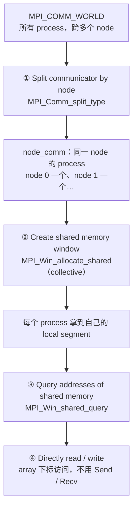
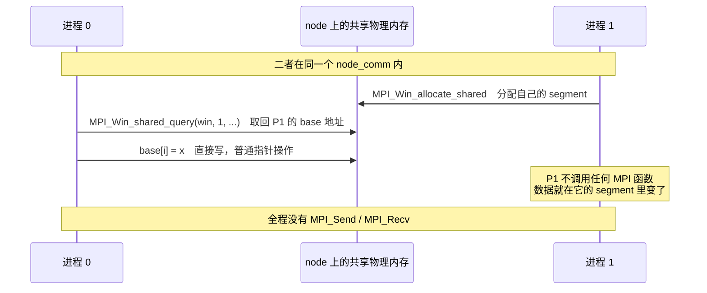

#course/ampp #mpi/shared-memory #mpi/rma #type/lecture #status/review

> [!info] 知识图谱
> 前置：[[07 单边通信与 RMA]] · 后续：[[09 混合编程]] · 原始导出稿：[[T8|T8 原始稿]]

# 08. MPI 共享内存：同一节点上只留一份数据

MPI 共享内存 MPI Shared Memory 要解决的是一件**内存问题，不是通信问题**：MPI 的默认模型里每个 process 有独立地址空间，于是同一个节点上的 128 个 process 会把同一张只读大表复制 128 份。本讲要做的就是让它们共用一份。

顺带的好处是访问方式也变了——拿到别人的地址之后，读写就是普通的 `array[i]`，**不再需要 `MPI_Send` / `MPI_Recv`**。

整条路径固定为四步，顺序不能换：

| 步骤 | 做什么 | 用什么 |
| --- | --- | --- |
| 1 | 把 processes 按 node 重新分组 | `MPI_Comm_split_type` |
| 2 | 在这个 node communicator 上创建 shared window | `MPI_Win_allocate_shared` |
| 3 | 查出别的 process 的 segment 在哪 | `MPI_Win_shared_query` |
| 4 | 直接 load / store 访问 | 普通数组下标 |

---

## 一、动机：duplication overhead

传统 MPI 程序里，每个 process 都有自己的独立地址空间，也就意味着**每个 process 都会分配自己的一份数据**。如果程序需要一个大型只读数据结构——lookup table、大型常量数组、预计算数据——那么每个 process 都会创建一份副本。

在 HPC 集群上，这个默认行为会造成严重的内存浪费：

```text
一个节点跑 128 个 MPI process，每个都要用同一张 1 GB 的 lookup table

 默认模型：每个 process 一份
   P0 [ 1 GB ]  P1 [ 1 GB ]  P2 [ 1 GB ]  …  P127 [ 1 GB ]
   └──────────────── 128 × 1 GB = 128 GB ────────────────┘
        其中真正必要的只有 1 GB，冗余 127 GB   ← duplication overhead

 共享内存模型：整个 node 一份
                shared memory region [ 1 GB ]
                  ↑      ↑      ↑            ↑
                 P0     P1     P2    …     P127     ← 每个 process 只持有一个引用
   └──────────────── 合计 1 GB，省下 127 GB ────────────┘
```

这就是 **duplication overhead（数据复制开销）**：由于每个 process 各自复制数据而导致的内存浪费。

**Shared memory（共享内存）的本质**：让同一个 node 上的多个 MPI processes 访问同一块物理内存。核心思想是从「每个 process 各存一份」变成「所有 process 共享一份」，直接压低 memory footprint（内存占用）。

> [!warning]- 关键前提：共享只发生在 node 内部
>
> **Shared memory 只能在同一个 node 内部使用。**
>
> **为什么**：node 之间是分布式内存系统（distributed memory），不同 node 的内存**物理隔离**，不存在共用一块物理内存的可能。
>
> 因此 **shared memory 不等于跨节点共享**。跨节点的数据交换仍然必须走 MPI communication——本讲省的是同一节点内的重复副本，不是节点之间的消息。
>
> 这也解释了为什么第一步必须是「找出哪些 processes 在同一个 node 上」：不先分组，根本没有可以共享的物理内存。

> [!example]- 练习：算一算能省多少
>
> 一个节点运行 **64 个 MPI processes**，每个 process 都存储一个 **2 GB 的 lookup table**。
>
> **1. 当前总内存使用是多少？**
> 每个 process 2 GB，共 64 个：$64 \times 2\,\text{GB} = 128\,\text{GB}$。
>
> **2. 改用 shared memory 能减少多少？**
> 整个 node 只需要 1 份 lookup table，即 2 GB。节省 $128 - 2 = 126\,\text{GB}$。
>
> 一般规律：$N$ 个同节点 process 共享一份大小为 $S$ 的只读数据，节省 $(N-1) \times S$。**process 越多，收益越大**——这正是现代节点核数越来越高时，这个机制越来越重要的原因。

## 二、四步流程总览

MPI 程序启动后，所有 processes 默认属于 `MPI_COMM_WORLD`，但**并不是所有 processes 都在同一个 node 上**。所以必须先分组，再谈共享。



第四步是这一讲最反直觉的地方：拿到地址之后，**访问退化成普通的 load / store**。



> [!example]- 练习：流程顺序选择题
>
> MPI shared memory 的典型执行流程顺序是什么？
>
> - **A** Create shared window → Split processes → Access memory
> - **B** Split processes → Create shared window → Access memory
> - **C** Create shared window → Access memory → Split processes
> - **D** Split processes → Access memory → Create shared window
>
> **答：B**。完整顺序是：① split processes → ② create shared window → ③ query memory location → ④ access memory。
>
> **为什么 split 必须在最前**：shared window 建立在 communicator 之上，而只有同一 node 的 processes 才能真共享物理内存。communicator 还没划好，window 就没有正确的作用范围。

## 三、第一步：把 processes 按 node 分组

这个过程叫 **communicator splitting（通信器划分）**：根据某个规则，把原 communicator 的 processes 划分成多个组，每个组形成一个新的 communicator。

### 通用工具：MPI_Comm_split

> [!success]- 代码：MPI_Comm_split 原型与参数
>
> ```c
> int MPI_Comm_split(
>     MPI_Comm  communicator,      // 要被拆分的 communicator，通常是 MPI_COMM_WORLD
>     int       colour,            // 决定本进程属于哪个 group
>     int       key,               // 决定新 communicator 内的 rank 排序
>     MPI_Comm* new_communicator   // 输出：新生成的 communicator
> );
> ```
>
> **`colour` 的规则**：
>
> | `colour` 取值 | 结果 |
> | --- | --- |
> | 相同 | 进入**同一个** communicator |
> | 不同 | 进入**不同**的 communicator |
> | `MPI_UNDEFINED` | 该 process **不加入任何** communicator，输出 `MPI_COMM_NULL` |
>
> `key` 不影响分组，只影响分完组之后新 communicator 里的 rank 编号顺序。

按 rank 奇偶分成两组的写法：

```c
MPI_Comm_split(MPI_COMM_WORLD, my_rank % 2, my_rank, &new_comm);
/* colour = my_rank % 2
   rank 0 → colour 0     rank 1 → colour 1
   rank 2 → colour 0     rank 3 → colour 1
   结果：communicator A = {0, 2, 4, …}，communicator B = {1, 3, 5, …} */
```

> [!example]- 练习：会生成几个 communicator
>
> ```c
> MPI_Comm_split(MPI_COMM_WORLD, my_rank % 3, my_rank, &new_comm);
> ```
>
> 假设 MPI ranks 为 `0,1,2,3,4,5`，会生成多少个 communicator？
>
> **答：3 个。** `colour = rank % 3`，取值只有 0/1/2 三种：
>
> | colour | 成员 |
> | --- | --- |
> | 0 | rank 0, rank 3 |
> | 1 | rank 1, rank 4 |
> | 2 | rank 2, rank 5 |
>
> 通用结论：**communicator 的数量等于 `colour` 的不同取值个数**（不含 `MPI_UNDEFINED`）。

### Shared memory 真正要用的：MPI_Comm_split_type

`MPI_Comm_split` 的问题是 `colour` 得自己算，而「这个 process 在哪个 node 上」并不是程序里现成的信息。MPI 为此提供了更高一层的 `MPI_Comm_split_type`：**分组规则由 MPI 按预定义类型自己判断**。

> [!success]- 代码：MPI_Comm_split_type 原型与参数
>
> ```c
> int MPI_Comm_split_type(
>     MPI_Comm  communicator,      // 要被拆分的 communicator
>     int       type,              // 分组方式，见下表
>     int       key,               // 新 communicator 内的 rank 排序
>     MPI_Info  info,              // 额外信息，一般 MPI_INFO_NULL
>     MPI_Comm* new_communicator   // 输出
> );
> ```
>
> 与 `MPI_Comm_split` 的区别只有两处：`colour` 换成了 `type`（由 MPI 解释），并多了一个 `info` 参数用来传更细的硬件描述。
>
> | `type` | 分组依据 |
> | --- | --- |
> | `MPI_COMM_TYPE_SHARED` | **把同一 node 的 processes 分到同一个 communicator**，shared memory 最常用 |
> | `MPI_COMM_TYPE_HW_GUIDED` | 按硬件资源分组（NUMA region、L3 cache 等），具体资源由 `info` 指定 |

最常见的 shared memory 写法，把它当固定套路记住：

```c
MPI_Comm node_comm;
MPI_Comm_split_type(
    MPI_COMM_WORLD,
    MPI_COMM_TYPE_SHARED,   /* 按 node 分组 */
    my_rank,                /* 用全局 rank 决定组内排序 */
    MPI_INFO_NULL,
    &node_comm              /* 输出：本 node 的 communicator */
);
/* 执行后每个 node 各得到一个 communicator：
   node 0 → {process 0, 1, 2}
   node 1 → {process 3, 4, 5}
   同一个 communicator 里的 processes 就可以共享内存了 */
```

需要比 node 更细的粒度时用 `MPI_COMM_TYPE_HW_GUIDED`，通过 `MPI_Info` 指明具体的硬件资源：

```c
MPI_Info info;
MPI_Info_create(&info);
MPI_Info_set(info, "mpi_hw_resource_type", "NUMANode");   /* 按 NUMA node 分组 */

MPI_Comm_split_type(
    MPI_COMM_WORLD,
    MPI_COMM_TYPE_HW_GUIDED,
    my_rank,
    info,
    &new_comm
);
```

这在 NUMA-aware optimisation 里很重要：同一 node 内跨 NUMA 访问内存也是有代价的，按 NUMA region 分组能把访问局部性再压紧一层。

> [!warning]- 易错点：MPI 不会自动知道 node topology
>
> 最常见的误解是**以为 MPI 自动就知道谁和谁同节点**。实际上：
>
> 1. **必须显式调用 `MPI_Comm_split_type`**，node 分组不会凭空发生；
> 2. 如果坚持用 `MPI_Comm_split` 自己实现 node grouping，就**需要额外查询 node 信息**（比如取主机名再映射成 `colour`），麻烦且易错——这正是 `MPI_Comm_split_type` 存在的理由；
> 3. **shared window 必须建立在 node communicator 上**，直接拿 `MPI_COMM_WORLD` 去建 shared window，在跨节点运行时就没有意义。

## 四、第二、三步：shared window 与地址查询

**shared window** 是一块被多个 MPI processes 共享的 memory region。它是 [[07 单边通信与 RMA|RMA]] 里 window 概念的特化版本：普通 window 暴露内存给远程 RMA 操作，**shared window 则让同一 node 的 processes 直接读写同一块物理内存**——访问方式是 `array[i]`，而不是 MPI communication。

> [!success]- 代码：MPI_Win_allocate_shared 原型与参数
>
> ```c
> int MPI_Win_allocate_shared(
>     MPI_Aint size,           // 本 process 分配的内存大小，单位是字节
>     int      disp_unit,      // 位移单位，通常取 sizeof(type)
>     MPI_Info info,           // 额外参数，一般 MPI_INFO_NULL
>     MPI_Comm communicator,   // 共享内存的 communicator，通常是 node communicator
>     void*    base,           // 输出：本进程 local memory 的地址
>     MPI_Win* window          // 输出：window 对象
> );
> ```
>
> **必须写死的三条**：
>
> 1. `size` 的单位是**字节**，`disp_unit` 的单位是**类型大小**（如 `sizeof(double)`）——两者单位不同，是最容易混的一对参数；
> 2. 与 `MPI_Win_create` 不同，它**自己负责分配内存**并通过 `base` 返回地址，不需要事先 `malloc`；
> 3. 它是 **collective operation**。

> [!warning]- 易错点：collective 与其余三个坑
>
> **`MPI_Win_allocate_shared` 是 collective operation**——communicator 中所有 processes 必须一起调用，**否则程序会 deadlock**。
>
> **为什么必须 collective**：shared window 是一个 **communicator 级别的资源**，不是某个进程私有的东西。要在整个 communicator 上建立一致的内存布局，就必须所有成员一起参与。
>
> 其余三个坑：
>
> 1. **不同 processes 传入不同 `size`**——语法上允许，但会导致内存布局与你预期的不符（尤其是配合下面「连续分配」的默认行为时）；
> 2. **没有先 split communicator**——shared window 必须建立在同一 node 的 communicator 上；
> 3. **忘了 collective 要求**——有进程没调用，整个程序挂起。

**默认的内存布局是连续分配（contiguous allocation）**：MPI 会把同一 window 里不同 process 的 memory segments 在地址上排成一片。

```text
node_comm 里三个 process，各自调用 MPI_Win_allocate_shared(size, ...)

 物理地址 →
 ┌────────────────┬────────────────┬────────────────┐
 │     seg 0      │     seg 1      │     seg 2      │
 └────────────────┴────────────────┴────────────────┘
   ↑ rank 0 的       ↑ rank 1 的       ↑ rank 2 的
     base              base              base

 因为连续，于是在 rank 1 上会出现一种特殊访问：

     my_array[-1]   →   很可能落到 seg 0 的最后一个元素

 能跑通，但通常不推荐：它依赖"连续分配"这个默认行为，
 而正规做法是用 MPI_Win_shared_query 明确查出目标 segment 的 base。
```

> [!success]- 代码：MPI_Win_shared_query 原型与参数
>
> ```c
> int MPI_Win_shared_query(
>     MPI_Win   win,         // shared window
>     int       rank,        // 要查询的 process rank
>     MPI_Aint* size,        // 输出：该 process segment 的大小
>     int*      disp_unit,   // 输出：该 process 的位移单位
>     void*     base         // 输出：该 process memory 的地址
> );
> ```
>
> 典型用法——进程 0 想访问进程 1 的 shared memory：
>
> ```c
> MPI_Aint seg_size;
> int      seg_disp;
> double*  remote;
>
> MPI_Win_shared_query(win, 1, &seg_size, &seg_disp, &remote);
> /* 拿到 rank 1 的 base address 之后，直接当普通指针用 */
> remote[3] = 42.0;
> ```
>
> 查出来的 `disp_unit` 有实际用途：**它告诉你那一段是按 `int` 还是按 `double` 组织的**，决定了你该用什么类型的指针去解释这块内存。

> [!example]- 练习：为什么 MPI_Win_allocate_shared 必须是 collective operation
>
> - **A** 因为 MPI 需要同步网络通信
> - **B** 因为所有 processes 必须共同建立 shared window
> - **C** 因为 MPI 必须复制数据
> - **D** 因为 MPI 需要创建线程
>
> **答：B**。shared window 是 **communicator 级别的资源**，因此 communicator 中所有 processes 必须参与创建。
>
> 排除法也很快：A 错在 shared memory 根本不走网络；C 错在它的目的正是**避免**复制；D 错在 MPI process 不是线程，本讲全程没有引入线程模型（那是[[09 混合编程|下一讲混合编程]]的事）。

## 一句话总结

MPI 共享内存解决的是 **intra-node memory duplication**：先用 `MPI_Comm_split_type(MPI_COMM_TYPE_SHARED)` 把同一 node 的 processes 圈成一个 communicator，再用 collective 的 `MPI_Win_allocate_shared` 建一块共享区、用 `MPI_Win_shared_query` 拿到别人的地址，之后读写退化成普通数组访问；**省的是同一节点内的重复副本，跨节点仍然必须走 MPI communication**。

## API 速查

| 函数 | 是否 collective | 作用 | 完成语义 / 单位 |
| --- | --- | --- | --- |
| `MPI_Comm_split` | **是** | 按 `colour` 把 communicator 拆成多组，`key` 定组内 rank 序 | 返回时新 communicator 已可用；`colour = MPI_UNDEFINED` 得到 `MPI_COMM_NULL` |
| `MPI_Comm_split_type` | **是** | 按预定义 `type` 分组，`MPI_COMM_TYPE_SHARED` 即按 node | 返回时新 communicator 已可用 |
| `MPI_Win_allocate_shared` | **是** | 分配并暴露一块可被同 node processes 共享的内存 | `size` 单位是**字节**；`disp_unit` 单位是**类型大小**；漏调即死锁 |
| `MPI_Win_shared_query` | 否（本地查询） | 查出指定 rank 的 segment 的 base、size、disp_unit | 返回即有效，之后是普通 load / store |
| `MPI_Info_create` / `MPI_Info_set` | 否（本地） | 构造 `MPI_Info`，如 `mpi_hw_resource_type = NUMANode` | 供 `MPI_COMM_TYPE_HW_GUIDED` 使用 |

**与 [[07 单边通信与 RMA]] 的对照**：两讲都用 window，但目的不同。

| | 普通 RMA window | shared window |
| --- | --- | --- |
| 创建函数 | `MPI_Win_create` / `MPI_Win_allocate` | `MPI_Win_allocate_shared` |
| 作用范围 | 跨 node 都可以 | **仅同一 node** |
| 访问方式 | `MPI_Put` / `MPI_Get` / `MPI_Accumulate` | **普通指针 load / store** |
| 需要 epoch 同步吗 | 需要（fence / GATS / lock） | 直接访问，不走 RMA 操作 |
| 主要收益 | 省掉匹配调用 | **省内存** |

## 知识图谱

- 前置：[[07 单边通信与 RMA]]——shared window 是 RMA window 概念的特化，`MPI_Win_allocate_shared` 与 `MPI_Win_create` 同为 collective，本讲直接复用了 window / `disp_unit` 这套词汇
- 前置：[[06 邻域集体通信]]——同样依赖「把 communicator 按结构切开」的思路，那里切的是拓扑邻居，这里切的是物理节点
- 后续：[[09 混合编程]]——共享内存是 MPI 内部解决 node 内数据共享的方案，混合编程 MPI + OpenMP 则是换用线程模型来解决同一个问题，两者是竞争关系
- 原始导出稿：[[T8|T8 原始稿]]

## 考点归纳

| 题目里出现这种描述 | 该想到 |
| --- | --- |
| 「每个 process 都存了一份大表」「内存不够」 | duplication overhead，用 shared memory |
| 「$N$ 个 process、每个 $S$ 大小，能省多少」 | 省 $(N-1) \times S$，共享后只留 1 份 |
| 「能不能跨节点共享内存」 | **不能**，node 之间物理隔离，跨节点仍走 MPI communication |
| 「怎么知道哪些进程在同一个 node」 | `MPI_Comm_split_type` + `MPI_COMM_TYPE_SHARED`，MPI 不会自动告诉你 |
| 「`colour` 相同 / 不同会怎样」 | 相同进同组；`MPI_UNDEFINED` 得到 `MPI_COMM_NULL` |
| 「会分出几个 communicator」 | 数 `colour` 的不同取值个数 |
| 「按 NUMA / L3 cache 分组」 | `MPI_COMM_TYPE_HW_GUIDED` + `MPI_Info` 里的 `mpi_hw_resource_type` |
| 「为什么 `MPI_Win_allocate_shared` 必须 collective」 | window 是 communicator 级别的资源，全员参与才能建立一致布局 |
| 「有进程没调用会怎样」 | deadlock，程序挂起 |
| 「`size` 和 `disp_unit` 的单位」 | `size` 是**字节**，`disp_unit` 是**类型大小** |
| 「怎么访问别的 process 的数据」 | `MPI_Win_shared_query` 拿 base，然后普通数组下标 |
| 「`my_array[-1]` 为什么能读到东西」 | 默认 contiguous allocation，落进前一个 segment；能跑但不推荐 |
| 「流程顺序题」 | split → allocate_shared → shared_query → 直接访问，顺序不能换 |

考试最集中的四类问题：**内存节省量的计算**；**`MPI_Comm_split` 与 `MPI_Comm_split_type` 的差别及 `colour` 语义**；**`MPI_Win_allocate_shared` 的 collective 性与两个参数的单位**；**「shared memory 不跨 node」这条边界**。

## 待补

**缺失插图 9 张**。原稿引用的 `Exported image 2026073016114*.png` / `...16115*.png` 在 `attachments\` 中**全部不存在**（该目录最新的导出图停在 2026-05），断链已删除。其中 **8 张已重建**，**只剩 1 张需要回课件重新截图**：

| 原图 | 原本要说明什么 | 现在的处理 |
| --- | --- | --- |
| `...161147-0` | 128 process × 1 GB 的重复副本示意 | ✅ §一 等宽内存占用对照图 |
| `...161147-1` `...161148-2` | `MPI_Comm_split` 原型与参数说明 | ✅ 已还原成代码块 + `colour` 规则表 |
| `...161149-3` | `MPI_Comm_split_type` 原型 | ✅ 已还原成代码块 |
| `...161154-5` | `MPI_COMM_TYPE_HW_GUIDED` + NUMA 的示例代码 | ✅ 已按原稿文字还原成代码块 |
| `...161155-6` | `MPI_Win_allocate_shared` 原型 | ✅ 已还原成代码块 |
| `...161156-7` | `MPI_Win_allocate_shared` 的 collective 要求 | ✅ §四 易错点 callout（原稿此处文字完整，图为强调用） |
| `...161157-8` | `MPI_Win_shared_query` 原型 | ✅ 已还原成代码块 |
| `...161153-4` | `MPI_Comm_split_type` 的 `type` 取值一览 | ⬜ 待截图（原稿正文只提到 `MPI_COMM_TYPE_SHARED` 与 `MPI_COMM_TYPE_HW_GUIDED` 两种，**这张表很可能列了完整的取值集合**，本笔记的 `type` 表只覆盖了文字里出现的两项，需对照课件补全） |

**其他存疑**：

- 原稿的 `MPI_Win_allocate_shared` 与 `MPI_Win_shared_query` 两个原型都把返回地址的参数写作 `void *base`。MPI 标准里这个参数接收的是**指针的地址**（惯用写法是声明 `void *baseptr` 并传 `&ptr`），本笔记照抄原稿的参数名与顺序，未改签名；**若课件原型与此不符以课件为准**。
- 原稿所有函数原型都被导出压平成单行、参数间只有全角空白分隔，本笔记补齐了排版与逐参数注释，参数名与顺序均照抄原稿。
- `MPI_Win_shared_query` 的 collective 性，原稿**没有明说**。API 速查表里按其语义标为本地查询（非 collective），需要时对照 slides 复核。
- 原稿**没有涉及 shared window 的同步问题**——多个 process 直接 load / store 同一块内存时如何避免竞争（是否需要 `MPI_Win_fence`、`MPI_Win_lock_all` 或内存屏障），本讲一句未提。这是实际写代码时绕不开的一环，考前建议确认课件是否在别处补过。
- 原稿分三段反复讲了同一条四步流程（第二段的 Step 1–4 与第四段的 Step 1–4），内容互有补充，本笔记已合并成第二节的一张流程图 + 第三、四节的展开。
- 原稿保留有 `来自 <chatgpt.com/...>` 的出处标记，以及「主题一句话」「核心讲解」「下一段建议」等生成时的结构性提示，已全部清除；说明该导出稿是对课件的二次整理稿而非课件原文，关键结论建议对照 slides 复核一遍。
- 本讲没有对应的 `- Ink.svg` 手写批注文件。
