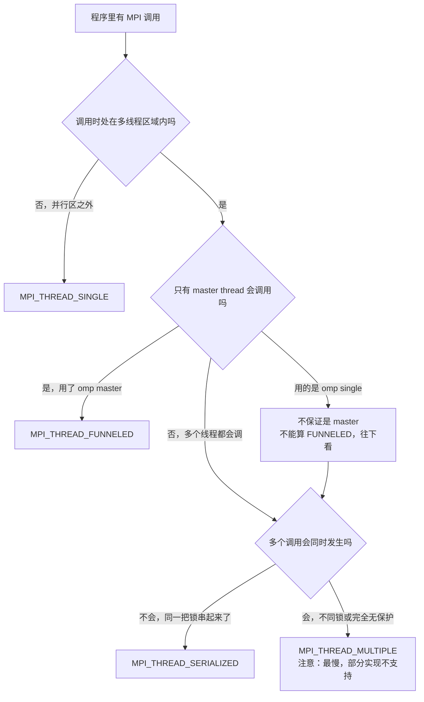

#course/ampp #mpi/hybrid #mpi/performance #type/lecture #status/review

> [!info] 知识图谱
> 前置：[[08 MPI 共享内存]] · 后续：[[T10 Persistent Communication|T10 持久化通信原始稿]] · 原始导出稿：[[T9|T9 原始稿]]

# 09. 混合编程：MPI + OpenMP 与线程支持等级

混合编程 Hybrid Programming 指在同一个程序里同时使用 **MPI**（分布式内存并行，负责节点之间）和 **OpenMP**（共享内存并行，负责节点内部），以匹配现代超算的层级化硬件结构。

先把最重要的一句话钉死：**Hybrid 不是必须的**。硬件虽然是多层的，但理论上完全可以「一个 core 一个 MPI process」跑纯 MPI——技术上可行，也确实有人这么跑。Hybrid 是一种**性能优化策略（performance optimisation strategy）**，用来缓解 MPI-only 在大规模下暴露的问题，不是语法要求。

本讲真正的考点集中在**线程支持等级**，四个等级按能力严格递增：

| 等级 | 谁可以调用 MPI | 典型 OpenMP 写法 |
| --- | --- | --- |
| `MPI_THREAD_SINGLE` | 只有一个线程（无多线程） | MPI 调用在并行区**之外** |
| `MPI_THREAD_FUNNELED` | **只有 master thread** | `#pragma omp master` |
| `MPI_THREAD_SERIALIZED` | 多个线程都可以，但**不能同时** | `#pragma omp critical`（同一把锁） |
| `MPI_THREAD_MULTIPLE` | 多个线程**可以同时**调用 | 并行区内直接调用，无任何保护 |

$$\texttt{SINGLE} < \texttt{FUNNELED} < \texttt{SERIALIZED} < \texttt{MULTIPLE}$$

---

## 一、动机：层级化硬件与 MPI + X

现代超级计算机不是单层结构，而是有明显的**层级化硬件架构（hierarchical hardware architecture）**：

| 层 | 结构 | 对应的并行模型 |
| --- | --- | --- |
| 节点层 node level | 每个节点内有大量 CPU cores，**共享同一块物理内存** | 共享内存并行 Shared Memory Parallelism |
| 系统层 cluster level | 大量节点通过高速网络互联 | 分布式内存并行 Distributed Memory Parallelism |

以 EPCC 的超算 **ARCHER2** 为例：128 CPU cores / node，约 5500+ nodes。整体是 `Supercomputer → Many Nodes → Many Cores per Node`，两种并行同时存在。

于是有了分工明确的组合：

- **MPI**（Message Passing Interface）负责**节点之间通信 inter-node communication**，即 multi-node processing；
- **OpenMP**（Open Multi-Processing）负责**节点内部线程并行 intra-node threading**，即 intra-node multi-threading。

这一族做法在 HPC 里统称 **MPI + X**——它是一类并行范式，不是单一技术。X 可以是 OpenMP、CUDA、OpenACC、SYCL 等，本讲讲的是 MPI + OpenMP。

两种模型的本质区别只有一条，其余全是推论：

| | Distributed Memory Programming | Shared Memory Programming |
| --- | --- | --- |
| 核心思想 | 每个进程有**独立地址空间** | 多个线程共享**同一地址空间** |
| 手段 | `MPI_Send` / `MPI_Recv` | `#pragma omp parallel` |
| 典型用途 | 跨节点通信 | 节点内部并行 |

从执行结构上看，两种跑法在一个 128-core 节点上的形状：

```text
MPI-only 模型                          Hybrid 模型
  Node                                   Node
   ├─ MPI rank                            ├─ MPI rank
   ├─ MPI rank                            │   ├─ OpenMP thread
   ├─ MPI rank                            │   ├─ OpenMP thread
   ├─ …                                   │   └─ …（共 32 个）
   └─ MPI rank                            ├─ MPI rank
                                          │   ├─ OpenMP thread
  每个 core 跑一个 MPI process             │   └─ …（共 32 个）
  128 cores → 128 MPI ranks               └─ …（共 4 个 rank）

                                          4 ranks × 32 threads = 128 cores
                                          core 数不变，MPI process 少了 32 倍
```

MPI-only 下一个 core 上就是一个 MPI process，也就只有一条执行流——**这里 core、process、执行流是一一对应的**；Hybrid 把这层对应关系拆成了两级。

> [!example]- 练习：算 rank 数与线程数
>
> 一个系统：**64 cores / node**，共 **16 nodes**。采用 Hybrid MPI + OpenMP，每个 node 开 **4 MPI ranks**、每个 rank 开 **16 OpenMP threads**。
>
> **1. 总线程数是多少？**
> 每个 node：$4 \times 16 = 64$ 个线程，正好铺满 64 个 core。
> 整个系统：$16 \times 64 = 1024$ 个线程。
>
> **2. 总 MPI ranks 是多少？**
> $4 \text{ ranks/node} \times 16 \text{ nodes} = 64$ 个 MPI ranks。
>
> 检查的窍门：**每个 node 上 `ranks × threads` 应该正好等于 core 数**，多了会超订、少了会闲置 core。

## 二、MPI-only 的四个挑战

既然 MPI-only 技术上可行，为什么还要 Hybrid？因为进程数一大，四个问题会逐个暴露。

**一、Memory Redundancy（内存冗余）**——很多应用要为**每个** MPI process 分配私有数据结构：grid arrays、lookup tables、buffers、metadata。跑 1 MPI process / core 时，每个进程都有一份独立副本：

$$\text{Total memory usage} = \text{memory per process} \times \text{number of processes}$$

进程数很大时内存消耗迅速增加。MPI-3 的 [[08 MPI 共享内存|shared memory]]（`MPI_Win_allocate_shared` / `MPI_Win_shared_query`）确实能补救，但它需要更高级的 MPI 技巧、容易写错、代码复杂度高——**Hybrid 是同一个问题的另一条解法**：进程少了，副本自然就少了。

**二、Load Balancing（负载均衡）**——MPI 进程各自独立执行，工作分配通常是**静态的（static decomposition）**：rank 0 拿 block A、rank 1 拿 block B……某个 block 计算量更大时，那个 rank 就更慢，其余进程只能干等。**MPI 本身没有内建的动态 load balancing**。

**三、Fine-grain Synchronisation（细粒度同步）**——MPI 的同步手段是 message passing（`MPI_Send` / `MPI_Recv` / `MPI_Barrier`），适合 coarse-grained synchronisation。需要线程级的细粒度任务协调时，MPI 会变得非常笨重。

**四、编程复杂度上升**——进程越多，程序越依赖高级 MPI 特性：collective operations（`MPI_Bcast` / `MPI_Reduce` / `MPI_Allreduce`）、virtual topologies（`MPI_Cart_create` / `MPI_Graph_create`）、non-blocking communication（`MPI_Isend` / `MPI_Irecv`）、通信计算重叠、RMA（`MPI_Put` / `MPI_Get` / `MPI_Win`），以及大量同步点。通信复杂度随进程数迅速增加。

## 三、Hybrid 的思路与优势

基本思想一句话：**减少 MPI processes，增加线程并行**。

```text
                   同一个 128-core node

 MPI-only :  128 MPI processes / node
 Hybrid   :    4 MPI processes / node  ×  32 OpenMP threads / process
              └──────── 4 × 32 = 128 cores，core 一个不少 ────────┘
                        但 MPI process 数量减少了 32 倍
```

三条具体收益：

**一、进程变少本身就是收益。** 在 Cirrus 超算上，如果每个 NUMA region 只放 1 个 MPI process，MPI 数量可以减少 12 倍。随之而来的是：更少通信、更少 MPI buffers、更少 memory duplication。

**二、可以逐步并行化。** 一个已有的 MPI 程序可以慢慢加 OpenMP，不必推倒重来：

```c
/* 原始：纯串行循环 */
for (i = 0; i < N; i++)
    compute();

/* 加一行就变成线程并行 */
#pragma omp parallel for
for (i = 0; i < N; i++)
    compute();
```

这叫 **incremental parallelisation（逐步并行化）**，是 OpenMP 相对其他线程方案的关键优势。

**三、OpenMP 自带很多 MPI 没有的机制**：

| OpenMP 能力 | 写法 | MPI 的处境 |
| --- | --- | --- |
| 动态负载均衡 | `schedule(dynamic)` | MPI 没有内建动态调度 |
| 任务并行 | `#pragma omp task` | MPI 无对应物 |
| Worksharing | `#pragma omp for` / `#pragma omp sections` | 需手工切分再分发 |
| 轻量同步 | `#pragma omp critical` / `single` / `barrier` | 只有 `MPI_Barrier` 这类粗粒度手段 |

课程里有一句很经典的话：**"Try to implement a `single` in MPI."**——意思是在 MPI 里实现类似 OpenMP `single` 的语义非常困难。

> [!example]- 练习：进程数减少多少倍，为什么能省内存
>
> 一个系统 **96 cores / node**。MPI-only 跑 96 MPI processes / node；Hybrid 跑 6 MPI processes / node、每个 16 OpenMP threads。
>
> **1. MPI process 数量减少了多少倍？**
> $96 / 6 = 16$，减少 **16 倍**（$6 \times 16 = 96$ core 数不变）。
>
> **2. 为什么这可能减少 memory redundancy？**
> 因为有些数据是 **per MPI process** 的（buffers、lookup tables 等）。MPI-only 下是 96 份副本，Hybrid 下只有 6 份——同一个 process 内的 16 个线程**共享同一地址空间**，不需要各存一份。
>
> 注意限定词「可能」：只有 **per-process 的数据**才省得下来，per-thread 的私有数据不会。

## 四、初始化：MPI_Init_thread 与四个线程支持等级

Hybrid 程序与普通 MPI 程序在代码上的**唯一结构性差别，就在初始化**。

普通 MPI 程序用 `MPI_Init(&argc, &argv)`，这等于告诉 MPI「**本程序是单线程的**」。Hybrid 程序里一个 MPI 进程内部会跑多个线程，于是必须回答一个新问题：**MPI 是否允许多个线程调用 MPI 函数？** 这就是 `MPI_Init_thread` 存在的理由——**声明程序需要什么级别的线程支持**。

**Finalize 阶段没有任何变化**，仍然是 `MPI_Finalize()`。改的只有初始化这一头。

> [!success]- 代码：MPI_Init_thread 与 MPI_Query_thread
>
> ```c
> int MPI_Init_thread(
>     int*   argc,       // 命令行参数数量
>     char***argv,       // 命令行参数数组
>     int    required,   // 输入：程序请求的线程支持级别
>     int*   provided    // 输出：MPI 实现实际提供的线程支持级别
> );
>
> int MPI_Query_thread(int* provided);
> // 事后再查一次当前 MPI 环境最终获得的 thread support level
> // provided 的含义与 MPI_Init_thread 返回的完全一样
> ```
>
> `MPI_Init_thread` 是「初始化并返回」，`MPI_Query_thread` 是「事后再查一次」。适用场景：已经调用过 `MPI_Init_thread`，后续某处还想确认当前级别，或者想把初始化逻辑与查询逻辑分开写。

**必须检查 `provided`**——这是本节最硬的一条纪律。MPI implementation **可能无法提供你要求的等级**，拿不到却继续跑，后果是线程安全错误、崩溃或未定义行为。

课程给出的标准检查模板：

```c
int required = /* 你需要的等级，如 MPI_THREAD_FUNNELED */;
int provided;

MPI_Init_thread(&argc, &argv, required, &provided);

if (provided < required)
{
    printf("The threading support level required could not be met.\n");
    MPI_Abort(MPI_COMM_WORLD, EXIT_FAILURE);
}

/* … 程序主体 … */

MPI_Finalize();
```

`provided < required` 这个直接比大小的写法之所以合法，**前提是四个等级按能力单调递增（monotonically increasing）**：

$$\texttt{MPI\_THREAD\_SINGLE} < \texttt{MPI\_THREAD\_FUNNELED} < \texttt{MPI\_THREAD\_SERIALIZED} < \texttt{MPI\_THREAD\_MULTIPLE}$$

所以也可以写 `provided >= MPI_THREAD_FUNNELED` 来判断能力是否够用。

> [!summary]- 速查：四个等级的准确含义
>
> | 等级 | 含义 | 适用情况 |
> | --- | --- | --- |
> | `MPI_THREAD_SINGLE` | MPI 进程**只有一个线程**，no multithreading | MPI-only 程序 |
> | `MPI_THREAD_FUNNELED` | 进程内部可以有多个线程，但**只有 master thread 可以调用 MPI** | **MPI + OpenMP 最常见模式** |
> | `MPI_THREAD_SERIALIZED` | 多个线程都可以调用 MPI，但**不能同时**；必须保证 only one thread calls MPI at a time，通常靠 mutex / lock | 需要多个线程发消息，但能串行化 |
> | `MPI_THREAD_MULTIPLE` | 多个线程**可以同时**调用 MPI，concurrent MPI calls allowed | 最强，但最贵 |
>
> `MPI_THREAD_FUNNELED` 的结构长这样，也是实践中最常见的形状：
>
> ```text
> MPI process
>  ├─ master thread  → MPI calls allowed
>  ├─ worker thread  → 只算，不调 MPI
>  ├─ worker thread
>  └─ worker thread
> ```
>
> 之所以最常用：master thread 调用 MPI、其他线程执行计算，**实现简单、开销较低、性能较好**。

> [!example]- 练习：该请求哪个等级
>
> 一个 Hybrid MPI + OpenMP 程序：多个线程执行计算，但**只有 master thread 调用 `MPI_Send` / `MPI_Recv`**。应该请求哪个线程支持等级？
>
> **答：`MPI_THREAD_FUNNELED`。** 程序允许多线程存在，但 MPI 调用只发生在主线程——这正是 FUNNELED 的定义。
>
> 不要选 SINGLE（那要求进程内根本没有多线程），也不要无脑选 MULTIPLE（能力够用就行，等级越高开销越大）。

## 五、判断 thread level：看谁调、会不会并发

这是本讲最容易出题、也最容易混的部分。**判断标准不是「用了多少线程」，而是三个问题**：

1. 哪些线程调用 MPI？
2. 是否会有多个线程调用 MPI？
3. 这些 MPI 调用是否可能**同时**发生？

六段代码走一遍，把边界全部划清。

**① MPI 调用在并行区之外 → `MPI_THREAD_SINGLE`**

```c
void some_function(void)
{
    MPI_Send(...);            /* 此刻程序仍是单线程执行 */
    #pragma omp parallel
    {
        // Non-MPI code       /* 有多线程，但线程里不碰 MPI */
    }
}
```

关键原因**不是**「程序完全没用线程」，而是：**MPI 调用发生时，这个进程对 MPI 来说仍然是单线程在用**。

**② `master` 包住 MPI 调用 → `MPI_THREAD_FUNNELED`**

```c
void some_function(void)
{
    #pragma omp parallel
    {
        #pragma omp master     /* 只有 master thread 执行这个块 */
        {
            MPI_Send(...);
        }
    }
}
```

本质定义：程序是多线程的，但所有 MPI 调用都「漏斗式」集中到主线程。

**③ 把 `master` 换成 `single` → 不一定还算 FUNNELED**

```c
void some_function(void)
{
    #pragma omp parallel
    {
        #pragma omp single     /* 注意：不是 master！ */
        {
            MPI_Send(...);
        }
    }
}
```

| OpenMP 指令 | 谁执行 |
| --- | --- |
| `master` | **只能 master thread** 执行 |
| `single` | **任意一个线程**执行一次，**不保证**是 master thread |

FUNNELED 的定义要求「只有 master thread 调用 MPI」，而 `single` 只保证「一个线程执行」。因此**严格来说这段代码不一定能算 FUNNELED**——如果执行 `single` 的不是 master，就违反了 FUNNELED 的要求。

> **一句话记忆：`master` 一定是主线程，`single` 只是某一个线程。**

**④ 未命名 `critical` 包住 MPI 调用 → `MPI_THREAD_SERIALIZED`**

```c
void some_function(void)
{
    #pragma omp parallel
    {
        #pragma omp critical
        {
            MPI_Send(...);
        }
    }
}
```

并行区里每个线程都可能进入这个 critical 块，所以**多个线程都可能调用 MPI**；但 critical 保证同一时刻只有一个线程执行其中代码，所以**这些调用不会并发**。这正是 SERIALIZED 的定义。

**⑤ 两个未命名 `critical` → 仍然是 `MPI_THREAD_SERIALIZED`**

```c
void some_function(void)
{
    #pragma omp parallel
    {
        #pragma omp critical
        {
            MPI_Send(...);
        }
        #pragma omp critical
        {
            MPI_Send(...);
        }
    }
}
```

关键在于**两个 critical 都没有名字**。OpenMP 里**所有未命名的 critical 默认属于同一个临界区集合，共享同一把锁**，所以这两个 `MPI_Send` 仍然不会并发执行。

**⑥ 命名 `critical(A)` 与 `critical(B)` → 不能算 SERIALIZED**

```c
void some_function(void)
{
    #pragma omp parallel
    {
        #pragma omp critical(A)
        {
            MPI_Send(...);
        }
        #pragma omp critical(B)
        {
            MPI_Send(...);
        }
    }
}
```

`critical(A)` 与 `critical(B)` 是两个不同名字的临界区，**用的是不同的锁**。于是可能发生：线程 1 进入 `critical(A)` 的同时，线程 2 进入 `critical(B)`——**两个线程同时调用 `MPI_Send`**。这就不再满足 SERIALIZED，因为 SERIALIZED 要求 MPI 调用**绝不能并发**。要安全运行，通常需要 `MPI_THREAD_MULTIPLE`。

**⑦ 并行区里裸调 MPI → `MPI_THREAD_MULTIPLE`**

```c
void some_function(void)
{
    #pragma omp parallel
    {
        MPI_Send(...);         /* 没有 master / single / critical 任何保护 */
    }
}
```

每个线程都可能直接执行 `MPI_Send`，多个线程可能同时调用 MPI。

> [!summary]- 速查：判断表（两张）
>
> **按 MPI 调用方式判断所需等级：**
>
> | 情况 | 所需等级 |
> | --- | --- |
> | 只有单线程调用 MPI | `MPI_THREAD_SINGLE` |
> | 多线程存在，但只有 master thread 调用 MPI | `MPI_THREAD_FUNNELED` |
> | 多个线程可能调用 MPI，但保证一次只有一个 | `MPI_THREAD_SERIALIZED` |
> | 多个线程可能**同时**调用 MPI | `MPI_THREAD_MULTIPLE` |
>
> **常见 OpenMP 结构对判断的影响：**
>
> | OpenMP 结构 | 对 MPI thread level 的典型含义 |
> | --- | --- |
> | `master` | 通常对应 FUNNELED |
> | `single` | **不保证**是 master，不能直接当成 FUNNELED |
> | `critical`（未命名） | 所有 MPI 调用被同一把锁保护 → 可对应 SERIALIZED |
> | `critical(A)` 与 `critical(B)` | 不同锁，可能并发 → 不一定是 SERIALIZED |
> | 线程中无保护地直接调 MPI | MULTIPLE |

> [!warning]- 易错点：三个高频坑
>
> 1. **把 `single` 当成 `master`**——最常见的错误。`single` 只是「某一个线程执行一次」，不是「主线程执行」。
> 2. **以为所有 `critical` 都是同一把锁**——只有**未命名**的 critical 才共享同一个临界区名称空间；写成 `critical(A)` / `critical(B)` 就是两把不同的锁。
> 3. **只看「有没有多线程」，不看「MPI 调用是否并发」**——真正决定 thread level 的是**谁调用 MPI** 和**调用是否并发**这两件事。

> [!example]- 练习：判断这段代码最少需要哪个等级
>
> ```c
> #pragma omp parallel
> {
>     #pragma omp single
>     {
>         MPI_Bcast(...);
>     }
> }
> ```
>
> **答：不能保证是 `MPI_THREAD_FUNNELED`。**
>
> **理由**：`single` 不保证执行者是 master thread。按 MPI 标准严格理解，这段代码不应直接按 FUNNELED 假设来写。
>
> 更严谨的写法是把 `single` 换成 `master`：
>
> ```c
> #pragma omp parallel
> {
>     #pragma omp master
>     {
>         MPI_Bcast(...);
>     }
> }
> ```
>
> 这样才能明确对应 `MPI_THREAD_FUNNELED`。

## 六、Hybrid 引入的新挑战

Hybrid 缓解了 MPI-only 的问题，但也带来新的复杂性。根源是一句话：**MPI-only 是 process isolation，Hybrid 是 threads share memory**——共享内存、线程调度、硬件拓扑三件事一起冒出来。

**一、False Sharing（伪共享）**——多个线程访问**不同变量**，但这些变量位于**同一条 cache line**上，于是 CPU 的 cache coherence 不断失效并重新同步，cache line 在核心之间反复搬运：

```text
                    ┌──────────── 同一条 cache line ────────────┐
                    │        varA        │        varB         │
                    └────────────────────┴─────────────────────┘
                              ↑                     ↑
                      Thread 1 writes varA   Thread 2 writes varB

  变量不同、逻辑上毫无关系，但因为落在同一条 cache line 上，
  两个核心会为这条 line 反复争抢所有权 → 性能塌方，且不会报任何错
```

**为什么 Hybrid 更容易出现**：OpenMP threads 共享同一地址空间，而 MPI processes 各有独立地址空间，所以 **MPI-only 程序天然避免 false sharing**。例外是用了 [[08 MPI 共享内存|MPI-3 shared memory]] 的情况——那时候进程之间也共享物理内存，同样可能中招。

**二、Process mapping 与 thread binding 更重要**——Hybrid 程序不仅要考虑 **MPI process placement**（mapping：进程映射到哪个 node / core），还要考虑 **OpenMP thread placement**（binding：线程绑定到哪个 CPU core）。绑定策略不好，线程会去访问远端内存，严重破坏 data locality。

现代 HPC 节点通常是 **NUMA architecture（Non-Uniform Memory Access）**：

```text
                       一个 node
   ┌──────────────────────────┬──────────────────────────┐
   │      NUMA region 0       │      NUMA region 1       │
   │   cores + local memory   │   cores + local memory   │
   └──────────────────────────┴──────────────────────────┘
          ↑ 访问本地内存：快        ↑ 跨 region 访问：延迟显著增加
```

**三、配置复杂度上升**——Hybrid 程序必须决定「每 node 几个 MPI process、每 process 几个 OpenMP thread」。同一个 128-core node 至少有三种铺法：

| 方案 | MPI ranks / node | threads / rank |
| --- | --- | --- |
| A | 128 | 1（等价于 MPI-only） |
| B | 4 | 32 |
| C | 8 | 16 |

三种都填满 128 个 core，但**性能差异巨大**，因此 Hybrid 程序需要额外调优。

**四、同步语义变成多层**——MPI 的同步主要是 point-to-point communication，粒度较粗；OpenMP 常用 `#pragma omp barrier`，那是 global barrier，所有线程都得同步。Hybrid 程序里 process-level 与 thread-level 两套同步同时存在，产生 **multiple levels of synchronisation semantics**。

**五、并行度结构不同**——MPI 程序通常是 **SPMD（Single Program Multiple Data）**，所有进程从头到尾并行执行；OpenMP 的并行只发生在 `#pragma omp parallel` 区域内，程序在「串行段 → 并行区 → 串行段 → 并行区」之间来回切。**并行区太少，线程利用率就很低。**

**六、通信与计算重叠更难**——MPI-only 里用 `MPI_Isend` / `MPI_Irecv` 做 computation / communication overlap 是成熟套路；Hybrid 里要同时考虑线程同步和 MPI 通信，overlapping inter-process and inter-thread 明显更难。

**七、MPI reduction 时 worker 线程闲置**——Hybrid 模式下 MPI reduction（如 `MPI_Allreduce`）通常只由 master thread 执行，其他 worker threads 可能处于 idle 状态，计算资源利用率下降。

> [!tip]- 优化建议：课程给的三条 Tips
>
> **一、NUMA-aware 设计**——推荐策略是 **1 MPI process per NUMA region**，然后在该 region 内 spawn OpenMP threads 铺满它的 cores：
>
> ```text
>   NUMA region  →  1 MPI process  →  N 个 OpenMP threads（N = 该 region 的 core 数）
> ```
>
> 好处：避免 cross-NUMA memory access，提高 locality。这也解释了第三节里「Cirrus 上按 NUMA region 放 process，MPI 数量减少 12 倍」的来历。
>
> **二、Thread-aware reduction**——如果 MPI reduction 成为瓶颈，可以自己实现两级归约：**先在 OpenMP 内部做线程级 reduction，再做一次 MPI reduction**。这样 worker 线程不会白等。
>
> **三、区分线程的通信**——多个线程都与 MPI 交互时，需要区分消息来源。常见方法是用不同的 **MPI tag**，或者用**不同的 communicator**（`MPI_Comm_split`，见 [[08 MPI 共享内存]]）把各线程的通信隔离开。

> [!warning]- 限制：MPI_THREAD_MULTIPLE 通常性能较差
>
> **为什么**：为了支持多个线程同时调用 MPI，MPI runtime 内部必须加入 locks 和 race-condition protection——每个 MPI 调用内部可能都要过一次 mutex，于是**每次 MPI 调用的开销都增加**。
>
> 更麻烦的是：**有些 MPI 实现甚至不完全支持 `MPI_THREAD_MULTIPLE`**。所以 `provided < required` 的检查不是形式主义，MULTIPLE 恰恰是最可能拿不到的那一级。
>
> 因此 HPC 实践中更常见的是 `MPI_THREAD_FUNNELED` 或 `MPI_THREAD_SERIALIZED`。**请求刚好够用的等级，不要无脑要最高的。**

> [!example]- 练习：给一个节点设计 Hybrid 配置
>
> 一个节点：**64 cores，2 个 NUMA regions，每个 NUMA 32 cores**。设计一个推荐的 Hybrid 配置。
>
> **答：2 MPI processes per node，每个 process 32 OpenMP threads。**
>
> 理由：每个 MPI process 正好对应一个 NUMA region（rank 0 → NUMA 0，rank 1 → NUMA 1），process 内的 32 个线程铺满该 region 的 32 个 core。这样**避免跨 NUMA memory access，提高 data locality**。
>
> 通用解法：**先数 NUMA region 个数，那就是每 node 的 MPI process 数；再用 region 内 core 数当线程数。**

## 一句话总结

Hybrid Programming 用 **MPI 管节点之间、OpenMP 管节点内部**，靠减少 MPI process 数来缓解内存冗余、负载均衡和编程复杂度问题；代价是初始化必须换成 `MPI_Init_thread` 并**检查 `provided`**，而线程支持等级取决于**谁调用 MPI、调用会不会并发**——不是取决于用没用线程。

## API 速查

| 函数 / 常量 | 是否 collective | 作用 | 关键语义 |
| --- | --- | --- | --- |
| `MPI_Init_thread` | **是**（同 `MPI_Init`） | 初始化 MPI 并申请线程支持级别 | `required` 输入、`provided` 输出；**必须检查 `provided < required`** |
| `MPI_Query_thread` | 否（本地查询） | 事后查询当前实际的线程支持级别 | `provided` 含义与 `MPI_Init_thread` 相同 |
| `MPI_Finalize` | **是** | 结束 MPI | Hybrid 程序**与普通程序完全相同**，无变化 |
| `MPI_Abort` | 否 | 线程支持不足时终止程序 | 标准模板里配合 `EXIT_FAILURE` 使用 |
| `MPI_THREAD_SINGLE` | — | 只有一个线程 | 四个等级**按能力单调递增**，可直接用 `<` / `>=` 比较 |
| `MPI_THREAD_FUNNELED` | — | 只有 master thread 调用 MPI | **MPI + OpenMP 最常见** |
| `MPI_THREAD_SERIALIZED` | — | 多线程可调用，但不能并发 | 需要 mutex / lock 或未命名 `critical` 保证 |
| `MPI_THREAD_MULTIPLE` | — | 多线程可并发调用 | 最强也**最慢**，部分实现不完全支持 |

**判断 thread level 的一句话**：看 MPI 调用方式，而不是只看是否使用 OpenMP。

## 知识图谱

- 前置：[[08 MPI 共享内存]]——两讲解决的是**同一个问题的两条路**：node 内减少数据副本。08 让进程共享内存，09 直接减少进程数改用线程；本讲第二节明确把 `MPI_Win_allocate_shared` 列为 Hybrid 的替代方案并指出它「容易写错」
- 前置：[[07 单边通信与 RMA]]——本讲把 RMA 列为「进程数变多后不得不用的高级特性」之一，是 Hybrid 动机的一部分
- 相关：[[06 邻域集体通信]]——同属「进程数一大就必须动用的高级 MPI 特性」清单
- 后续：[[T10 Persistent Communication|T10 持久化通信]]——继续沿着降低通信开销这条线走
- 原始导出稿：[[T9|T9 原始稿]]

## 考点归纳

| 题目里出现这种描述 | 该想到 |
| --- | --- |
| 「MPI + X 里的 X 可以是什么」 | OpenMP / CUDA / OpenACC / SYCL，是一类范式不是单一技术 |
| 「Hybrid 是不是必须的」 | **不是**，1 MPI process / core 完全可行；Hybrid 是优化策略 |
| 「$n$ ranks × $m$ threads 铺满多少 core」 | $n \times m$ 应等于 node 的 core 数；再乘 node 数得全系统 |
| 「为什么 MPI-only 内存不够」 | memory redundancy：总内存 = 每进程内存 × 进程数 |
| 「MPI 能不能动态负载均衡」 | **不能**，静态分解；OpenMP 有 `schedule(dynamic)` |
| 「Hybrid 程序初始化有什么不同」 | 换 `MPI_Init_thread`，且**必须检查 `provided`**；Finalize 不变 |
| 「为什么能写 `provided < required`」 | 四个等级**单调递增** |
| 「MPI 调用在并行区之外」 | `MPI_THREAD_SINGLE` |
| 「`#pragma omp master` 里调 MPI」 | `MPI_THREAD_FUNNELED` |
| 「`#pragma omp single` 里调 MPI」 | **陷阱**：不保证是 master，不能直接算 FUNNELED |
| 「未命名 `critical` 里调 MPI」 | `MPI_THREAD_SERIALIZED`（共享同一把锁） |
| 「`critical(A)` 和 `critical(B)` 各调一次 MPI」 | **陷阱**：不同锁可并发，需要 `MPI_THREAD_MULTIPLE` |
| 「并行区里裸调 MPI」 | `MPI_THREAD_MULTIPLE` |
| 「为什么 MULTIPLE 慢」 | runtime 内部要加 lock / race protection，每次调用都有开销 |
| 「多个线程写不同变量却很慢」 | false sharing，同一条 cache line |
| 「节点有几个 NUMA region，怎么配」 | 1 MPI process per NUMA region，线程铺满该 region 的 core |
| 「reduction 时其他线程在干嘛」 | 通常 idle；解法是先 OpenMP 内部 reduction 再 MPI reduction |
| 「多个线程发消息怎么区分」 | 用不同 MPI tag，或用 `MPI_Comm_split` 分不同 communicator |

考试最集中的四类问题：**给代码判断所需的 thread support level**（尤其 `single` 与命名 `critical` 两个陷阱）；**四个等级的定义与单调递增性质**；**Hybrid 相对 MPI-only 的动机与代价**；**NUMA-aware 的进程 / 线程配置计算**。

判断 thread level 的路径：



## 待补

**缺失插图 9 张**。原稿引用的 `Exported image 20260730161159*.png` / `...1612*.png` 在 `attachments\` 中**全部不存在**（该目录最新的导出图停在 2026-05），断链已删除。**9 张全部已重建**——它们都是代码或函数原型的截图，而原稿正文完整给出了对应的代码文字：

| 原图 | 原本要说明什么 | 现在的处理 |
| --- | --- | --- |
| `...161159-0` | Hybrid 程序改用 `MPI_Init_thread` 初始化 | ✅ §四 代码块 + 标准检查模板 |
| `...161200-1` | `MPI_Query_thread` 原型 | ✅ §四 代码 callout |
| `...161204-2` | `MPI_THREAD_SINGLE` 的代码例子 | ✅ §五 ① 代码块 |
| `...161205-3` | `MPI_THREAD_FUNNELED` 的代码例子 | ✅ §五 ② 代码块 |
| `...161206-4` | `single` 版本「还算 FUNNELED 吗」 | ✅ §五 ③ 代码块 + `master` / `single` 对照表 |
| `...161207-5` | `MPI_THREAD_SERIALIZED` 的代码例子 | ✅ §五 ④ 代码块 |
| `...161208-6` | 两个未命名 `critical` | ✅ §五 ⑤ 代码块 |
| `...161209-7` | `critical(A)` / `critical(B)` 的陷阱 | ✅ §五 ⑥ 代码块 |
| `...161210-8` | `MPI_THREAD_MULTIPLE` 的代码例子 | ✅ §五 ⑦ 代码块 |

**其他存疑**：

- **`single` 那道题，原稿给的是「不能保证是 FUNNELED」而非直接判定某个等级**，本笔记照此保留，未替课件下结论。判断依据在原稿里写得很清楚：FUNNELED 要求 master thread 调用，而 `single` 只保证「某一个线程执行一次」。考试若要求填一个确定等级，按「改写成 `master` 才是 FUNNELED」这个方向答。
- 原稿的 `MPI_Init_thread` 原型被导出压平成单行、参数间只有全角空白分隔，本笔记补齐了排版与逐参数注释；参数名与顺序均照抄原稿。原稿写作 `Required` / `Provided`（首字母大写），已按 C 惯例统一为小写。
- 原稿在讲 MPI-only 模型时插了一句括注「core 就相当于一个 thread，请记住」，这是导出稿里的批注口吻。本笔记把它改写进 §一 正文（MPI-only 下 core、process、执行流一一对应），未保留批注形式。
- **原稿没有给出任何完整的 Hybrid 程序示例**（只有片段），也没有涉及编译与运行时的配置方式（`OMP_NUM_THREADS`、Slurm 的 `--cpus-per-task` 等）。原稿末尾两处「下一段建议」把 Hybrid performance tuning、thread affinity、Slurm 作业配置都标为后续内容，本讲未讲到，**未收入**。
- 原稿把同一批内容分四大段生成，Hybrid 动机、四个线程等级、`provided` 检查模板各讲了两遍，本笔记已合并，取最完整的表述。
- 原稿保留有三处 `来自 <chatgpt.com/...>` 的出处标记，以及「主题一句话」「核心讲解」「下一段建议」「建议重点关注」等生成时的结构性提示，已全部清除；说明该导出稿是对课件的二次整理稿而非课件原文，关键结论建议对照 slides 复核一遍。
- 本讲没有对应的 `- Ink.svg` 手写批注文件。
